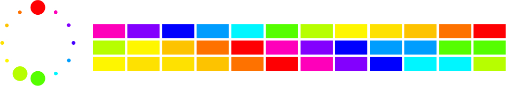
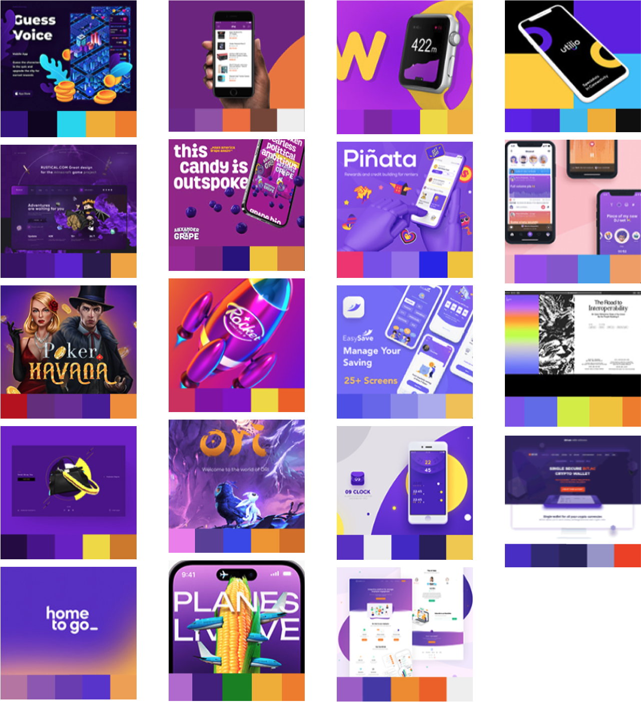
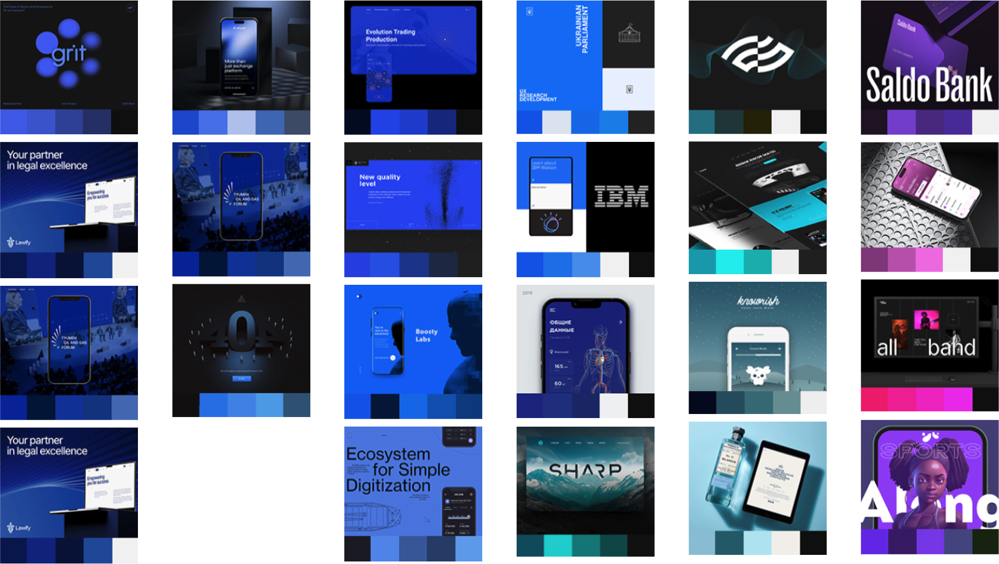

# Color

- ## Primary colors

- ## Secondary colors

- ## Tertiary colors

- ## Analogous Naturals colors

- ## Near opposites colors/Complements

Red + Green

Red and green are powerful, contrasting colors that are frequently used in design and art for their **emotional, symbolic, and visual effects**. Here's why they are chosen together:

### 1. **Complementary Colors**
- On the color wheel, red and green sit **opposite** each other.
- This creates **high contrast** and **visual vibrancy** when used together.
- Used for **emphasis**, **highlighting**, or dynamic tension in compositions.

### ❤️💚 2. **Emotional Duality**
- **Red**: Passion, love, energy, danger, power
- **Green**: Nature, calm, growth, balance, freshness

→ Together, they **balance emotional intensity** with natural calmness.

### 3. **Cultural Associations**
- **Red and green** often appear in **cultural motifs** (e.g., holidays like Christmas, traditional clothing, flags).
- They are **symbolically rich** and can evoke familiarity or celebration.

### 4. **Color Psychology in UI/UX**
- **Red** is used to **warn, alert, or draw attention** (errors, urgency).
- **Green** is used for **success, safety, or affirmation** (checkmarks, success messages).
- In interfaces, they support **clear communication** through color cues.

### 5. **Experimental/Artistic Value**
- Artists and designers use red-green contrasts for **optical effects**, especially in:
  - **Op art**
  - **Abstract expressionism**
  - **Data visualizations**

They create **vibration, tension, and visual interest** in flat or minimal compositions.

## 6. **Accessibility Considerations**
- Be cautious: **Red-green color blindness** is the most common type.
- Use shapes, patterns, or text labels when red-green are critical for functionality.

### Summary: When to Use Red + Green
| Use Case                    | Why It Works                          |
|-----------------------------|---------------------------------------|
| Visual tension/complement  | Strong contrast for impact            |
| Symbolism                  | Red = emotion, Green = nature/balance |
| Alerts + Confirmation (UI) | Red = error, Green = success          |
| Holiday/festival design    | Recognizable cultural pairing         |
| Artistic abstraction       | Vibrant optical or emotional effects  | 

Blue + Orange

Color selection is one of the most powerful tools in design and visual communication. The combinations of **Blue + Orange** and **Blue + Yellow** are popular choices for both artistic expression and branding because they create **high-impact visual harmony** and psychological contrast.

### 🔵🟠 Blue + Orange: Complementary Energy

#### Psychological Impact:
- **Blue** = calm, trust, professionalism
- **Orange** = energy, enthusiasm, creativity
- Together they create **tension + harmony** (opposites attract)

#### Visual Reason:
- They are **complementary colors** on the color wheel
- High **color contrast** increases visibility and draws attention
- Often used for **call-to-action buttons**, **tech interfaces**, and **sports branding**

#### Artistic Use:
- Adds vibrancy and visual dynamism
- Used in abstract painting to express emotional duality (cool vs warm)

### 🔵🟡 Blue + Yellow: Bright Clarity & Optimism

#### Psychological Impact:
- **Yellow** = optimism, warmth, innovation
- **Blue** = stability, intellect, trust
- Together they symbolize **balance between logic and joy**

#### Visual Reason:
- Blue and yellow are **primary colors**, ensuring strong contrast
- Often associated with **youthfulness, learning, and clarity**
- Common in **education**, **healthcare**, and **user interface design**

#### Artistic Use:
- Evokes sky and sunlight — nature-inspired color psychology
- Used in modern art movements like Bauhaus, De Stijl, and Minimalism

### Summary: Why These Combos Work

| Combo          | Use Case                            | Emotional Tone              |
|----------------|-------------------------------------|-----------------------------|
| **Blue + Orange** | Tech, energy brands, calls to action | Balanced tension, creativity |
| **Blue + Yellow** | Education, youth, clarity, trust      | Friendly clarity, logic + optimism |

### Design Tip:
> Use **blue as a stabilizer**, and **orange or yellow as the emotional amplifier**.

They can be applied in logos, UI accents, backgrounds, or moodboards to enhance meaning and resonance.

Purple + Yellow

Purple and yellow are complementary colors, sitting opposite each other on the color wheel. When used together, they create **dynamic contrast**, **emotional depth**, and a **visually captivating aesthetic**. Here's why they're effective:

### Color Psychology

#### 🟣 Purple
- Symbolizes **creativity**, **mystery**, **luxury**, and **spirituality**
- Evokes introspection and emotional richness
- Historically associated with royalty and imagination

#### 🟡 Yellow
- Symbolizes **energy**, **optimism**, **clarity**, and **happiness**
- Catches attention easily and brings warmth to compositions
- Represents intellectual curiosity and forward movement

### Design Benefits

| Attribute                | Purple                     | Yellow                       | Together                       |
|-------------------------|----------------------------|------------------------------|--------------------------------|
| **Mood**                | Deep, mysterious, emotional| Bright, cheerful, confident | Balance of mind & heart        |
| **Contrast**            | Dark cool tone             | Light warm tone              | Maximum visual contrast        |
| **Focus**               | Background/supportive       | Highlight/CTA                | Directs user attention         |
| **Application**         | Depth, richness             | Accents, alerts, buttons     | Hero sections, art statements  |

### Artistic Uses
- **Purple** creates atmospheric space or emotional shadows
- **Yellow** adds spark, joy, or disrupts a moody palette with clarity
- Artists like **van Gogh** used yellow to convey mania/life, while purple added calmness and contrast

### Use in Branding or UI/UX
- Tech and AI brands use purple for futuristic, thoughtful vibes
- Yellow adds approachability or friendliness to the interface
- Together: ideal for artistic, generative, or emotion-driven products

### Summary
> Purple + Yellow is a **power combo**:
> - Expressive yet clear
> - Rich yet accessible
> - Balanced between head and heart

Use this pairing when you want your work to **stand out**, **feel alive**, and **evoke both emotion and clarity**.

- ## Monochrome

  
Why Use Monochrome Color in Design and Art?

Monochrome color schemes involve using a single base hue, extended with its tints, tones, and shades. This approach is popular in graphic design, branding, web interfaces, and fine art for a number of aesthetic and functional reasons.

### Benefits of Monochrome Color Use

#### 1. **Focus & Clarity**
- Reduces visual noise.
- Helps viewers focus on composition, typography, and form.
- Especially effective in minimalist design systems.

#### 2. **Emotional Consistency**
- A single hue can deliver a strong, unified emotional message.
  - Blue = calm and trustworthy
  - Red = passion and energy
  - Black = sophistication and luxury

#### 3. **Timeless Aesthetic**
- Monochrome palettes are modern yet timeless.
- Widely used in editorial design, branding, and Swiss-style layouts.

#### 4. **Visual Hierarchy via Value**
- Designers can build contrast using **lightness and darkness** rather than multiple colors.
- Improves readability and accessibility.

#### 5. **Brand Identity & Recognition**
- Monochrome systems often become iconic (e.g., Apple's black/white branding, Chanel’s black-and-white identity).

### When to Use Monochrome in Design
- Creating brand systems with high clarity and elegance
- Editorial layouts and posters (for dramatic visual rhythm)
- Interfaces where function must guide attention
- Abstract art focused on form, space, and emotion
- Mood boards and concept explorations

### Artistic & Psychological Considerations
- Monochrome is often associated with **restraint**, **discipline**, and **conceptual clarity**.
- Abstract artists (e.g. Malevich, Rothko) and modernists used monochrome to explore **pure form** and **emotional intensity**.

### Tools & Examples
- In Figma: Create grayscale or tonal palettes to test layouts.
- In Photoshop: Use Gradient Maps or Black & White adjustment layers.
- In P5.js: Control tone through alpha and brightness values.

Monochrome does **not mean boring** — it amplifies structure, emotion, and function.

- ## Black + One

  
Why Designers Use Black + One Color in Visual Design & Art?

**A minimal color palette** of black + one color is a timeless and intentional choice in graphic design and art. Here’s why this aesthetic remains powerful and widely used:

### 1. Clarity and Focus

- Reduces visual noise
- Highlights important elements (calls to action, logos, focal points)
- The single accent color acts as a **visual guide** across a composition

### 2. Emotional and Conceptual Impact

- Black is **neutral, elegant, and strong** — a visual anchor
- A single color carries **emotional weight** (e.g. red = passion, blue = calm, yellow = energy)
- Combining both creates strong **conceptual meaning** with minimal tools

### 3. Modern and Timeless Aesthetic

- Used in Swiss, Dutch, and Modernist design for its **clarity and objectivity**
- Often feels **sophisticated and confident**
- Associated with **editorial design, tech branding, minimalist posters**

### 4. Visual Hierarchy and Composition

- Black creates contrast and structure
- The accent color provides emphasis or rhythm
- Helps define hierarchy without overusing gradients or color noise

### 5. Versatility in Mediums

- Works across print, digital, motion, and branding
- Easy to translate to black-and-white media (e.g., print, screens, prototyping)
- Accessible and scalable in design systems

### Examples of This Approach

| Color Used | Emotional Association | Common Use |
|------------|------------------------|------------|
| Black + Red | Urgency, strength     | Tech, fashion, activism |
| Black + Blue | Trust, clarity       | Corporate, software |
| Black + Yellow | Energy, innovation | Posters, art, culture |
| Black + Neon | Futuristic, edgy     | Web3, AI, digital art |

### Summary

Using **black + one color** is a powerful constraint that leads to bold, clear, and emotional design.

> “With fewer tools, your voice becomes sharper.”

It's not just a visual choice — it's a **conceptual discipline**.

- ## Black + Two

- ## Neutral earth tones