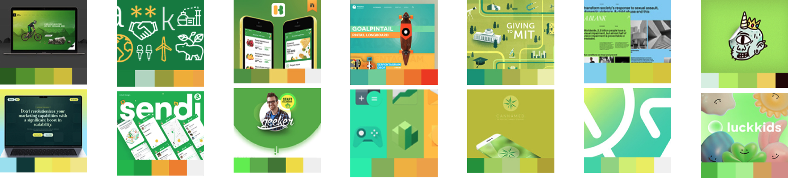
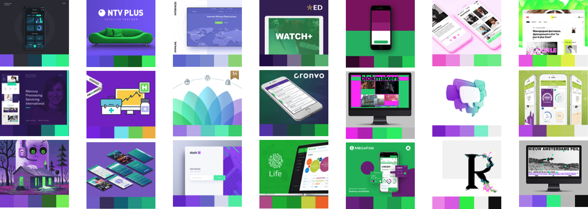
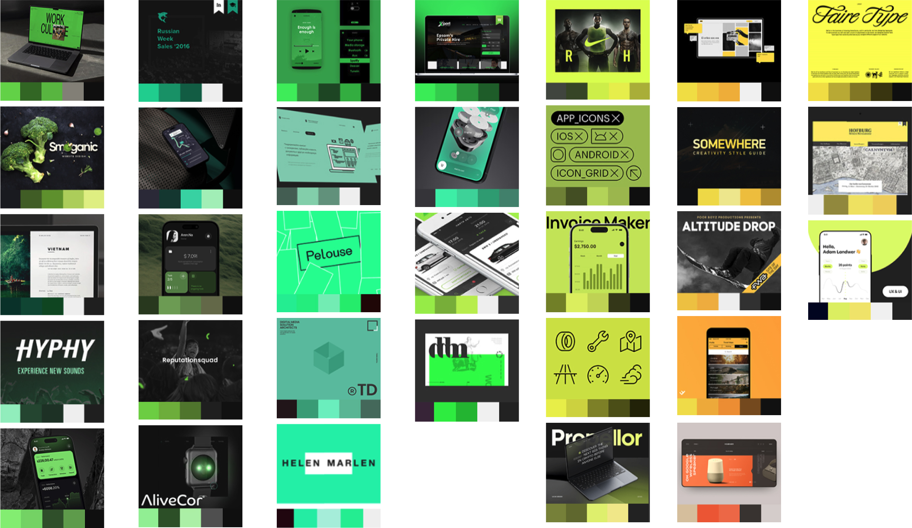

# Color

- ## Primary colors

- ## Secondary colors

- ## Tertiary colors

- ## Analogous Naturals colors

  
Red + Blue 

Using **red + blue** together is a powerful color strategy in design and art because of their **psychological, visual, and symbolic contrast**. Here's why this combination works so well:

### 🔵🔴 1. **Psychological Impact**
| Color | Meaning |
|-------|---------|
| 🔴 **Red** | Passion, urgency, energy, danger, warmth |
| 🔵 **Blue** | Calmness, trust, stability, intellect |

👉 The balance between **emotional energy (red)** and **rational calm (blue)** creates **tension and harmony** — excellent for branding, art, or UI design.

### 2. **Visual Contrast**
- Red and blue are **almost opposite** on the color wheel (warm vs. cool).
- This creates **strong visual contrast**, useful for:
  - Drawing attention
  - Defining hierarchy
  - Creating dynamic compositions

### 3. **Symbolic Duality**
This combo is often used to represent dualism:
- **Masculine vs. Feminine**
- **Emotion vs. Logic**
- **Warm vs. Cool**
- **Action vs. Reflection**

Used well, it tells a **deeper story** in brand identity or artwork.

### 4. **Art & Culture References**
- **Modern art**: Used in Constructivism and Pop Art
- **Tech & UI**: Common in futuristic or cyberpunk themes (neon red + electric blue)
- **Politics & Culture**: Red vs. Blue often symbolizes opposition or choice

### Design Tips for Red + Blue
- Avoid placing full-saturation red next to blue — it can visually vibrate
- Use **shades and transparency** to soften transitions
- Add **white or black** to anchor and enhance contrast

### In Summary
The red + blue palette provides:
- High emotional range
- Balanced composition
- Conceptual duality
- Cultural resonance

It’s a timeless and strategic choice for **expressive, impactful, and meaningful visual communication**.

  
Blue + Green

Blue and green are a powerful color pairing in visual design, branding, and art because they evoke harmony, balance, and innovation.

### 🟦 Blue: Trust, Calm, Intelligence

| Trait | Meaning in Design |
|-------|-------------------|
| **Trust** | Widely used in tech and finance for reliability (e.g. IBM, Intel) |
| **Calm** | Creates a peaceful, meditative space |
| **Intellect** | Associated with depth, reflection, and technology |
| **Coolness** | Blue can recede in layout, helping emphasize content hierarchy |

### 🟩 Green: Growth, Nature, Innovation

| Trait | Meaning in Design |
|-------|-------------------|
| **Nature** | Symbolizes life, sustainability, and freshness |
| **Balance** | Represents emotional harmony and healing |
| **Growth** | Startups and eco-products use green for innovation and transformation |
| **Energy** | Bright greens feel optimistic and modern (Web3, health tech, etc.) |

### Why Combine Blue + Green?

| Combination Trait | Design Effect |
|-------------------|----------------|
| **Cool + Cool**   | Creates a soothing and modern palette |
| **Tech + Nature** | Perfect for future-facing, sustainable, or AI-driven products |
| **Trust + Growth**| Balanced branding: human yet forward-thinking |
| **Versatility**   | Suitable for UI/UX, branding, healthcare, wellness, sustainability, AI |

### Examples of Use
- **Web3 or AI Brands**: Clean neon green with cool blues for futuristic energy
- **Healthcare and Wellness**: Soft green + pale blue for calm and trust
- **Environmental Brands**: Deep forest green + ocean blue = ecological strength
- **Art Projects**: Use layering, gradients, and opacity for emotional depth

### Tips for Using Blue + Green
- Use **blue as base** and green as **accent/emphasis**
- Try **gradients** from aqua to teal for modern web backgrounds
- Pair with **white or dark neutral** to maintain clarity and legibility

### Summary

Blue + Green is more than just cool colors — it’s a color system for **hope, balance, and intelligent innovation**.

> It’s a palette that feels alive and modern while being grounded in emotional trust.

  
Green + Yellow

Green and yellow are more than just colors — they carry rich **psychological, symbolic, and cultural meanings** that make them powerful choices for visual design and artistic expression.

### 🌿 Green: Nature, Growth, Balance
| Trait         | Meaning                                    |
|---------------|--------------------------------------------|
| Nature        | Symbolizes forests, plants, and freshness  |
| Growth        | Associated with renewal and progress       |
| Harmony       | Represents balance, health, and stability  |
| Tech/AI Trend | Neon greens used in futuristic UI design   |

**Use Case in Design**:
- Evokes sustainability (eco brands)
- Refreshing and calming background color
- Often used in wellness, organic products, and energy UI

### ☀️ Yellow: Optimism, Creativity, Energy
| Trait         | Meaning                                       |
|---------------|-----------------------------------------------|
| Light         | Brightness, intellect, and sunshine           |
| Joy           | Cheerfulness and positivity                   |
| Attention     | Catches the eye quickly                       |
| Emotion       | Used for friendliness and emotional warmth    |

**Use Case in Design**:
- Perfect for calls-to-action (buttons, highlights)
- Youthful, energetic branding
- Associated with creative, fun experiences

### Why Combine Green + Yellow?
| Reason                     | Impact                                   |
|----------------------------|------------------------------------------|
| Vibrancy                  | Together, they create a glowing, vivid palette |
| Emotional & Natural Blend | Mixes optimism (yellow) with balance (green) |
| Futuristic Touch          | Especially in neon forms (Web3/AI design) |
| Abstract Feel             | Works beautifully in generative, surreal, or Orphist styles |

### Example Applications
- **AI Art Interfaces**: Abstract backgrounds with green & yellow waveforms
- **Branding**: Eco-tech, sustainability, innovation
- **Web Design**: Gradients, hover animations, icons

### Design Tip

Pair green and yellow with **minimal neutrals** (e.g., white, black, or deep blue) for a clean, modern contrast — or overlay them on dark interfaces for a glowing neon effect.
  

  
Red + Yellow

Red and yellow are among the most powerful and emotionally evocative colors in design and art. Here's why they are often chosen — both individually and in combination:

### 🔴 Red – The Color of Energy and Emotion

**Psychological Associations**:
- Passion, love, energy, strength
- Danger, urgency, attention

**Use in Design**:
- Calls to action (e.g., "Buy Now", "Alert")
- Emotional resonance in artwork
- Stimulates excitement and appetite

### 🟡 Yellow – The Color of Optimism and Clarity

**Psychological Associations**:
- Joy, positivity, sunlight, hope
- Caution, warning

**Use in Design**:
- Grabs attention gently (great for highlights)
- Inspires warmth and creativity
- Enhances readability and cheerfulness

### 🔴🟡 Red + Yellow Combo – Why It Works

**Visual Power**:
- High contrast pairing – very visible even from far away
- Eye-catching, vibrant, bold

**Emotional Impact**:
- Energizing and lively — great for youth, playfulness, urgency
- Combines emotional warmth (red) with brightness (yellow)

**Examples in Use**:
- Fast food logos (e.g., McDonald's, In-N-Out) → triggers appetite + excitement
- Abstract or expressive artworks → reflects fire, sun, vitality

### In Art Contexts

- **Symbolism**: Fire, transformation, action, celebration
- **Abstract Expressionism**: Often used to invoke intensity and movement
- **Cultural Uses**:
  - In Chinese culture: red = luck, yellow = royalty
  - In Western: red = love/passion, yellow = happiness

### Tips for Use

- Use **red** for emotional weight, **yellow** for clarity and balance
- Control saturation and brightness to avoid visual fatigue
- Works well in **warm-themed** palettes and expressive or dynamic designs

 

- ## Near opposites colors/Complements

Red + Green

Red and green are powerful, contrasting colors that are frequently used in design and art for their **emotional, symbolic, and visual effects**. Here's why they are chosen together:

### 1. **Complementary Colors**
- On the color wheel, red and green sit **opposite** each other.
- This creates **high contrast** and **visual vibrancy** when used together.
- Used for **emphasis**, **highlighting**, or dynamic tension in compositions.

### ❤️💚 2. **Emotional Duality**
- **Red**: Passion, love, energy, danger, power
- **Green**: Nature, calm, growth, balance, freshness

→ Together, they **balance emotional intensity** with natural calmness.

### 3. **Cultural Associations**
- **Red and green** often appear in **cultural motifs** (e.g., holidays like Christmas, traditional clothing, flags).
- They are **symbolically rich** and can evoke familiarity or celebration.

### 4. **Color Psychology in UI/UX**
- **Red** is used to **warn, alert, or draw attention** (errors, urgency).
- **Green** is used for **success, safety, or affirmation** (checkmarks, success messages).
- In interfaces, they support **clear communication** through color cues.

### 5. **Experimental/Artistic Value**
- Artists and designers use red-green contrasts for **optical effects**, especially in:
  - **Op art**
  - **Abstract expressionism**
  - **Data visualizations**

They create **vibration, tension, and visual interest** in flat or minimal compositions.

## 6. **Accessibility Considerations**
- Be cautious: **Red-green color blindness** is the most common type.
- Use shapes, patterns, or text labels when red-green are critical for functionality.

### Summary: When to Use Red + Green
| Use Case                    | Why It Works                          |
|-----------------------------|---------------------------------------|
| Visual tension/complement  | Strong contrast for impact            |
| Symbolism                  | Red = emotion, Green = nature/balance |
| Alerts + Confirmation (UI) | Red = error, Green = success          |
| Holiday/festival design    | Recognizable cultural pairing         |
| Artistic abstraction       | Vibrant optical or emotional effects  | 

Blue + Orange

Color selection is one of the most powerful tools in design and visual communication. The combinations of **Blue + Orange** and **Blue + Yellow** are popular choices for both artistic expression and branding because they create **high-impact visual harmony** and psychological contrast.

### 🔵🟠 Blue + Orange: Complementary Energy

#### Psychological Impact:
- **Blue** = calm, trust, professionalism
- **Orange** = energy, enthusiasm, creativity
- Together they create **tension + harmony** (opposites attract)

#### Visual Reason:
- They are **complementary colors** on the color wheel
- High **color contrast** increases visibility and draws attention
- Often used for **call-to-action buttons**, **tech interfaces**, and **sports branding**

#### Artistic Use:
- Adds vibrancy and visual dynamism
- Used in abstract painting to express emotional duality (cool vs warm)

### 🔵🟡 Blue + Yellow: Bright Clarity & Optimism

#### Psychological Impact:
- **Yellow** = optimism, warmth, innovation
- **Blue** = stability, intellect, trust
- Together they symbolize **balance between logic and joy**

#### Visual Reason:
- Blue and yellow are **primary colors**, ensuring strong contrast
- Often associated with **youthfulness, learning, and clarity**
- Common in **education**, **healthcare**, and **user interface design**

#### Artistic Use:
- Evokes sky and sunlight — nature-inspired color psychology
- Used in modern art movements like Bauhaus, De Stijl, and Minimalism

### Summary: Why These Combos Work

| Combo          | Use Case                            | Emotional Tone              |
|----------------|-------------------------------------|-----------------------------|
| **Blue + Orange** | Tech, energy brands, calls to action | Balanced tension, creativity |
| **Blue + Yellow** | Education, youth, clarity, trust      | Friendly clarity, logic + optimism |

### Design Tip:
> Use **blue as a stabilizer**, and **orange or yellow as the emotional amplifier**.

They can be applied in logos, UI accents, backgrounds, or moodboards to enhance meaning and resonance.

Purple + Yellow

Purple and yellow are complementary colors, sitting opposite each other on the color wheel. When used together, they create **dynamic contrast**, **emotional depth**, and a **visually captivating aesthetic**. Here's why they're effective:

### Color Psychology

#### 🟣 Purple
- Symbolizes **creativity**, **mystery**, **luxury**, and **spirituality**
- Evokes introspection and emotional richness
- Historically associated with royalty and imagination

#### 🟡 Yellow
- Symbolizes **energy**, **optimism**, **clarity**, and **happiness**
- Catches attention easily and brings warmth to compositions
- Represents intellectual curiosity and forward movement

### Design Benefits

| Attribute                | Purple                     | Yellow                       | Together                       |
|-------------------------|----------------------------|------------------------------|--------------------------------|
| **Mood**                | Deep, mysterious, emotional| Bright, cheerful, confident | Balance of mind & heart        |
| **Contrast**            | Dark cool tone             | Light warm tone              | Maximum visual contrast        |
| **Focus**               | Background/supportive       | Highlight/CTA                | Directs user attention         |
| **Application**         | Depth, richness             | Accents, alerts, buttons     | Hero sections, art statements  |

### Artistic Uses
- **Purple** creates atmospheric space or emotional shadows
- **Yellow** adds spark, joy, or disrupts a moody palette with clarity
- Artists like **van Gogh** used yellow to convey mania/life, while purple added calmness and contrast

### Use in Branding or UI/UX
- Tech and AI brands use purple for futuristic, thoughtful vibes
- Yellow adds approachability or friendliness to the interface
- Together: ideal for artistic, generative, or emotion-driven products

### Summary
> Purple + Yellow is a **power combo**:
> - Expressive yet clear
> - Rich yet accessible
> - Balanced between head and heart

Use this pairing when you want your work to **stand out**, **feel alive**, and **evoke both emotion and clarity**.

  
Purple + Green

Purple and green is a **bold, contrasting color pairing** that can evoke emotional depth, modernity, and visual tension. Below are the reasons and theories for using this duo in your design or art:

### 1. **Color Theory: Contrast & Balance**
- Purple (a secondary color made from red + blue) and green (from yellow + blue) are **near complements** on the color wheel.
- This contrast creates **visual energy** while maintaining **natural harmony**.
- Used properly, they generate a vibrant and dynamic feeling without clashing.

### 2. **Psychological Associations**

| Color | Symbolism |
|-------|-----------|
| **Purple** | Creativity, mystery, luxury, introspection |
| **Green** | Growth, renewal, technology, balance, nature |

Together:
- Can convey a mix of **technology + nature**, **logic + emotion**, or **spiritual + grounded**.
- Often used in futuristic designs, wellness brands, or psychedelic art.

### 3. **Design Contexts Where It Works Well**
- **Tech Products**: Green = innovation, Purple = futuristic imagination
- **AI Interfaces**: Green = logic/data, Purple = intuition/emotion
- **Fashion/Art**: Eye-catching, symbolic contrast of inner/outer worlds
- **Gaming**: Combines power (purple) with vitality (green)

### 4. **Historical & Cultural Notes**
- **Purple** has royal origins, historically expensive and rare.
- **Green** is often symbolic of life, rebirth, and digital code (Matrix aesthetic).
- The combo appears in spiritual art, glitch art, and even abstract expressionist works.

### 5. Use in Modern Design Systems
- **UI Design**: Buttons or highlights using green for CTA, purple for accent layers
- **Abstract Art**: Balance gradients or layer contrasts using muted or neon variants
- **Branding**: Use green as a base for trust + purple as a poetic brand differentiator

### Tips for Working with Purple + Green
- Use **one as dominant**, one as accent
- Use **analogous shades** (lavender + mint) for softness
- Use **neon or high-contrast** variants for digital/glitch art feel
- Avoid muddying the palette — test saturation and lightness carefully

### Summary
Purple + Green is not just visually striking — it also enables rich storytelling:
**Imagination + logic, spirituality + science, nature + futurism.**

Perfect for brands, artworks, and experiences that live at the edge of **intuition and innovation**.

- ## Monochrome

  
Why Use Monochrome Color in Design and Art?

Monochrome color schemes involve using a single base hue, extended with its tints, tones, and shades. This approach is popular in graphic design, branding, web interfaces, and fine art for a number of aesthetic and functional reasons.

### Benefits of Monochrome Color Use

#### 1. **Focus & Clarity**
- Reduces visual noise.
- Helps viewers focus on composition, typography, and form.
- Especially effective in minimalist design systems.

#### 2. **Emotional Consistency**
- A single hue can deliver a strong, unified emotional message.
  - Blue = calm and trustworthy
  - Red = passion and energy
  - Black = sophistication and luxury

#### 3. **Timeless Aesthetic**
- Monochrome palettes are modern yet timeless.
- Widely used in editorial design, branding, and Swiss-style layouts.

#### 4. **Visual Hierarchy via Value**
- Designers can build contrast using **lightness and darkness** rather than multiple colors.
- Improves readability and accessibility.

#### 5. **Brand Identity & Recognition**
- Monochrome systems often become iconic (e.g., Apple's black/white branding, Chanel’s black-and-white identity).

### When to Use Monochrome in Design
- Creating brand systems with high clarity and elegance
- Editorial layouts and posters (for dramatic visual rhythm)
- Interfaces where function must guide attention
- Abstract art focused on form, space, and emotion
- Mood boards and concept explorations

### Artistic & Psychological Considerations
- Monochrome is often associated with **restraint**, **discipline**, and **conceptual clarity**.
- Abstract artists (e.g. Malevich, Rothko) and modernists used monochrome to explore **pure form** and **emotional intensity**.

### Tools & Examples
- In Figma: Create grayscale or tonal palettes to test layouts.
- In Photoshop: Use Gradient Maps or Black & White adjustment layers.
- In P5.js: Control tone through alpha and brightness values.

Monochrome does **not mean boring** — it amplifies structure, emotion, and function.

- ## Black + One

  
Why Designers Use Black + One Color in Visual Design & Art?

**A minimal color palette** of black + one color is a timeless and intentional choice in graphic design and art. Here’s why this aesthetic remains powerful and widely used:

### 1. Clarity and Focus

- Reduces visual noise
- Highlights important elements (calls to action, logos, focal points)
- The single accent color acts as a **visual guide** across a composition

### 2. Emotional and Conceptual Impact

- Black is **neutral, elegant, and strong** — a visual anchor
- A single color carries **emotional weight** (e.g. red = passion, blue = calm, yellow = energy)
- Combining both creates strong **conceptual meaning** with minimal tools

### 3. Modern and Timeless Aesthetic

- Used in Swiss, Dutch, and Modernist design for its **clarity and objectivity**
- Often feels **sophisticated and confident**
- Associated with **editorial design, tech branding, minimalist posters**

### 4. Visual Hierarchy and Composition

- Black creates contrast and structure
- The accent color provides emphasis or rhythm
- Helps define hierarchy without overusing gradients or color noise

### 5. Versatility in Mediums

- Works across print, digital, motion, and branding
- Easy to translate to black-and-white media (e.g., print, screens, prototyping)
- Accessible and scalable in design systems

### Examples of This Approach

| Color Used | Emotional Association | Common Use |
|------------|------------------------|------------|
| Black + Red | Urgency, strength     | Tech, fashion, activism |
| Black + Blue | Trust, clarity       | Corporate, software |
| Black + Yellow | Energy, innovation | Posters, art, culture |
| Black + Neon | Futuristic, edgy     | Web3, AI, digital art |

### Summary

Using **black + one color** is a powerful constraint that leads to bold, clear, and emotional design.

> “With fewer tools, your voice becomes sharper.”

It's not just a visual choice — it's a **conceptual discipline**.

- ## Black + Two

  
Why Choose Black + Two Colors in Design & Art？

Using **Black + Two Accent Colors** is a timeless and strategic approach in both graphic design and art. This color strategy balances **clarity**, **emotional impact**, and **visual hierarchy**. Here’s why it works so well:

### 1. Focus & Clarity
- Black acts as a strong neutral background or anchor.
- Limiting the palette to just two colors **reduces noise** and enhances legibility.
- Creates a **focused visual hierarchy** that guides the viewer’s eye.

### 2. Emotional Precision
- Each accent color can carry **specific emotional or cultural meanings**.
- The limited palette makes emotional messaging more **intentional and powerful**.
- Black adds **seriousness**, **elegance**, or **mystery**, depending on the tone.

### 3. Visual Identity
- Great for **branding**: consistent use of two signature colors + black creates **recognizability**.
- Simplifies cross-medium applications: works well in print, web, motion, and packaging.

### 4. Contrast & Legibility
- Black offers **high contrast** with most hues.
- Two accent colors give enough flexibility to define foreground/background, UI states, etc.

### 5. Artistic Expression
- The constraint forces creativity—leading to **minimal yet expressive compositions**.
- Common in styles like **Constructivism**, **Swiss Design**, and **Neo-Minimalism**.
- Useful in **lyrical abstraction**: two expressive tones can evoke rhythm and motion against the black.

### When to Use
- Branding systems
- Editorial layouts
- UI design
- Poster and motion graphics
- Data visualization (limited color encoding)

## 📌 Tips for Selecting the Two Colors
| Intent        | Pairing Example        |
|---------------|------------------------|
| Energetic     | Magenta + Cyan         |
| Calm          | Teal + Soft Yellow     |
| Bold/Modern   | Red + White            |
| Futuristic    | Neon Green + Purple    |

### Summary
Choosing **Black + Two Colors** is not a limitation—it’s a **design discipline** that fosters clarity, emotional depth, and memorable visual identity.

- ## Neutral earth tones

- ## Gray tones