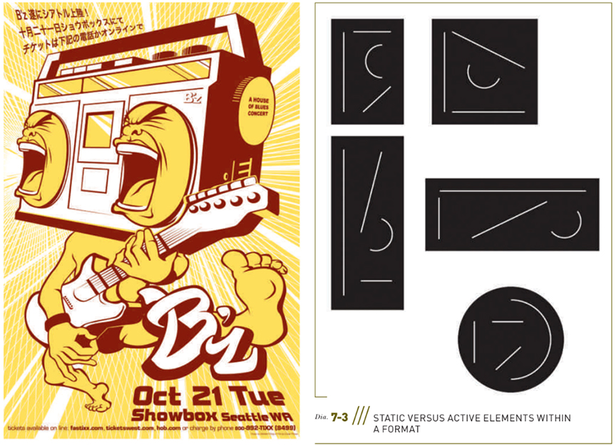
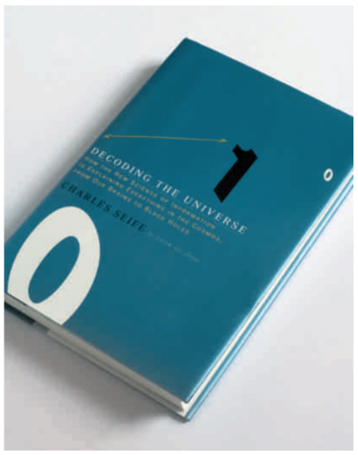
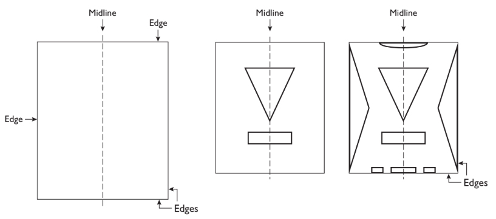
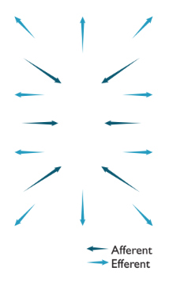
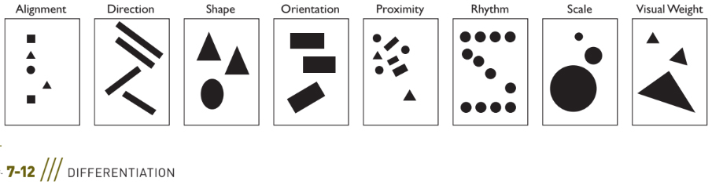

# Composition
## Fundamentals of Composition

- Creating visual interest and clarity of communication are two main goals of composition. 
- A formulaic design might be clear, but if it’s boring, no one is going to bother to look at it or spend time with it. Often, viewers will spend
more time trying to make sense of a message if the form of
a graphic design solution interests them. To create interest-
ing and comprehensible solutions, you need to develop keen compositional skills.
- Composition is the form, the whole spatial property and structure
resulting from the visualization and arrangement of graphic
elements—type and images—in relation to one another and
to the format, created with the intention to visually commu-
nicate, to be compelling, and to be expressive. 
- Composing is about how all the parts of your design work together — ```the visual organization of type and images in a graphic spatial arrangement.```
### The Format: Static Versus Active Composition
- Vertical and horizontal elements and movements parallel the edges of a rectangular or square format. 
- In static compositions,vertical and horizontal movements are emphasized. 
- In active compositions, diagonal or curved movements—directions that contradict or are in counterpoint to the edges of the format—
are emphasized. 
- Generally, compositions with dominating parallel movements are deemed more placid. 
- Compositionn with counterpointing movements are more active or tense;


### Responding to the Edges of the Format
All visual elements must respond to (though not necessarily touch) the edges of the page. Not merely the end of the graphic space, a format’s boundaries fully participate in the
compositional structure.


#### Acknowledging the Midline
Envision an imaginary vertical line down the center of a page
(Diagram 7-4). As you position graphic elements, analyze how
each interacts with that midline. Do graphic elements cross the
midline? Approach the midline? How do the graphic elements
interrelate in the central space of the composition? Notice how
Figure 7-3 makes use of a prominent midline.


### The Format: Closed Versus Open Composition
- The terms closed and open refer to the way the graphic elements of a composition relate to the edges of a format. 
### Symmetrical Versus Asymmetrical Compositions
- Each static, single format has a vertical axis. 
- The equal distribution of visual weight on either side of the
vertical axis is the key to establishing balance (Diagram 7-5).
- In a symmetrical composition, corresponding (mirrored) forms are arranged on either side of the vertical axis. 
    - In general, balance achieved through symmetry yields stable and often static(as opposed to active) results. 
    - In an asymmetrical composition, arranging a balanced composition does not rely on symmetry. Forms are arranged to coun- terbalance each other without mirrored opposite visual weight and positioning. To achieve a balanced asymmetrical composition, you consider the position and visual weight (size, texture, color, value) of each graphic element in relation to the other and to the format. Asymmetry is not a formulaic approach to composition. Asymmetry often is more active due to its inherent variations, but it does not necessarily have more impact than symmetry.
- In asymmetrical compositions where complementary graphic elements are positioned in counterpoint, visual weight deliberations are strategic, not formulaic. To understand balancing a composition through counterpoint, think of every visual weight you position in a composition requiring a contrasting counterbalancing force strategically placed in the composition. 
- In design, counterpoint is the use of contrast or the interplay of graphic elements in a work simultaneously providing unity and variety. In any balancecomposition, if you move one graphic element, you will need
to reconsider the balance of the entire composition. (See Chapter 2 for more information on visual weight.)


### Balancing Forces
- Every graphic element positioned on a page con-
tributes to a potentially balanced action, to how opposing physical movements operate . 
- Think of these complementary balancing forces as simultaneous actions building stability, balance, and harmony
    - In and Out. Pulling forces inward, toward the vertical midline of the page, and forces expanding outward,toward the edges of the page.
    - Afferent and Efferent. Inward contraction from the outer edges to the core, moving from the edges to the focal point (the point of emphasis in a composition) and then back from focal point to the boundaries. (Not to be confused with actual radial composition where the composition radiates outward from a central point.)
    - Up and Down. Grounding (rooting) the elements down while simultaneously lifting them up; that is, considering how the composition flows from top to bottom and bottom to top and considering all the transitions in between.


### Illusion of Spatial Depth
- When you set out to compose on a two-dimensional surface, like a
screen or a piece of paper, you begin with the picture plane. As soon as you make one mark (draw a line, place a letterform, or any graphic element) on the surface, ```that mark interacts with the picture plane and perimeter of the format. ```
- ```The illusion of spatial depth means the appearance of three dimensional space, where some things appear closer to the viewer and some things appear farther away—just as in actual space. ```The illusion of spatial depth can be shallow or deep, recessive or projected. One diagonal line can evoke the illusion of depth.
- In “regular” or “Classical” compositions (Classical here refers to the Italian Renaissance; think Raphael [Raffaello Sanzio] and Leonardo da Vinci), none of the major forms appear to move in front of the picture plane. This can be called a “picture window” arrangement, where, like a window pane, all that we see recedes behind the front plane and does not move in front of the picture plane into the viewer’s space .
- In an “irregular” or Baroque pictorial space (referring to Flemish Baroque painting; think Peter Paul Rubens, or a comic book superhero’s fist punching in front of the picture plane), diagonal elements and planes move in front of as well as behind the picture plane creating the illusion of depth and action, suggesting an aggressive spatial property.
### Differentiation Through Grouping
- The Gestalt principles of perception—similarity, proximity, continuity, and closure—explain how people tend to understand what they see by grouping, by visually assembling images and how they relate to one another into groups.
    - ```Grouping``` is a fundamental Gestalt concept, proposing that
    when graphic elements appear similar—share characteristics,
    are arranged close together, are connected, or are enclosed in
    a common spatial area—people perceive them as belonging
    together. Groups can be formed in a variety of ways.
- If you understand how grouping functions, you can more easily create visual emphasis in a composition through differentiation. One graphic element can be emphasized, become the focal point, by differentiating it from the other graphic elements through contrast in size (scale), weight, color, rhythm, orientation, and more.
