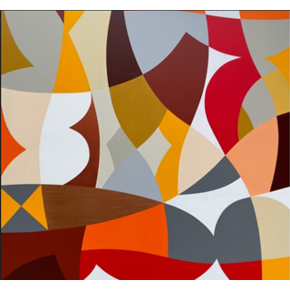
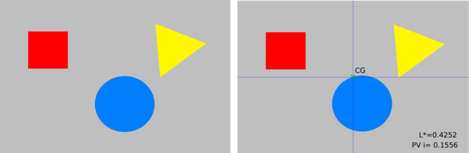
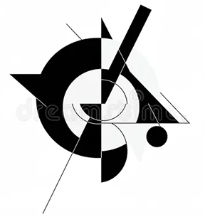
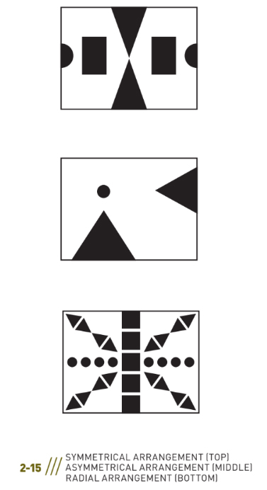
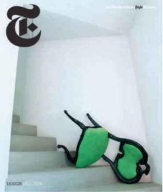
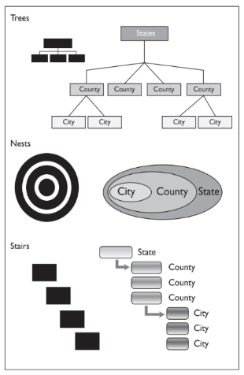
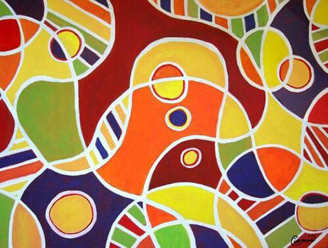
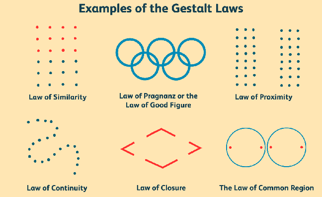
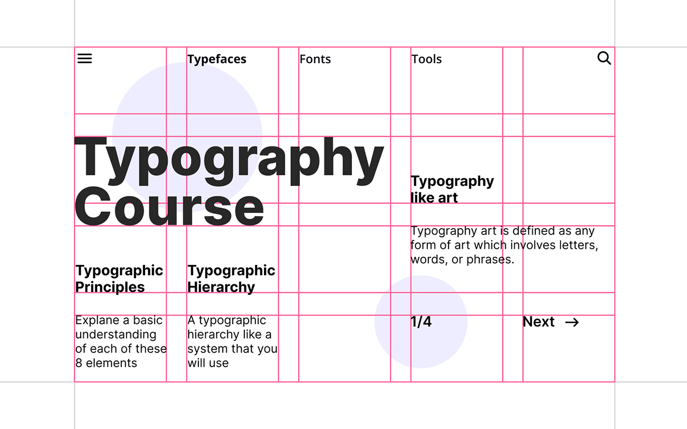

# Graphic Design: Formal Elements & Principles of Design
## Formal Elements   
- Line                  
- Shape
- Color
- Texture
### Line
- The basic functions of lines include: ```Define shapes, edges, forms; create images, letters, and patterns```
- Delineate boundaries and define areas within a composition
- Assist in ```visually organizing a composition and creating a line of vision``` 
- Can establish a linear mode of expression, a linear style
- When line is the predominant element used to unify a composition or to describe shapes or forms in a design (or painting), the style is termed ```linear```.

    
### Shape
- A ```curvilinear shape```, organic, or biomorphic shape is formed by curves or dominating marked flowing edges,which seems to have a naturalistic feel. It may be drawn precisely or loosely.
- An ```abstract shape``` refers to a simple or complex rearrangement, alteration, or distortion of the representation of natural appearance used for stylistic distinction and/or communication purposes.
- A ```representational shape``` is recognizable and reminds the viewer of actual objects seen in nature; it is also called a figurative shape.
- Figure(positive space)/Ground(negative space) - The figure or positive shape is a definite shape, immediately discernible as a shape. 

### Tecture
- The tactile quality of a surface or the simulation or representation of such a surface quality is a texture. 
- In the visual arts, there are two categories of texture: tactile and visual.
- ```Tactile textures``` have actual tactile quality and can be physically
touched and felt; they are also called actual textures. 
- ```Visual textures``` are illusions of real textures created by hand,
scanned from actual textures, or photographed. Using skills learned in drawing, painting, photography, and various other image-making media, a designer can create a great variety of textures.
### Pattern
- Pattern is a consistent repetition of a single visual unit or element within a given area. In all cases, there must be systematic repetition with obvious directional movement. 
- An interesting aspect of pattern is that the viewer anticipates a sequence. If you examine patterns, you will notice that their structures rely on the configuration of three basic building blocks: ```dots, lines, and grids```. 
- In a pattern, any individual small unit, whether a nonobjective or representational shape, can be based on the dot. Any moving path is based on lines, also called stripes. Any two intersecting units yield a pattern grid.
- Why is the pattern important for a brand?
  The pattern is an element that can make a difference within the visual communication; if used well, it can become a distinctive feature of your brand and make you recognizable. The use of customized patterns will help you to give your brand more personality and can become a fundamental element of recognition, especially online or on social media.  the important thing is that it reflects your brand and what you want to communicate.
- How to use It?
A pattern can make a creative work visually more exciting and recognizable. Today,
Applying a pattern on the packaging of different items helps to create a coordinated image between the various products of a brand to make it recognizable at a glance. Furthermore, the use of colour variants can help to differentiate the varieties: in this case, each colour will be associated with a particular taste, aroma, etc ... In the same way, using different textures or graphic motifs but of the same colour can help to identify a specific line of products.
## Principles of Design
- Format
- Balance
- Visual Hierarchy
- Rhythm
- Unity
- Laws of Perceptual Organization
### Format
- The format is the defined perimeter as well as the field it encloses—the outer edges or boundaries of a design. 
- Format refers to the field or substrate (piece of paper, mobile phone screen, outdoor billboard, etc.) for the graphic design
project. 
- Designers often use the term format to describe the type of project—that is, a poster, a CD cover, a mobile ads, and so on. Graphic designers work with a variety of formats.
### Balance
- Balance is stability or equilibrium created by an even distribution of visual weight on each side of a central axis as well as by an even distribution of weight among all the elements of the composition. 
- When a design is balanced, it tends toward harmony. A balanced composition affects the viewer—communicating stability. The average viewer is averse to imbalance in a composition and reacts negatively to instability. 
- Understanding balance involves the study of several interrelated visual factors: 
  - Visual weight
  - Position
  - Arrangement.
  #### Visual Weight
  

  Factors Affecting Visual Weight
  - Orientation and location of an element within the format
  - Line of vision (directional pull)
  - Size and shape of an element
  - Whether the element is figure or ground
  - Color: hue, value, saturation, and temperature
  - Texture
  - Density or number of elements in a given area
  - Isolation and emphasis of an element in the composition (focal point)
  - Groupings (equal groups; group of several small shapes could counterbalance one large shape)
  - Actual movement (in time-based/screen-based media, motion graphics)
  
    ##### In two-dimensional design, weight is defined as a visual force or as visual weight. 
    ##### This visual weight refers to the relative amount of visual attraction, importance, or emphasis the element carries in a composition. 
    ##### ```Every element in a composition carries energy``` — an impression of force, strength, or weight.
    - The size, shape, value, color, and texture of a mark all contribute to an element’s visual weight. 
    - Where you position the mark on the page also affects its visual weight. The same mark positioned at different points on a page—bottom left, center, top right, or top left—will appear to change in visual weight because of its position. 
    - In visual perception, different areas of the page seem to carry more or less visual weight. 
      ##### Symmetry 
      Symmetry is an equal distribution of visual weights, a mirroring of equivalent elements on either side of a central axis; it is also called reflection symmetry. Symmetry and approximate symmetry can communicate harmony and stability.
      ##### Asymmetry 
      Asymmetry is an equal distribution of visual weights achieved through weight and counterweight by balancing one element with the weight of a counterpointing element without mirroring elements on either side of a central axis (Figure 2-8). To achieve asymmetrical balance, the position, visual weight, size, value, color, shape, and texture of a mark on the page must be considered and weighed against every other mark. Every element and its position contribute to the overall balancing effect in a composition. （Most designer use asymmetry to their artworks.）
       
      
      ##### Radial balance 
      Radial balance is symmetry achieved through a combination of horizontally and vertically oriented symmetry (Diagram2-15). Elements radiate out from a point in the center of the composition.
      
      
### Visual Hierarchy
- One of the primary purposes of graphic design is to ```communicate information```, and visual hierarchy is the primary principle for ```organizing information```. 
- To guide the viewer, the designer uses visual hierarchy, ```the arrangement of all graphic elements according to emphasis```. 
  - Emphasis is the arrangement of visual elements according to importance, stressing some elements over others, making some superordinate (dominant) elements and subordinating other elements. 
  - Basically, the designer determines which graphic elements the viewer will see first, second, third, and so on. 
  #### The designer must determine what to emphasize and what to de-emphasize. if you give emphasis to all elements in a design, you have given it to none of them; you end up with visual chaos. 
  #### Emphasis is directly related to establishing a point of focus.
  ```The focal point``` is the part of a design that is most emphasized or accentuated, where the green chair is the focal point. ```Position, size, shape, direction, hue, value, saturation, and texture of a graphic element``` all contribute to establishing a focal point.
              
  #### Ways to Achieve Emphasis
  To establish a visual hierarchy, decide on the importance of the graphic elements (images and type) of your design. Create a flow of information from the most important graphic element to the least.
  Emphasis by Isolation
  Isolating a shape focuses attention on it (focused attention equals more visual weight). Please note that a focal point usually carries a good amount of visual weight and must be counterbalanced accordingly with other elements in a composition.
  
  
  - ###### Emphasis by Placement
  How the viewer moves visually through a spatial composition is an ongoing topic of study. It has been shown that viewers have preferences for specific regions of a page. Placing a graphic element at a specific position in a composition, such as the foreground, the top-left corner, or the center/middle of a page, attracts most viewers' gaze most easily.
  - ###### Emphasis Through Scale
  The size and scale of shapes or objects play an important role in emphasis and creating the illusion of spatial depth. Used effectively, the size of one shape or object in relation to another—what we call scale—can make elements appear to move forward or backward on the page. Large shapes and forms tend to attract more attention. However, a very small object can also attract attention if it is seen in contrast to many larger ones.
  - ###### Emphasis Through Contrast
  Through contrast—light versus dark, smooth versus rough, bright versus dull—you can emphasize some graphic elements over others. For example, a dark shape amid a field of lighter shapes might become a focal point. Contrast also depends on and is aided by size, scale, location, shape, and/or position.
  - ###### Emphasis Through Direction and Pointers 
  Elements such as arrows and diagonals use direction to point viewers’s eyes to where they should go.
  - ###### Emphasis Through Diagrammatic Structures
    - ```Tree structures```. Positioning the main or superordinate element at the top with subordinated elements below it in descending order creates hierarchical relationships. Another tree structure looks similar to a tree trunk with branches; subordinate elements stem out from the main element carried by lines.
    - ```Nest structures```. This can be done either through layering(the main element is the first layer and other layers move behind it) or through containment (the main element contains the less significant elements). Layering for the purpose of hierarchy is critical to understand in relation to websites and information design.
    - ```Stair structures```. To illustrate hierarchy, this structure stacks elements, with the main element at the top and subordinate elements descending like stairsteps.
  
    
### Rhythm
- In graphic design, a strong and consistent repetition, a pattern of elements can set up a rhythm, which causes the viewer’s eyes to move around the page. Timing can be set by the intervals between and among the position of elements on the page. 
- Many factors can contribute to establishing rhythm — ```color,texture, figure/ground relationships, emphasis, and balance.```
    
  #### Repetition and Variation
  - The key to establishing rhythm in design is to understand the difference between repetition and variation. 
  - In graphic design, the repetition of rhythm is interposed by variation to create visual interest. 
  - Repetition occurs when you repeat one or a few visual elements a number times or with great or total consistency. 
  - Variation is established by a break or modification in the pattern or by changing elements, such as the color, size, shape, spacing,position, or visual weight. 
  - Variation creates visual interest to engage a viewer and add an element of surprise. However, too much variation will dilute a visual beat.
    
    
### Unity
All the graphic elements in a design are so interrelated they form a greater whole. All the graphic elements look as though they belong together.Viewers best understand and remember a composition that is unified. 
  #### Gestalt
  German for “form,” which places an emphasis on the perception of forms as organized wholes, primarily concerned with how the mind attempts to impose order on the world, to unify and order perceptions. 
  
  
  - ##### From gestalt, we derive certain laws of perceptual organization that govern visual thinking, profoundly affecting how you construct unity in a composition. 
  - The mind attempts to create order, make connections, and to seek a whole by grouping—perceiving visual units by ```location, orientation, likeness, shape, and color.``` 
  - ##### [the law of prägnanz](https://lawsofux.com/law-of-pr%C3%A4gnanz/)
    German for “precision” or “conciseness”— which means we seek to order our experience as a whole in a regular, simple, coherent manner.

    
      - The human eye likes to find simplicity and order in complex shapes because it prevents us from becoming overwhelmed with information.
      - Research confirms that people are better able to visually process and remember simple figures than complex figures.
      - The human eye simplifies complex shapes by transforming them into a single, unified shape.
  #### Laws of Perceptual Organization
  
  - ##### Similarity
    like elements, those that share characteristics,are perceived as belonging together. Elements can share likeness in shape, texture, color, or direction. Dissimilar elements tend to separate from like elements.
  - ##### Proximity
    elements near each other, in spatial proximity, are perceived as belonging together.
  - ##### Continuity
    perceived visual paths or connections (actual or implied) among parts. Elements that appear as a continuation of previous elements are perceived as linked, creating an impression of movement.
  - ##### Closure
    the mind’s tendency to connect individual elements to produce a completed form, unit, or pattern.
  - ##### Common fate
    elements are likely to be perceived as a unit if they move in the same direction.
  - ##### Continuing line
    lines are always perceived as following the simplest path. If two lines break, the viewer sees the overall movement rather than the break; also called implied line.
  #### Modular grid 
  Structure and Unity - Viewers will perceive a greater sense of unity in a composition when they see or sense visual connections through the alignment of elements, objects, or edges. Because people seek order, their eyes easily pick up these relationships and make connections among the forms. 
  
  