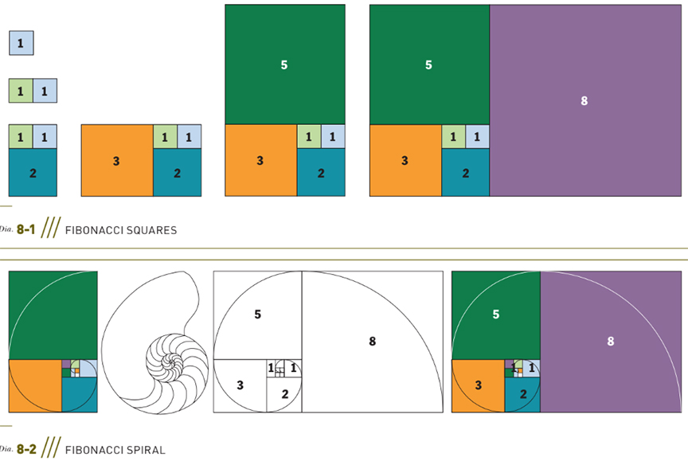
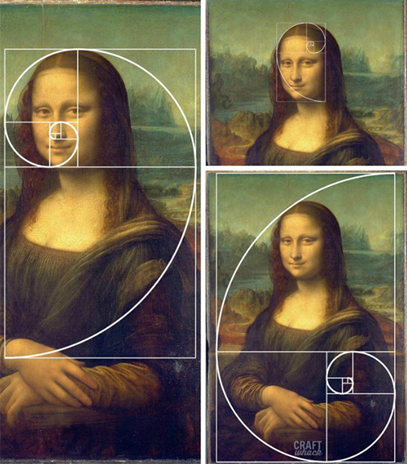
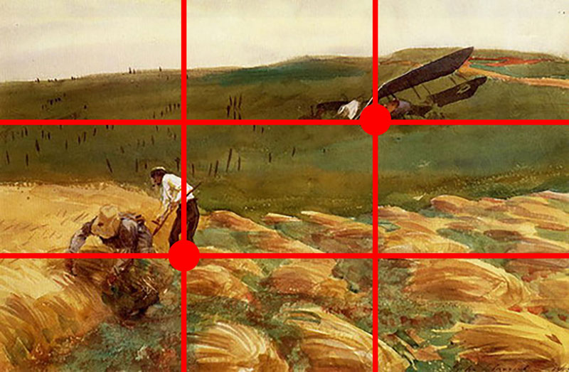
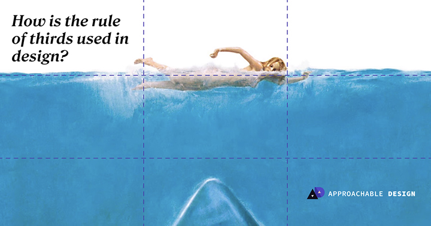
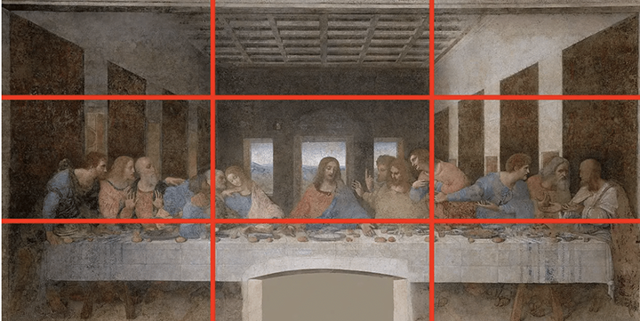
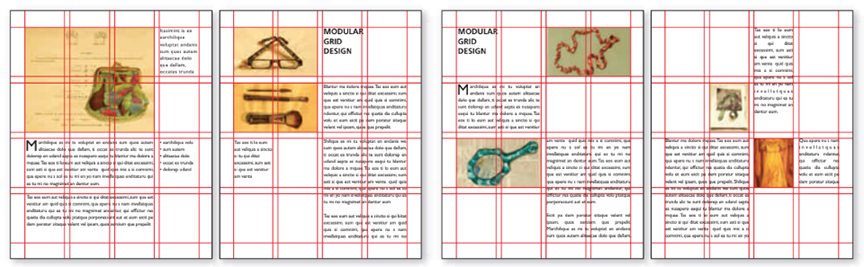
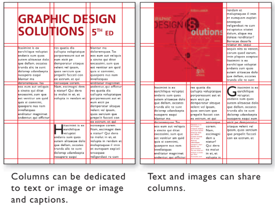

# Proportional Systems and the Grid
## Mathematical Ratios and Proportional Systems
- Artists, architects, and musicians have been interested in ideal proportions. 
- Some looked to math for a system of creating ideal proportions that could be applied to the visual arts, music, and architecture.
- Most designers prefer to rely on their learned and innate sense
of proportion. 
- Others employ graphic devices that can aid in establishing harmony, such as Fibonacci numbers or the golden section, among other proportional systems.
- ### Proportion
    Proportion is the comparative size relationships of parts to
    one another and to the whole. Elements or parts are compared
    to the whole in terms of magnitude, measure, and/or quantity.

    For designers, it is an aesthetic arrangement—a harmonious or
    agreeable relationship of parts or elements within a whole. Considered proportions are one main key to creating pleasing
    form.

    In design, harmony is agreement within a composition, where elements are constructed, arranged, and function in relation to one another to a congruent effect. Art critic John

    Ruskin said, “In all perfectly beautiful objects there is found the opposition of one part to another and a reciprocal balance.” Although Ruskin’s view bestows value on aesthetics and beauty, a designer can deliberately play with expected proportion in a composition with the goal of creating graphic impact that is not even remotely about beauty, yet still establish a balanced reciprocity among the graphic elements.
- ### Fibonacci Numbers
    The opposite corners of the squares yields a spiral that resembles many found in plants, seashells, and other forms in nature.

    
- ### The Golden Ratio
    In Western art, shapes or structures defined by or based on the
    golden section have been considered aesthetically pleasing by
    many artists, designers, and architects. For example, architect
    Le Corbusier used the golden ratio as the basis of his modular architectural system. The golden ratio is still used today in graphic design, fine art, and architecture. Graphic designers utilize the golden section for grid systems and page formats.

    
- ### Rule of Thirds
     

    The rule of thirds is an asymmetrical compositional technique
    often used by painters, photographers, and designers to create visual interest and balance. It involves overlaying the format with a grid and positioning or aligning the focal point or primary graphic elements of the composition along these grid lines or especially on the intersections of the grid lines. To employ the rule, the focal point is placed at one intersection.

    for example, and a counterbalancing secondary graphic element or accent placed at an opposing intersection. In a landscape, this often translates into placing the horizon line along one of the horizontal grid lines. This rule is also sometimes called the golden grid rule because the modules created by the grid roughly relate to the ratio of the golden section 

    In practice, the aim of the rule is to prevent the placement of the subject of an image at the center of a composition or to discourage placements that divide the image in half.

     

     

     

     
- ### Modularity
    In graphic design, modularity is a structural principle employed to subdivide a format into manageable smallerparts—that is, to handle content using modules. 

    A module is a self-contained, fixed unit that is combined with others to form a larger foundational structure composed
    of regular units. A module is also defined as any single fixed element within a bigger system or structure. For example, a
    unit on graph paper is a module, a pixel in a digital image is a module, a rectangular unit in a grid system is a module, and a
    fixed encapsulated chunk of a composition is a module.
    Modularity in the form of grids helps manage content as well as complexity (think of all the content on a government website). 

    Modularity has three main advantages: 
    (1) the underlying structure produces unity and continuity across a multipage application, 
    (2) the content within each module can easily be replaced or interchanged, and 
    (3) modules can be rearranged to create different zones or forms yet still remain unified.

    Modularity is also used to create modular alphabets, hand-lettering , typographic treatments, signage systems, symbol systems, pixel effects, or any modular-based imagery (for example, a transformation or sequence developed in modular units; figures composed of units).

## The Grid
A grid is a guide—a compositional structure made up of verticals and
horizontals that divide a format into columns and margins.

Grids underlie the structure of books, magazines, brochures, desktop websites, mobile websites, and more. As far back in history as 3000 b.c., we can see the use of a column structure in cuneiform writing in Mesopotamia as well as similar structures in hieroglyphics writing in Egypt. 

In the 1950s, Swiss designers adopted the grid as a structural design device. Their enthusiasm propelled the grid into popular use.

Grids organize type and images. They help you build pages,print or digital. If you have to organize the enormous amount
of content in any given newspaper, textbook, or corporate, government, museum, or editorial website, you would want some type of structure to ensure that readers would be able to easily access and read an abundance of information.

Imagine designing your daily newspaper using a spontaneous composition method. You would have to intuitively design
every page and then make sure each page had some resemblance to all the others while ensuring a sense of congruence
across all the pages. Certainly, you could compose spontaneously, but you would not meet a daily deadline. Not only does
a grid spare you the time of having to spontaneously compose
every page, but it also affords a skeletal structure that provides
continuity, congruence, unity, and visual flow across many print or digital pages.

- ### Single-Column Grid
A single-column grid structure tends to work well on the smaller size of mobile screens. 

When designing a site for both desktop and mobile screen, some designers draft the grid structures simultaneously so that they offer similar experiences. 

When designing for several screens—desktop, tablet, and mobile—some say best practice is to design the desktop website first. Others say to design the mobile grid structure first because it needs to have the simplest structure due to its diminutive screen. “Mobile devices require software development teams to focus on only the most important data and actions in an application,” .
- ### Multicolumn Grids
- ### Columns and Column Intervals
In any grid, the number of columns depends on several factors, mainly the concept, purpose, and how the designer wants to present the content. When using more than one column, columns can be the same width or vary in width. One or more columns can be dedicated to only text or only images or a combination thereof. The spaces between columns are called column intervals.
- A grid’s proportions and spaces provide a consistent visual appearance for a multipage format in print or on screen. A grid is a structural system that supplies an underlying unifying skeletal structure. It provides alignment.
- Multicolumn grids are used for desktop, tablet, and mobile
screens measured and designed in pixels. Nathan Smith cre-
ated the 960 Grid System (http://960.gs/), a web grid that is
960 pixels wide, which works well on a majority of screens. 
- A twelve-column grid has 60 pixel-wide columns, which yield column widths of 60, 140, 220, 300, 380, 460, 540, 620, 700, 780, 860, and 940. 
- A sixteen-column grid has 40 pixel-wide columns, which yield column widths of 40, 100, 160, 220, 280, 340, 400, 460, 520, 580, 640, 700, 760, 820, 880, and 940. Each column has 10-pixel margins on left and right, which yield 20 pixel-wide column intervals between columns (see http://www.thegridsystem.org/).

- ### Flowlines
- ### Grid Modules
- ### Spatial Zones
- ### Modular Grids

