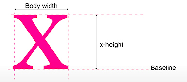

# Typography
### Type Measurement
For the screen, you can specify type measurement using points, pixels, percentages, or em units, which is a unit of measurement in typography. An em is defined as the width of the uppercase M in the parent face and point size; for example,in 14-point type, an em is a distance of 14 points. 
### Type Classification


### Type Selection
Before you choose a typeface, ```clearly define the audience, tone, personality and attitude``` of what you are trying to communicate and how you want to say it. 
#### Tips on Selecting a Typeface
- Select based on appropriateness for audience, design concept, message, communication requirements, and context.
- For large amounts of text, you need a highly readable typeface.
- select a typeface based on suitability for the purpose: editorial versus promotional versus branding.
- Notice the x-height of a typeface. A substantial or large x-height aids readability, especially on screen.

- ##### Check how a typeface looks across browsers.
    - See if the typeface is versatile.
    - Read reviews of the typeface and font.
    - For flexibility and unity, consider employing a type family. In a family, all the type maintains the same basic structure with variations, differentiated by slight individual characteristics.
    - Ensure sufficient value contrast between the typeface and the background.
### Design Concept
- Often, beginning students (and almost all nondesigners) choose typefaces for their novelty appeal rather than select a suitable
typeface to express the design concept. Every font carries meaning — ```historical, cultural, emotional — whether the designer intends it or not.```
   - Beginners tend to be attracted to typefaces that are decorative. ```They may also have little understanding of what a typeface connotes, of its history and classification.``` For example, choosing a typeface associated with a time period or style, such as art deco, carries historical and aesthetic meaning, even if you aren’t aware of it. Knowing type classifications and design history comes strongly into play when selecting a typeface. For example, would you use American
nineteenth-century wood type for a magazine article about the history of East Asia? Each typeface has a history, context, and classification — and using it communicates certain unspoken associations:   
   > Didot	18th-century French elegance	Luxury, fashion

   > Futura	Bauhaus modernism (1920s)	Clean, rational, modern

   > Cooper Black	1920s–70s Americana	Retro, friendly

   > Papyrus	Ancient Middle Eastern / exoticized	Overused, cliché
   
   > Wood Type	19th-century American posters	Frontier, Western, industrial

