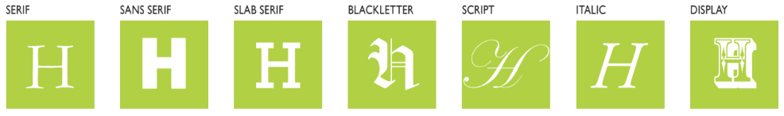
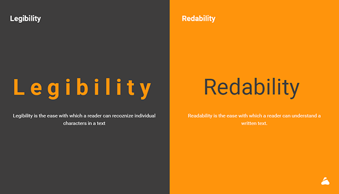

# Typography

<details>
  <summary>Type Measurement</summary>
For the screen, you can specify type measurement using points, pixels, percentages, or em units, which is a unit of measurement in typography. An em is defined as the width of the uppercase M in the parent face and point size; for example,in 14-point type, an em is a distance of 14 points. 
</details>

<details>
  <summary>Type Classification</summary>



</details>
  
<details>
  <summary>Type Selection</summary>
Before you choose a typeface, ```clearly define the audience, tone, personality and attitude``` of what you are trying to communicate and how you want to say it. 
#### Tips on Selecting a Typeface
- Select based on appropriateness for audience, design concept, message, communication requirements, and context.
- For large amounts of text, you need a highly readable typeface.
- select a typeface based on suitability for the purpose: editorial versus promotional versus branding.
- Notice the x-height of a typeface. A substantial or large x-height aids readability, especially on screen.

- ##### Check how a typeface looks across browsers.
    - See if the typeface is versatile.
    - Read reviews of the typeface and font.
    - For flexibility and unity, consider employing a type family. In a family, all the type maintains the same basic structure with variations, differentiated by slight individual characteristics.
    - Ensure sufficient value contrast between the typeface and the background.
</details>
  

### Design Concept
- Often, beginning students (and almost all nondesigners) choose typefaces for their novelty appeal rather than select a suitable
typeface to express the design concept. Every font carries meaning — ```historical, cultural, emotional — whether the designer intends it or not.```
   - Beginners tend to be attracted to typefaces that are decorative. ```They may also have little understanding of what a typeface connotes, of its history and classification.``` For example, choosing a typeface associated with a time period or style, such as art deco, carries historical and aesthetic meaning, even if you aren’t aware of it. Knowing type classifications and design history comes strongly into play when selecting a typeface. For example, would you use American
nineteenth-century wood type for a magazine article about the history of East Asia? ```Each typeface has a history, context, and classification``` — and using it communicates certain unspoken associations:   
   > Didot - 18th-century French elegance	Luxury, fashion

   
   > Futura - Bauhaus modernism (1920s)	Clean, rational, modern

   
   > Cooper Black - 1920s–70s Americana	Retro, friendly

   
   > Papyrus - Ancient Middle Eastern / exoticized	Overused, cliché

     
   > Wood Type - 19th-century American posters	Frontier, Western, industrial

   
### Readability and Legibility
   
With considerations of size, spacing, margins, color, and paper selection, contributes to readability. 
- Typefaces that are too light or too heavy may be difficult to read, especially in smaller sizes. Caution: Thin strokes are very difficult to see on screen and should be avoided for text.
- Typefaces with too much thick–thin contrast may be difficult to read if they are set very small—the thin strokes may seem to disappear.
- Condensed or expanded letters are more difficult to read (especially in small sizes). They can appear to merge together when condensed and dissociate when expanded.
- Text type set in all capitals is difficult to read. Opinions differ on whether all caps enhance or diminish readability for display type.
- Greater value contrast between type and background increases readability.
- Highly saturated colors may interfere with readability.
- People tend to read darker colors first.
### Integration with image
- Should the typeface share visual characteristics with the image?
- Should the typeface contrast with the characteristics of the image?
- Should the typeface be neutral (one that does not draw great attention to itself) and allow the image to drive the solution?
In such a case, the typeface would contextualize the image.
- Should the typeface dominate the solution? 
- Should the typeface carry the main communication with the image subordinate to it?
- Should the type and image operate collectively? (See Figure3-7)
- Would hand-drawn or handmade lettering or handwriting work best?
### Typeface Pairings
Being creative involves experimentation. Having guidelines or grasping standards allows you to critique your experiments.
Designers mix typefaces for conceptual, creative, and/or aesthetic reasons. 
There are general type rules for beginners and, perhaps, for any designer.
- #### Limit Mixing and Select for Contrast
   - Pair typefaces for distinction between display type and text type. 
      - The most common rule is to restrict designing to utilizing no more than two typefaces—one for display and one for text. 
      - For example, in print, mix a sans serif for display and a serif for readable text.
      - The obvious point of mixing faces is to add contrast, for differentiation 
      
      

      [fontpair](https://www.fontpair.co/)
      > In editorial design the type and image should coexist harmoniously, and one should never overpower the other. They should complement each other. Novice designers often select elaborate display typefaces that conflict with the image. A good selection of a serif and sans serif typeface that contain a corresponding italic is all that is needed
   - #### Select for Contrast and Variation
      > Serif Versus Sans Serif

      > Light Versus Bold
      
      > Regular Versus Condensed
   - #### Pair Complementary Typefaces
      > Select typefaces that have contrasting voices but similar x-heights — pair a soft voice with a bombastic voice.

      > Consider pairing a typeface with a linear quality with a typeface made from thick strokes. 

      > Consider pairing actual handwriting with an industrial typeface.
### Spacing
When setting type, whether it’s a big, two-word headline or a big,
two-hundred-page document, one of the most overlooked aspects
is the space between the letters, the words, the sentences and the
paragraphs. This is as important as which typeface you choose and
at what size you use it. Everyone can look at type and design with
it but it takes a real craftsperson to look at the negative space and
define the true relationship within the typography. Whether it’s
loose or tight, it has to be consistent and pleasurable, and it’s right
there, you just have to shift your attention.
                                             — Armin Vit
                                             UnderConsideration LLC
### Voice and Branding
- Make sure the typeface selection is appropriate for the brand or entity.
- Typeface selection can help differentiate a brand. (Caution:
Typefaces selected for a brand or group’s identity may
work in print but may not translate well to the screen—for
example, a modern classification with very thin strokes.)
- Any display typeface should support the logo, not fight with
it for attention. Maintain enough area of isolation (margins
of white space) around the logo.
- The typeface’s voice should enhance communication.
Variety
- As in print, a type family, extended family, or super family
offers a variety of weights and widths.
- Select type styles for weight and width contrast.
Selecting Typefaces for Screens
There are many typefaces for use on screen available for
dynamic download from the cloud. You can purchase web
fonts from reputable type foundries online. Many web font
purchases include a font for print as well.

