# Composition

<details>
  <summary>Fundamentals of Composition</summary>

- Creating visual interest and clarity of communication are two main goals of composition. 
- A formulaic design might be clear, but if it’s boring, no one is going to bother to look at it or spend time with it. Often, viewers will spend
more time trying to make sense of a message if the form of
a graphic design solution interests them. To create interest-
ing and comprehensible solutions, you need to develop keen compositional skills.
- Composition is the form, the whole spatial property and structure
resulting from the visualization and arrangement of graphic
elements—type and images—in relation to one another and
to the format, created with the intention to visually commu-
nicate, to be compelling, and to be expressive. 
- Composing is about how all the parts of your design work together — ```the visual organization of type and images in a graphic spatial arrangement.```
### The Format: Static Versus Active Composition
- Vertical and horizontal elements and movements parallel the edges of a rectangular or square format. 
- In static compositions,vertical and horizontal movements are emphasized. 
- In active compositions, diagonal or curved movements—directions that contradict or are in counterpoint to the edges of the format—
are emphasized. 
- Generally, compositions with dominating parallel movements are deemed more placid. 
- Compositionn with counterpointing movements are more active or tense;

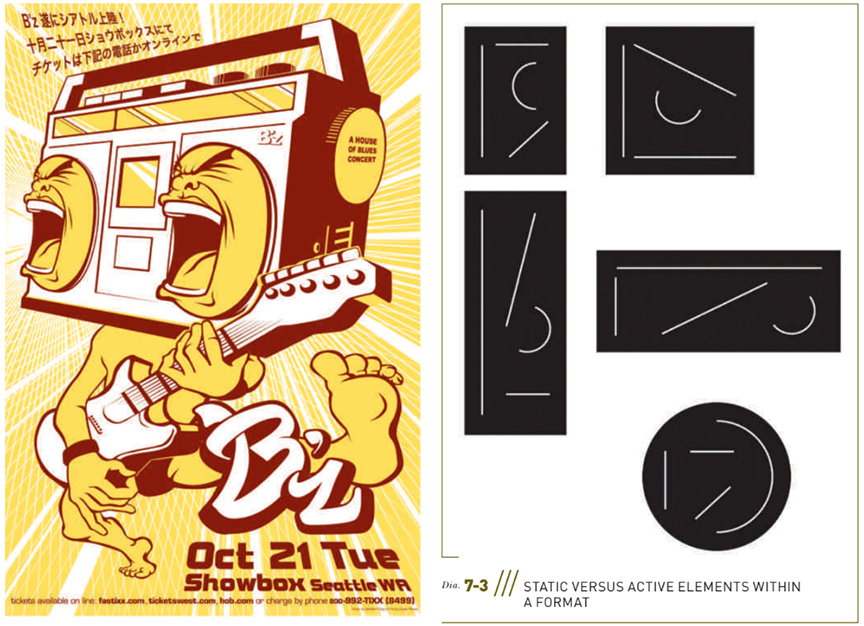
### Responding to the Edges of the Format
All visual elements must respond to (though not necessarily touch) the edges of the page. Not merely the end of the graphic space, a format’s boundaries fully participate in the
compositional structure.


#### Acknowledging the Midline
Envision an imaginary vertical line down the center of a page
(Diagram 7-4). As you position graphic elements, analyze how
each interacts with that midline. Do graphic elements cross the
midline? Approach the midline? How do the graphic elements
interrelate in the central space of the composition? Notice how
Figure 7-3 makes use of a prominent midline.

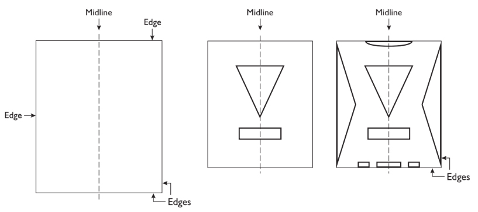
### The Format: Closed Versus Open Composition
- The terms closed and open refer to the way the graphic elements of a composition relate to the edges of a format. 
### Symmetrical Versus Asymmetrical Compositions
- Each static, single format has a vertical axis. 
- The equal distribution of visual weight on either side of the
vertical axis is the key to establishing balance (Diagram 7-5).
- In a symmetrical composition, corresponding (mirrored) forms are arranged on either side of the vertical axis. 
    - In general, balance achieved through symmetry yields stable and often static(as opposed to active) results. 
    - In an asymmetrical composition, arranging a balanced composition does not rely on symmetry. Forms are arranged to coun- terbalance each other without mirrored opposite visual weight and positioning. To achieve a balanced asymmetrical composition, you consider the position and visual weight (size, texture, color, value) of each graphic element in relation to the other and to the format. Asymmetry is not a formulaic approach to composition. Asymmetry often is more active due to its inherent variations, but it does not necessarily have more impact than symmetry.
- In asymmetrical compositions where complementary graphic elements are positioned in counterpoint, visual weight deliberations are strategic, not formulaic. To understand balancing a composition through counterpoint, think of every visual weight you position in a composition requiring a contrasting counterbalancing force strategically placed in the composition. 
- In design, counterpoint is the use of contrast or the interplay of graphic elements in a work simultaneously providing unity and variety. In any balancecomposition, if you move one graphic element, you will need
to reconsider the balance of the entire composition. (See Chapter 2 for more information on visual weight.)


### Balancing Forces
- Every graphic element positioned on a page con-
tributes to a potentially balanced action, to how opposing physical movements operate . 
- Think of these complementary balancing forces as simultaneous actions building stability, balance, and harmony
    - In and Out. Pulling forces inward, toward the vertical midline of the page, and forces expanding outward,toward the edges of the page.
    - Afferent and Efferent. Inward contraction from the outer edges to the core, moving from the edges to the focal point (the point of emphasis in a composition) and then back from focal point to the boundaries. (Not to be confused with actual radial composition where the composition radiates outward from a central point.)
    - Up and Down. Grounding (rooting) the elements down while simultaneously lifting them up; that is, considering how the composition flows from top to bottom and bottom to top and considering all the transitions in between.


</details>

<details>
  <summary>Illusion of Spatial Depth</summary>

- When you set out to compose on a two-dimensional surface, like a
screen or a piece of paper, you begin with the picture plane. As soon as you make one mark (draw a line, place a letterform, or any graphic element) on the surface, ```that mark interacts with the picture plane and perimeter of the format. ```
- ```The illusion of spatial depth means the appearance of three dimensional space, where some things appear closer to the viewer and some things appear farther away—just as in actual space. ```The illusion of spatial depth can be shallow or deep, recessive or projected. One diagonal line can evoke the illusion of depth.
- In “regular” or “Classical” compositions (Classical here refers to the Italian Renaissance; think Raphael [Raffaello Sanzio] and Leonardo da Vinci), none of the major forms appear to move in front of the picture plane. This can be called a “picture window” arrangement, where, like a window pane, all that we see recedes behind the front plane and does not move in front of the picture plane into the viewer’s space .
- In an “irregular” or Baroque pictorial space (referring to Flemish Baroque painting; think Peter Paul Rubens, or a comic book superhero’s fist punching in front of the picture plane), diagonal elements and planes move in front of as well as behind the picture plane creating the illusion of depth and action, suggesting an aggressive spatial property.

</details>

<details>
  <summary>Differentiation Through Grouping</summary>

- The Gestalt principles of perception—similarity, proximity, continuity, and closure—explain how people tend to understand what they see by grouping, by visually assembling images and how they relate to one another into groups.
    - ```Grouping``` is a fundamental Gestalt concept, proposing that
    when graphic elements appear similar—share characteristics,
    are arranged close together, are connected, or are enclosed in
    a common spatial area—people perceive them as belonging
    together. Groups can be formed in a variety of ways.
- If you understand how grouping functions, you can more easily create visual emphasis in a composition through differentiation. One graphic element can be emphasized, become the focal point, by differentiating it from the other graphic elements through contrast in size (scale), weight, color, rhythm, orientation, and more.
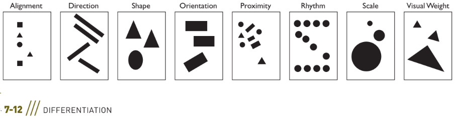

</details>

<details>
  <summary>Compositional Process</summary>

- ```Composing is a process where one achieves a desired result by repeating a sequence of steps and successively getting closer to that result.``` You can get there by spontaneous means, by using proportional systems or compositional structures. The compositional method you use depends on the project’s specifications and your own method of composing and visualizing.
- ```Composing is an iterative process. ```Iterations or revising (major and minor changes) usually happen at the same time as creating and producing. This means you are rethinking, revising as you work, which is part of the creative process of composing.
    - ```Spontaneous composing```: mostly unplanned visualization and structuring, with the design concept driving the visualizing and composing. In the process of creating, shaping, moving, improvising, and experimenting with graphic elements, while utilizing the principles of composition as well as relying on your intuition and insights into the
    creative process, you form a composition. This type of
    composing is usually for a single surface and therefore
    does not utilize formal structural devices or systems, such
    as a grid, which is necessary and utilized for multiple pages
    or screens. Spontaneous composing does rely on creative
    as well as critical thinking, creative impulses that result
    from a working knowledge of design principles and ardent
    experimentation. Many designers use creativity exercises to
    start the process, such as problem finding, free drawing/
    sketching, prompted sketching, unconventional methods,
    or any of the creativity exercises in this book. The best way
    is to start sketching, to think with a pencil, marker, or stylus
    in your hand. Sketching is thinking.`
    - If spontaneous composing is too open ended as a starting
    point, you can try sketching or experimenting using one of the
    following as preliminary creativity exercises:
    > Play with form: Use contrast. Create the illusion of three-
    dimensional space, movement, or sound. Exaggerate scale.
    Exaggerate near and far relationships. Manipulate images
    through synthesis or create a visual merge. Form unex-
    pected juxtapositions. Use abstraction.
    
    > Play with media: collage, photograms, photomontage,
    experimental materials, mixed media, painting, sculpture,
    3D illustrations, photography, sewing/stitching, weavings,
    rubbings/blottings, monotypes, printmaking, among
    many others.
   
    > Play with historical styles: Vienna Secession, Psychedelic, New
    Wave, among many others.
    
    > Sketch in the style of Alberto Giacometti, Honoré Daumier,
    Georges Seurat, Luca Cambiaso, Käthe Kollwitz, Willem de
    Kooning, Julie Mehretu, among many other fine artists.
    ### Composing for a Single Static Surface Format
- When composing for a single surface format such as a poster,
book or magazine cover, mobile ad, or website landing page or
ad (as opposed to multipage formats, such as book interiors or
websites), ```consider the roles and interrelationships of type and
images as a whole.```
#### Type-Driven, Image-Driven, and Visual-Verbal Synergy
Consider one of the following ways to drive the communication:
- Type-driven: emphasis on type and de-emphasis on images,
where type is the dominant force with images as secondary. Type can be the only component of such a solution.

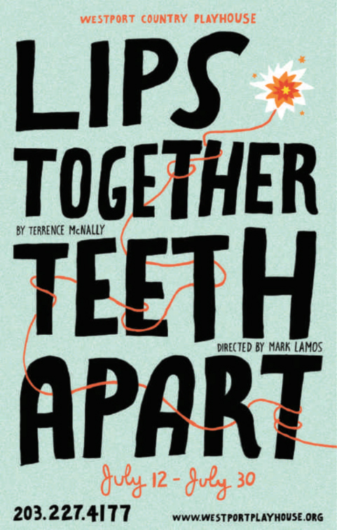
- Image-driven: emphasis on image and de-emphasis on type,
where image is the “hero” and type is subordinate to the
image. An image-driven composition can
have no text. In advertising, an image-driven ad with no
text is referred to as a no-copy solution.

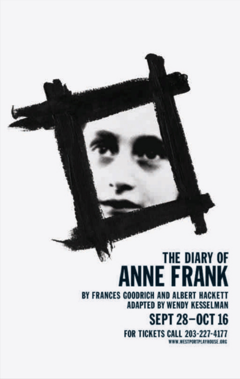
- Visual-verbal synergy: a synergistic relationship between verbal message (the title or headline) and the primary image.
This mode is a fundamental means for advertising design
and for book jacket design and posters.

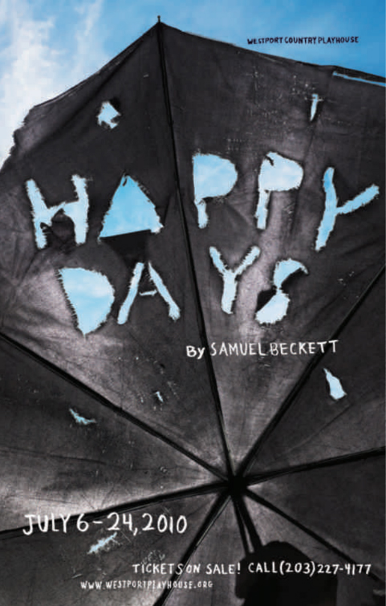

</details>

<details>
  <summary>Arranging Type and Image</summary>
When you compose type and image (the two main graphic
components), you arrange them to respond to one another and to the shape and edges of the format. 
> Will type and image be fused? 

> Will they appear next to one another not touching? 

> Will they touch? 

> Will type run across the image(s)? 
- ```Type and image are fused```: type is inseparable from the image,
often positioned inside the primary image, creating a
conjoined relationship. When type and image are fused,
there is an automatic relationship. When they are fused in
an organic, almost seamless, relationship, they appear and
operate as a single entity.
- ```Type runs across image```: type runs across the image(s). The
viewer reads the type while seeing the image behind it, as
if the type were on a pane of glass over the image. “Seeing”
both type and image simultaneously enhances the message; the type/image relationship is constructed this way
for the purpose of communicating in unison.
- ```Type is positioned outside the image or adjacent to the image```: type is not placed inside the main image, does not run over the
main image, but is placed outside the image within the
remaining pictorial space of the format. The type may also
be adjacent to the image.

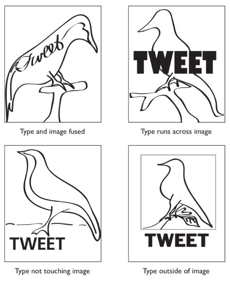
When type runs across an image, the relationship is evident
through touching one another. When type and image are not
fused or do not touch, their relationship must be arranged
through alignment and flow. 
- Consider how one leads to the other. 
- Consider size relationships; consider which element is dominant and which is subordinate. 
- Which is the focal point of the composition? 
- ```Do you want the viewer to see the type or image first?```

Designers who compose spontaneously optically seek naturally
inherent ways to align type and images. They find movements
within the graphic elements that can be paralleled or echoed
and prospect for occasions of sympathetic relationships among the forms where alignments could occur. 

Several basic alignments—flush left, flush right, centered, justified—help establish flow and unity. There are wraparound or edge or internal alignments as well.

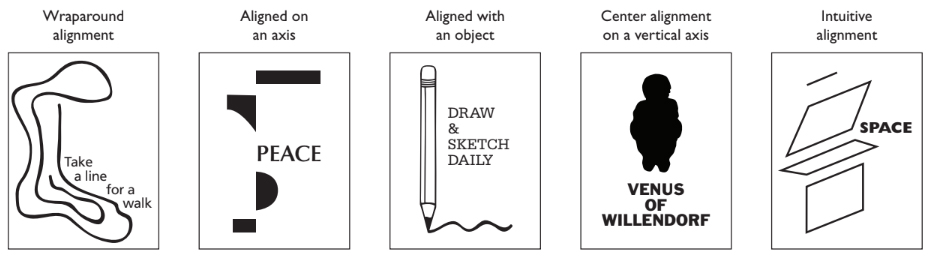

#### Integrating Type and Image
A line will take us hours maybe; Yet if it does not seem a moment’s
thought, Our stitching and unstitching has been naught.

A graphic design problem can be solved typographically or with images alone. But when type and images interact, thenyou have to determine how they will interact.
> Will the form of type and images share characteristics?
> Will the type and images work in opposition, be contrasted in style of visualization and/or form?
> Will the type drive the composition? Will the image drive the composition?
> Will the type and images be organically intertwined?
> Will they touch, overlap, be juxtaposed, fuse? Will they be words that incorporate images or be images that incorporate words?
> Will one be the star and the other the supporting player? To best explain type and image integration, let’s break it into
three categories.
### Supporting Partner Type and Image Relationship
- In the supporting partner relationship, a classic “neutral” type-
face works cooperatively with the image, which has the starring
role. (Designers, by far, employ this category most commonly.)
- For the sake of clarity and visual interest, the tendency is to
allow either type or image(s) to be the star, hero, or heavy lifter, with the other component acting in a more neutral fash-
ion, like a supporting actor. 
- In a design, type might be the well-chosen, sterile, blank slate,
and the visual “furnishes the room.” 
- If both type and image attract our attention due to equal prominence, then focus is diffused or lost. Here type is purposely understated in contrast to a strong visual statement, where, perhaps, the visual is the
“big idea.” 

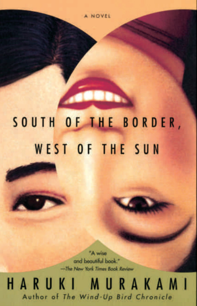
### Sympathetic Type and Image Relationship
- Type and images possess shared or similar characteristics, which produce harmony. The agreement in form enhances meaning. Type and image share apparent character and purpose. (This is the next most often employed category.)
- Congruence relies on agreement in shape, form, proportions,
weights, widths, thin/thick strokes, lines, textures, positive and
negative shapes, and time period. For example, ```type and image share characteristics```.

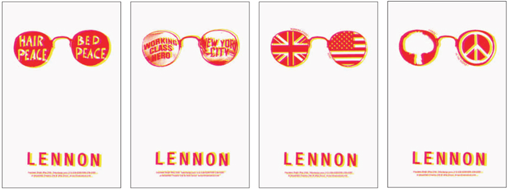
### Contrasting Type and Image Relationship
- There are two basic ways type and images work in contrast: complementary relationship or a formal ironic relationship.
    - Complementary relationship. Typeface or hand-drawn type is chosen to work in opposition to or in juxtaposition to images, relying on contrasts in shape, form, proportions, weights, widths, thin/ thick strokes, lines, textures, positive and negative shapes—for example, geometric versus organic, elegant versus rough, re- fined versus sloppy, detailed versus loosely rendered (such as adetailed linear illustration contrasted with sloppy huge type).
    
    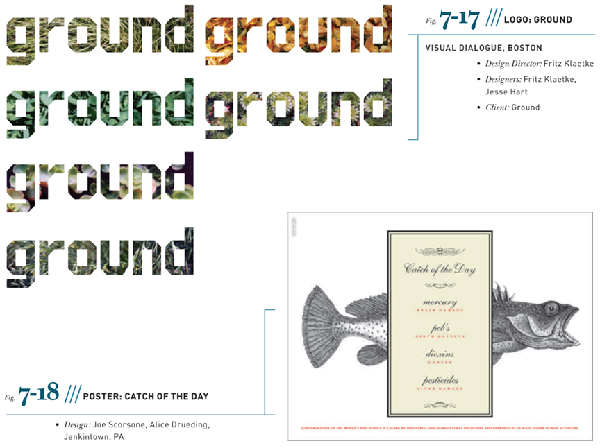
    - Formal ironic relationship. Typeface and image(s) are selected for incongruity, for an ironic effect

    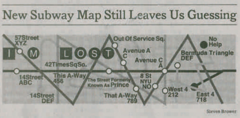
</details>

<details>
  <summary>Arrangement</summary>
In all two-dimensional design compositions—graphic design,
illustration, painting, or drawing—the viewer seeks a point of
entry into the graphic space, just as a visitor seeks a point of entry into an architectural space. The designer needs to construct visual cues about where to enter. Most people look at foreground elements first and try to find a way to enter thegraphic space.

This entry point can be the focal point (the largest or brightest or
key positioned element, or component with the greatest visual
weight, etc.), it can be a visual path created by white space, or
any number of other kinds of entry points. You must structure
space to facilitate the viewer’s comprehension (visual reading)
of the composition, his or her passage through the compositional space. 
    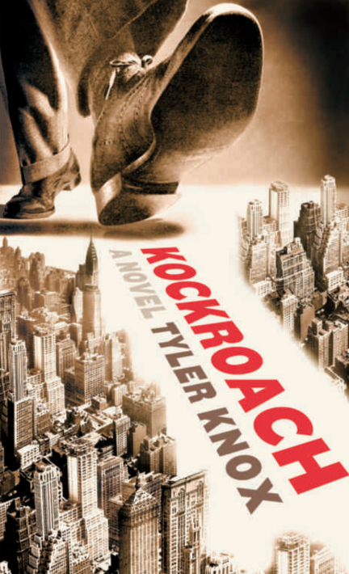

Eye-tracking studies (a method used to determine how peo-
ple’s eyes move, scan, and rest on a page) reveal how visitors
observe print, web banners, and websites. Besides the composi-
tion, there are many variables involved with how an individual
views and scans a single surface, including associative mean-
ing, time exposed to the design, personal attention span, and
distractions, among others.
</details>

<details>
  <summary>Guiding the Viewer</summary>

- #### Transitions
Preferred points of entry can be the focal point, the key graphic
element established through visual hierarchy, or a dominant
image (```people tend to prefer images over text```). 

Transitions are the key to creating a smooth visual flow from one graphic element to another throughout the composition. ```A transition is the passage or progression connecting one graphic element or movement to another in a design```. 

Often, the transition is white space or a subordinate element.

> Consider each and every interstice and every transition from
shape to shape, letter to letter, and visual component to type
component.

> If you focus on the interstices, spaces that inter-
vene between shapes and forms and type, then the entire com-
position will be appear organically related and taut. 

> To ```create visual passageways, employ negative space to direct
the viewer’s eyes``` . 

 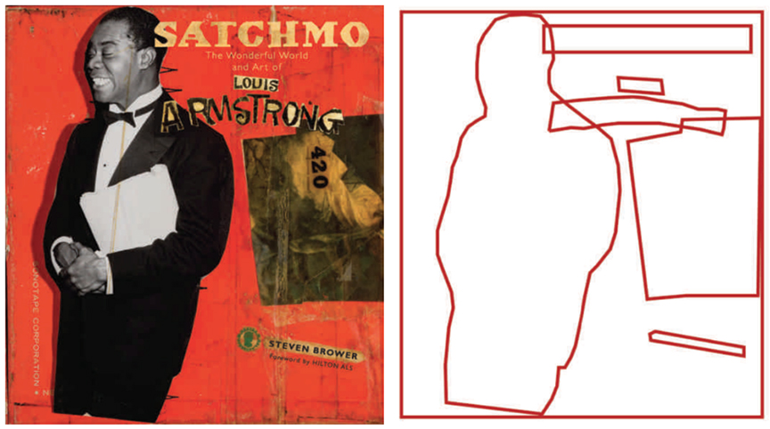
 - #### Continuity
You can help the viewer navigate through a composition with
continuity—one element directing your eyes to the next ele-
ment. Goals of composition are to create a visual flow from one
graphic element to another, to create continuity (visual paths)
as well as unity. There are arrangement strategies for produc-
ing continuity, composing the visual path and/or alignments
within a group of graphic elements to direct the viewer’s eyes
to the point of emphasis.

To produce agreement, keep in mind these factors:
- Position and orientation of the graphic elements can promote (or inhibit) visual flow.
- An articulate visual hierarchy with an apparent focal point will provide a point of entry; for example, a dominant title or headline or a dominant visual provides a point of entry.
- All directions must be considered: right, left, up, and down.
- Viewers tend to be drawn to the figure as opposed to the ground.
- Unity and balance contribute to visual flow.
- Repetition, parallel movements, and counterpointing movements contribute to guiding the viewer.
- Agreement throughout a website or app: A clear sense of place or geography created by consistent position of menus and graphic elements helps guide the viewer.
- Agreement across a spread: Determine the most advantageous way to bridge the gap of the gutter (the blank space formed by the inner margins of two facing pages in a publication).
- Agreement in a series: When designing for a series of individual but related units (for example, a series of brochures, a series of covers, related package designs), establish parameters to define a typographic system (palette and usage).

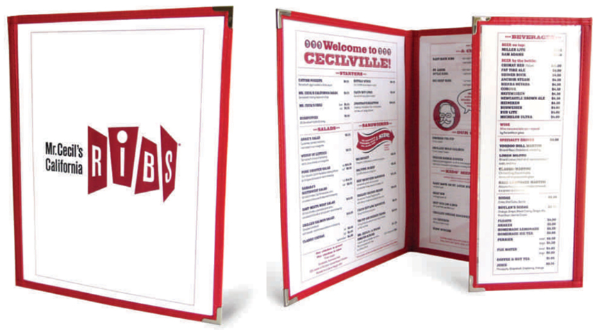
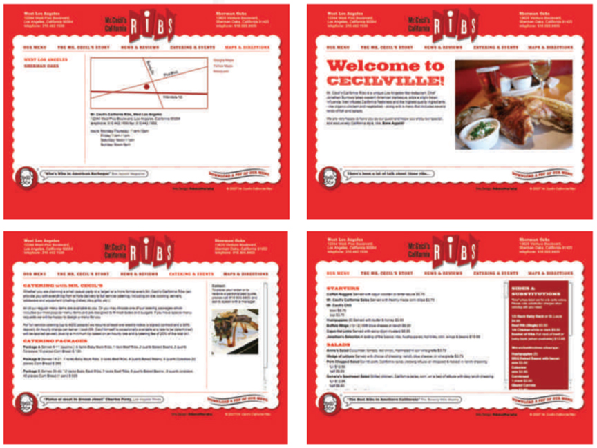

### Building Compositions 
- You can build a composition around one dominant visual(using size, shape, color, pattern, or value contrast), where all other graphic elements form relationships with that dominant visual. A dominant composition can be based on one major movement, gesture, or compositional thrust, with all other movements minor ones built in relation to it through optical decisions and adjustments.
- You can build a composition where there is no one overtly
dominant visual. Here relationships are built through sequence, pattern, grid, modular structure, repetition, stair
structures, axis alignment, edge alignment, positioning and flow, or some unifying principle. No graphic element dominates. This structuring concept applies to single surfaces, multiple surfaces, and motion graphics.
- You can build a static composition or one that suggests motion
or movement. A static composition represents a fixed position. It neither moves nor does it imply motion. The illusion of move-
ment can be created by a variety of means.
- A visual sequence is a number of items, graphic elements, or
events in an order that might imply the passage of time, interval, or motion over a period of time (duration). A sequence can be estab-
lished on a single surface, on sequential pages, or in motion
graphics. For example, a storyboard or comic graphic format
can visualize a sequence. Or when a reader turns a page, that
kinetic experience can be utilized to represent a sequence of
events over a short period of time. Certainly, motion graphics
and film are natural media for depicting sequence. 
- Sequential arrangements have a discernible specific order or
form a particular sequence. One graphic element or frame can
seem to be the consequence or result of the previous element
or frame. Sequential elements can also denote the illusion
of motion through visual multiplication. Multiple positions
(think a comic book rendering of a dog with many legs to
denote running), blurred boundaries or edges, repetition,
shifts, or layers contribute to the illusion of motion.

</details>


<details>
  <summary>Understanding Composition in Web Design</summary>

Web composition refers to how visual elements are arranged on a web page to create clarity, hierarchy, usability, and aesthetic balance. A strong composition helps users navigate content and engage intuitively with the site.

### Core Principles of Web Composition

**1. Grid System**
- Creates consistent alignment and spacing
- Helps maintain rhythm and structure
- Common systems: 12-column grid, baseline grid

**2. Visual Hierarchy**
- Guides the viewer’s eye from most to least important
- Uses size, color, spacing, and contrast
- Example: Headline > Subheading > Body text > Footer

**3. Whitespace (Negative Space)**
- Gives elements room to breathe
- Enhances clarity and elegance
- Prevents clutter and overload

**4. Balance and Symmetry**
- Symmetrical: Stable, formal, safe (e.g., portfolios)
- Asymmetrical: Dynamic, engaging, modern (e.g., creative studios)

**5. Focal Point**
- Clear visual entry point (e.g., hero image, call to action)
- Often larger or more colorful than surroundings

**6. Consistency**
- Typography, colors, and UI elements repeat consistently
- Supports brand identity and user recognition

### Recommended Visuals for Web Composition
Visual types to use for teaching and layout reference:
- Wireframe layout examples (mobile vs desktop)
- Grid overlays on existing websites
- Visual hierarchy diagrams
- Before/after layout improvements

### ✅ Summary
> “Good composition is invisible. It guides, balances, and brings clarity without calling attention to itself.”

A well-composed web page invites users in, helps them understand what to do, and reflects the brand’s tone — all without visual chaos.

 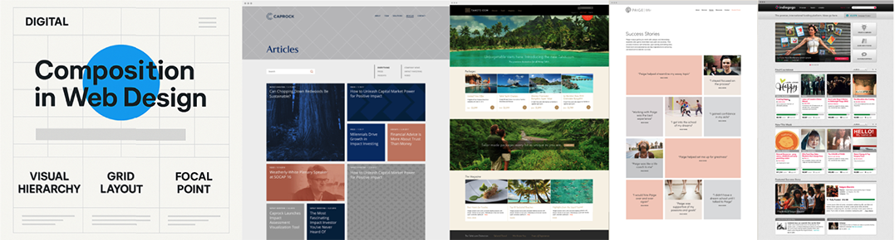

</details>