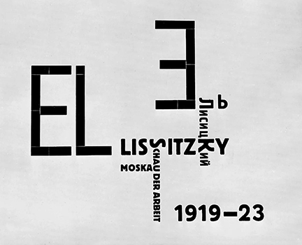
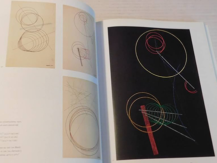
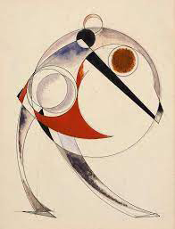
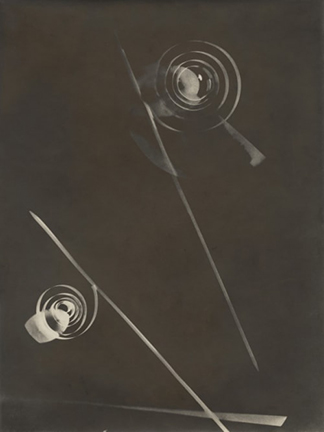

# Modern Art Movements Influence Graphic Design

This guide explores the influence of **11 key modern art movements** on the evolution and application of graphic design in areas like branding, user interface, motion graphics, and visual identity systems.

---

## Constructivism
- **Origin**: Russia, early 20th century
- **Core Ideas**: Functionalism, industrial aesthetics, bold geometry
- **Impact**: Grid systems, modular layout, typographic posters

### Constructivism Influence Graphic Design 
Constructivism is a design and art movement that originated in Russia in the early 20th century. It is known for its geometric abstraction, functional aesthetics, and use of industrial materials. In design art, Constructivism focuses on structure, utility, and bold visual communication. Here's a breakdown of its design methods and key principles:

  
Key Design Methods in Constructivism

### Geometric Composition
- Uses straight lines, circles, rectangles, and dynamic diagonal elements.
- Avoids decorative flourishes—focuses on order and clarity.

### Asymmetry and Visual Tension
- Rejects classical balance; instead, it uses asymmetrical layouts to create dynamic energy.
- Diagonals, overlays, and non-centered elements are common.

### Limited Color Palette
- Often uses primary colors (red, blue, yellow) with black, white, and gray.
- Colors are used for structural or symbolic emphasis, not decoration.

### Typography as Structure
- Type is treated as a visual element, not just text.
- Uses bold sans-serif fonts, vertical/horizontal text, and diagonal text placement.
- Words become part of the visual grid, often interacting with shapes.

### Photomontage and Mixed Media
- Combines photographs, cutouts, and graphic elements.
- Emphasizes social messages, industrial progress, and propaganda-like clarity.

### Function Over Form
- Design must serve a social or practical purpose—not just aesthetics.
- Posters, books, exhibitions, and architecture were intended to educate or mobilize.

### Grid and Modularity
- Underlying grid systems organize content.
- Repeated modular elements reflect mechanical, mass-production ideals.

  
Example Influences

- ### El Lissitzky: 
Pioneer in merging art with graphic design through “Proun” compositions.

- ### Alexander Rodchenko: 
Known for typographic experiments and photomontage.

- ### László Moholy-Nagy (Bauhaus): 
Influenced by Constructivist ideas, brought them into modern design.

  
Constructivism in UI/UX Design

  - #### Clarity and Functionality First
    - Constructivism prioritizes utility over decoration—this aligns well with usability heuristics in UI/UX (e.g., simplicity, visibility of system status, user control).
    - Its clear visual hierarchy helps users scan and act quickly.

  - #### Grid Systems and Layout
    The rigid, modular structure of Constructivist design maps beautifully to responsive grid systems in modern web/app design.
    Enables predictable yet flexible layouts.

  - #### Bold Typography
    - Typography as a graphic and functional tool resonates with call-to-action (CTA) design and accessibility.
    - Diagonal or asymmetrical placement can guide attention creatively without sacrificing legibility.

  - #### Visual Impact
    Constructivism’s bold contrast and geometric shapes can make interfaces feel modern and sharp, especially in minimal or brutalist digital aesthetics.

  
Constructivism in AI-Driven UI/UX Design

  
  - #### Data-Driven Composition
    Constructivism thrives on intentional visual logic—this pairs well with AI-personalized layouts, where content rearranges based on user behavior but remains grounded in geometric order.
  - #### Explainability & Trust
    - In AI interfaces (e.g. chatbots, recommendation systems), users must trust and understand the output.
    - A Constructivist design can frame AI responses clearly with structured layouts, clean typography, and non-ambiguous iconography.
  - #### Ethical Minimalism
    Constructivist minimalism can combat UI “dark patterns” often found in AI interfaces by encouraging honest, functional interactions.
  - #### Visual Language for Machine Logic
    - The visual style of Constructivism mirrors algorithmic patterns—grids, modular repetition, bold segmentations—which can visually represent how an AI “thinks.”
    - Helpful in AI dashboards, explainable AI (XAI) tools, or data visualization interfaces.

  #### Potential Challenges

Too much Constructivist rigidity might limit playful, soft, or emotion-driven UI, which some modern AI products aim for (e.g., wellness, journaling apps). Must adapt for accessibility—bold contrast is great, but diagonal text and extreme asymmetry may challenge screen readers or users with dyslexia.

  
Constructivism Influence

  Constructivism is a foundational design movement that influenced many other modern design styles — both directly and indirectly.

  

  
Core Styles That Belong to or Evolved from Constructivism

  #### 1. Bauhaus (Germany, 1919–1933)
  - Directly influenced by Constructivism
  - Combined industrial design, architecture, and graphic arts 
  - Geometric, minimal, functional
  - “Form follows function” became a key modernist principle
  - Shared roots: Grid, abstraction, purpose-driven aesthetics

  #### 2. De Stijl (Netherlands, 1917–1931)
  - Founded by Theo van Doesburg & Piet Mondrian
  - Pure abstraction, primary colors, vertical/horizontal geometry
  - Influenced modern architecture and design systems
  - Shared roots: Rational form, visual reduction, utopian ideals

  #### 3. Swiss Design (International Typographic Style) (Switzerland, 1950s–1970s)
  - Evolved the Constructivist grid into corporate visual identity systems
  - Used type, photography, and layout with clarity and neutrality
  - Major influence on modern UI/UX
  - Shared roots: Grids, sans-serif typography, order, function

  #### 4. Brutalist Graphic Design (Modern revival, 2010s–now)
  - Inspired by the architectural Brutalism rooted in post-WWII minimalism
  - Harsh, blocky forms; minimal styling; raw functionality
  - Seen in websites like Cargo or experimental portfolios
  - Shared roots: Anti-decorative, structure over surface, ideological clarity

  #### 5. Neo-Constructivism (Contemporary reinterpretations)
  - Seen in poster design, motion graphics, political visual art
  - Abstract geometry, bold color blocking, and activist energy return in new media
  - Shared roots: Visual propaganda aesthetics, striking diagonals, type-as-structure

  #### 6. Modernist Corporate Identity Design (1950s–1980s)
  - Think: IBM, Lufthansa, NASA (Massimo Vignelli, Paul Rand, etc.)
  - Grids + minimal forms + universal logic
  - Heavy Constructivist influence in building visual systems
  

  
  

  
Constructivism (Russia/Soviet Union, 1920s–30s)

  
- #### Philosophy:
  - Functionalism + political activism
  - Art must serve the needs of society — art for the people
  - Deeply tied to revolutionary ideals (communism, socialism)
  - Form follows function — no luxury, no decoration
- #### Visual Style:
  - Geometric abstraction: circles, lines, triangles
  - Diagonal layouts, dynamic compositions
  - Photomontage (cut-and-paste photography + bold text)
  - Strong red and black color schemes
  - Tall, narrow sans-serif or blocky fonts
-  #### Purpose:
  - Political propaganda
  - Posters for workers, industry, revolution
  - Bring design into architecture, theater, film, everyday life
  

  
Dutch Design (Netherlands, late 20th century → today)

  
  Dutch Design is globally respected for its clarity, bold experimentation, and concept-driven approach. 
  Dutch Design refers to a design philosophy and movement that originated in the Netherlands—especially after the 1990s. It spans across graphic design, product design, architecture, and even digital media.

  - Minimal but Conceptual - Strong focus on idea and concept behind the design—less decoration, more message.
  - Experimental & Playful - Willing to bend rules—odd typography, asymmetry, unexpected layouts.
  - Systematic - Deep roots in grid-based design and modularity, often influenced by De Stijl (e.g., Mondrian).
  - Critical / Social - Dutch designers often question social issues through design—design as commentary.
  - Flat, Clear, Bold Typography - Often uses Helvetica, Univers, or strong sans-serif typefaces in clever ways.
- #### Philosophy:
  - Concept-driven: The idea or message is more important than decoration.
  - Strong emphasis on clarity, logic, and innovation.
  - Often playful, ironic, or experimental — even minimalistic.
- #### Visual Style:
  - Clean, modular grids, Flat colors, geometric shapes
  - Clean lines with unexpected layering or asymmetry
  - Use of negative space and precise layout
  - Abstract, structured, and always idea-driven
  - Bold color fields (red, blue, yellow + black/white) — influenced by De Stijl
  - Bold, flat typography (often sans-serif)
  - Typography as form (letters become part of layout rhythm)
  - Focus on visual communication in modern society (posters, books, branding, UI)
- #### Purpose:
  - Express abstract concepts clearly
  - Innovate in design systems
  - Often connected to social commentary, art, or government identity
- #### Example Influences
  - Wim Crouwel - "Gridnik" – strong grid systems, digital-feeling layouts before the digital era
  - Irma Boom - Experimental book design, uses blank space and visual storytelling
  - Studio Dumbar - Vibrant visual identities for government and tech (often motion-based)
  - Droog Design - In product design—reimagining everyday objects with wit and irony

- #### How Dutch Design Emerged from Constructivism
  - Constructivism’s use of geometry and type -	Adopted by De Stijl (e.g., Mondrian, Theo van Doesburg) — clean lines, primary colors, grid
  - Constructivist message-driven design - Dutch designers became known for conceptual, idea-first design
  - Constructivist layout & tension	- Dutch design often plays with asymmetry, rhythm, and clever abstraction (think Studio Dumbar, Experimental Jetset)

  
 Swiss Design

  Swiss Design, also known as the International Typographic Style, is one of the most influential movements in modern visual communication — and it can deeply inform your minimal, geometric, and clever design voice.

  Swiss Design emerged in Switzerland in the 1950s. It emphasized clarity, readability, and grid-based structure, and it became the foundation for modern graphic design, UI, and branding systems worldwide.
  
  ####  Core Principles of Swiss Design
  - Grid Systems - Everything aligns to a modular grid — creating balance and harmony
  - Sans-serif Typography - Neutral, clean fonts (Helvetica, Univers) used with strict hierarchy
  - Asymmetrical Layouts - Balance achieved through space and rhythm, not symmetry
  - Photography Over Illustration -	Realism and objectivity were emphasized (less ornament, more fact)
  - Minimal Use of Color - Often black, white, red (Swiss flag influence), or muted palettes
  - Function Over Style -	Design is about communication, not decoration

  #### Famous Swiss Designers
  - Josef Müller-Brockmann - Posters, grid theory, and book: Grid Systems in Graphic Design
  - Armin Hofmann -	The “Swiss School” in Basel, influential design educator
  - Max Bill - Architect, artist, and designer who integrated Bauhaus into Swiss modernism

  #### How Swiss Design Emerged from Constructivism
  - Constructivist use of grid and alignment - Swiss design formalized this into precise modular grid systems
  - Constructivist type hierarchy	Swiss designers developed type as structure (e.g., Müller-Brockmann’s posters)
  - Constructivist objectivity	Swiss design removed emotion, emphasizing clarity and neutrality
  

  
Modernist Corporate Identity Design (1950s–1980s)

  Modernist Corporate Identity Design from the 1950s–1980s was a golden era in branding — where Constructivist and Swiss design principles became global business standards. These identity systems shaped how modern companies look and communicate even today.

  A visual and strategic approach to brand design based on:
  - Clarity
  - Simplicity
  - Modular grid systems
  - Consistent visual rules
  - Universal, timeless design
  - This era saw design become a business tool, not just decoration.

  #### Design Philosophy
  - "Form follows function" - Design should serve communication, not express personal style
  - Systematic thinking - Identity = rules, not just a logo
  - Neutral type + grid - Often Helvetica, Univers; layout based on math
  - Visual consistency - Logos, signage, print, uniforms, vehicles — everything connected
  - Timelessness over trend - Design should survive decades of use 

  #### Famous Manuals and Legacy
  - NASA Graphics Manual: Danne & Blackburn	Showed how every element was ruled by logic
  - Lufthansa Design Manual: Otl Aicher	A bible of typography, spacing, signage, and tone
  - NYC Subway Manual: Unimark International	Grid + type (Helvetica) turned into a global system
  - MIT Press Identity	Muriel: Cooper	Abstract logo system with perfect alignment to grid

  #### Tools and Components
  - Logo: Geometric, usually black & white or primary colors
  - Typography: Helvetica / Univers / Akzidenz-Grotesk
  - Grid System: Baseline for everything: layouts, documents, signage
  - Color: Rational palettes with 1–2 dominant accents
  - Icons: Created from the same geometric foundation
  - Manual/Guidelines:	Printed rulebook (identity bible) with specifications for every use case
      

### Constructivist Applications in Design
- Posters (especially propaganda): strong use of typography and bold forms.
- UI & Web Design: blocky navigation, rigid structure, and grid-based layouts.
- Logos & Branding: minimalist, symbolic, and geometry-driven marks.
- Exhibition Design: emphasis on structure and interactive presentation.

## Bauhaus
- **Origin**: Germany, 1919–1933
- **Core Ideas**: Form follows function, integration of art and industry
- **Impact**: Clean interfaces, sans-serif typography, product design influence

## De Stijl (Dutch Modernism)
- **Origin**: Netherlands, 1917–1931
- **Core Ideas**: Universal harmony through abstract geometry and primary colors
- **Impact**: Rigid grid systems, brand modularity, asymmetrical balance

## Swiss / International Typographic Style
- **Origin**: Switzerland, 1950s
- **Core Ideas**: Objectivity, clarity, use of grid and sans-serif type
- **Impact**: Corporate identity, UX design systems, information hierarchy

## Pop Art
- **Origin**: UK & USA, 1950s–60s
- **Core Ideas**: Mass culture, irony, bold color
- **Impact**: Eye-catching visuals, playful UI, marketing design

## Lyrical Abstraction
- **Origin**: USA, post-WWII
- **Core Ideas**: Emotion, spontaneity, gestural painting
- **Impact**: Expressive branding, textured motion design, emotional resonance

## Cubism
- **Origin**: France, early 20th century
- **Core Ideas**: Fragmented perspective, flattened space
- **Impact**: Collage layouts, overlapping UI, editorial experimentation

## Abstract Art
- **Origin**: Early 1900s–present
- **Core Ideas**: Non-representational form, emphasis on line/shape/color
- **Impact**: Visual rhythm, AI-generated backgrounds, branding emotion

## Color Field Painting
- **Origin**: USA, 1950s
- **Core Ideas**: Meditative color planes, spiritual minimalism
- **Impact**: Gradient-based UIs, soft ambient interfaces

## Minimalism
- **Origin**: 1960s USA/Japan
- **Core Ideas**: Reductionism, simplicity, purity of form
- **Impact**: Clear navigation, whitespace, type hierarchy

## Conceptual Art
- **Origin**: 1960s–present
- **Core Ideas**: Ideas over visuals, language as medium
- **Impact**: Narrative UX, onboarding design, brand storytelling

## Summary
Modern art movements shaped how we:
- Use grids and typography
- Design visual systems and layouts
- Create emotional, conceptual, or generative graphics
- Combine aesthetic clarity with functional purpose

They continue to inspire how designers bring **emotion + logic** to digital and visual communication today.
