# Graphic Design: Formal Elements & Principles of Design
## Formal Elements   

<details>
  <summary>Point, Line, Plane</summary>

#### line
- The basic functions of lines include: ```Define shapes, edges, forms; create images, letters, and patterns```
- Delineate boundaries and define areas within a composition
- Assist in ```visually organizing a composition and creating a line of vision``` 
- Can establish a linear mode of expression, a linear style
- When line is the predominant element used to unify a composition or to describe shapes or forms in a design (or painting), the style is termed ```linear```.

    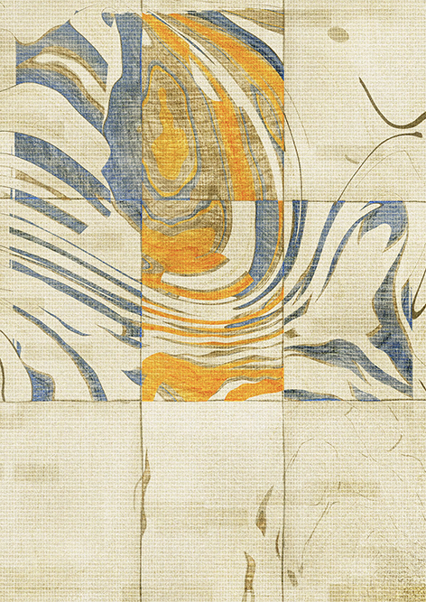
#### Space and Volume

 ```Point and Line```: Physical and Digital In the lettering experiments shown here, each word is written with lines, points, or both, produced with physical elements, digital illustrations, or code-generated vectors. 

  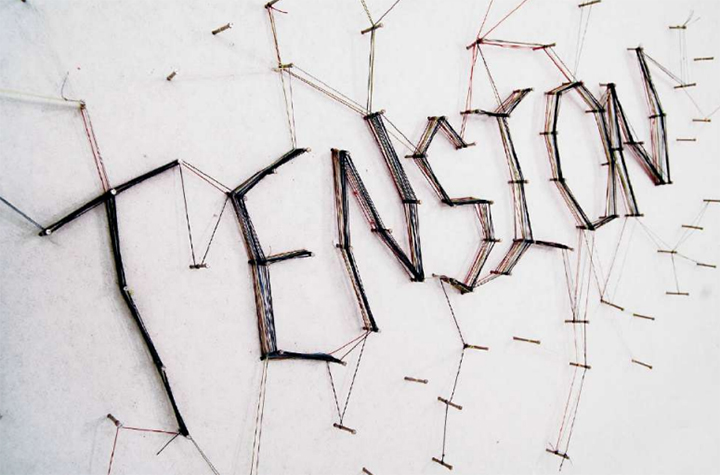

 ```Three Objects```: Thirty-Three Ways This comprehensive design project encourages designers to observe, represent, and abstract visible objects using a variety of materials and techniques. Designers begin by visiting an unusual place with surprising things to see and observe, such as a local museum, aquarium, or botanical garden. They produce a substantial number of observational drawings of three objects, paying special attention to the appearance of form, color, texture, and materials. Careful observation is followed by exercises in creating word lists and drawing from memory to create a total of ninety-nine studies. The project exposes designers to the iterative design process, building individual capacity for patience, endurance, and an open mind. 

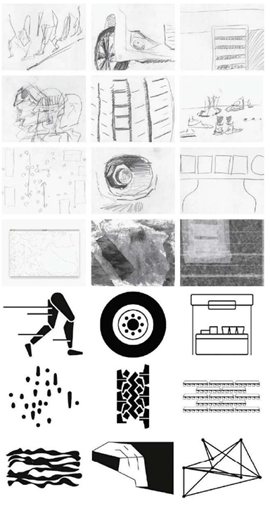

 ```Spatial Translation```:
In this project, designers explore point, line, and plane as tools for
expression. They immerse themselves in a space and observe it
from multiple points of view, including different vantage points
(above, below) and different psychological orientations (as a male, a
female, a giraffe, a shrimp, etc.). Participants generate images of
their chosen spaces in diverse media, including photography,
drawing, painting, printing, collage, or video. Representations can
be literal, abstract, iconic, indexical, or symbolic. After gathering
their initial observations, designers create a series of
representations using dot stickers, tape, and cut paper. The final
application is a sequence of ten images suitable for an accordion
fold book.

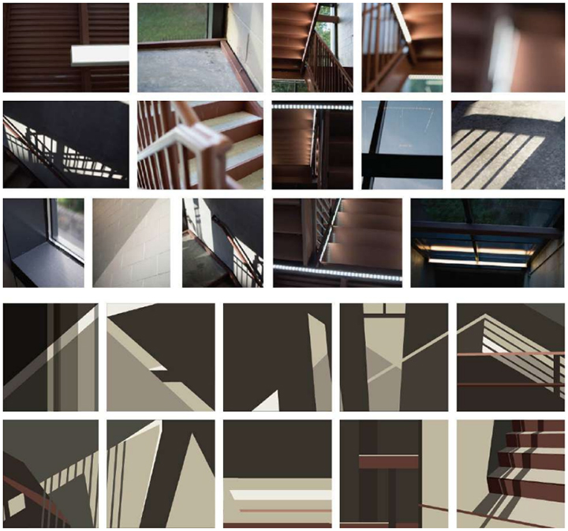
</details>

<details>
  <summary>Shape</summary>

- A ```curvilinear shape```, organic, or biomorphic shape is formed by curves or dominating marked flowing edges,which seems to have a naturalistic feel. It may be drawn precisely or loosely.
- An ```abstract shape``` refers to a simple or complex rearrangement, alteration, or distortion of the representation of natural appearance used for stylistic distinction and/or communication purposes.
- A ```representational shape``` is recognizable and reminds the viewer of actual objects seen in nature; it is also called a figurative shape.
- ```Figure(positive space)/Ground(negative space)``` The figure or positive shape is a definite shape, immediately discernible as a shape. 

 
- ```Interwoven Space``` Designers, illustrators, and photographers often play with figure/ground relationships to add interest and intrigue to their work. Unlike conventional depictions where subjects are centered and framed against a background, active figure/ground conditions churn and interweave form and space, creating tension and ambiguity.

 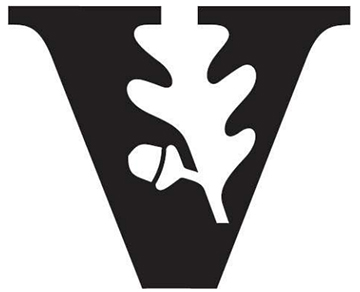
  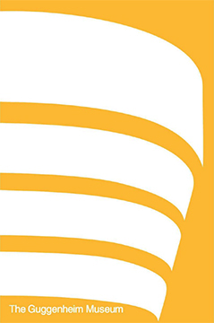
- ```Concept Sketching```
Fast, informal visualizations allow designers to explore different
figure/ground relationships in a low-risk environment that fosters
invention and discovery. While verbalizing ideas helps designers
build a bank of potential concepts, sketching pushes these ideas
closer to reality. Multiple sketches yield a more valuable process
than single sketches, as drawings begin to speak to one another,
opening the mind and eye to new connections.

 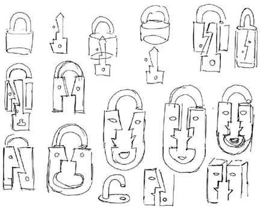
  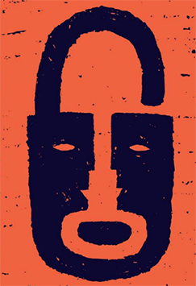
    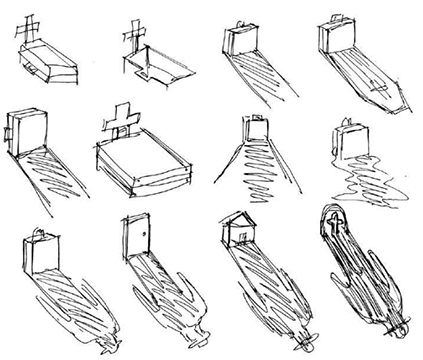
      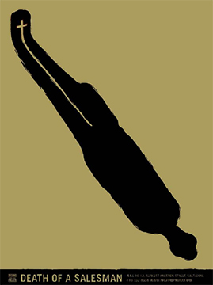
- Letterform Abstraction In this introduction to letterform anatomy, students
examined the forms and counterforms of the alphabet in many font variations,
eventually isolating just enough of each letter to hint at its identity. Each student
sought to strike a balance between positive and negative space. 

  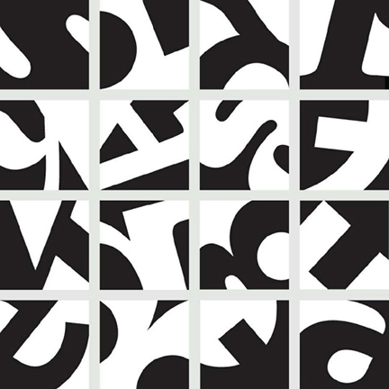
</details>

<details>
  <summary>Color</summary>

  Color can convey a mood, describe reality, or codify information. Words like “gloomy,” “drab,” and “glittering” each bring to mind a general climate of colors, a palette of relationships. 

  Designers use color to make some things stand out (warning signs) and to make other things disappear (camouflage). Color serves to differentiate and connect, to highlight and to hide.

  According to the classical tradition, the essence of design lies in linear structures and tonal relationships (drawing and shading), notin fleeting optical effects (hue, intensity, luminosity). Design used to be understood as an abstract armature that underlies appearances. Color, in contrast, was seen as subjective and unstable.And, indeed, it is. Color exists, literally, in the eye of the beholder. We cannot perceive color until light bounces off an object or is emitted from a source and enters the eye.

  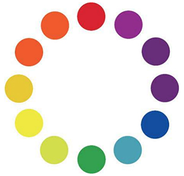 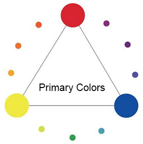    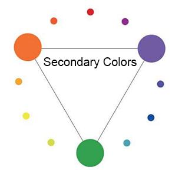

  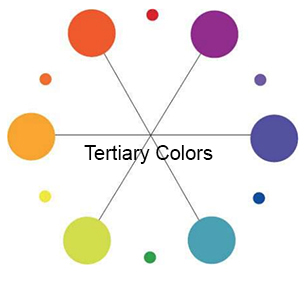   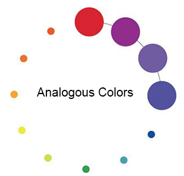     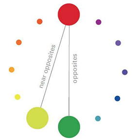

  - ```Secondaries and Complements``` This series of posters is produced with complements (orange + blue) and two secondary colors (orange + purple). Mixes and gradients provide the steps in between. 
  
  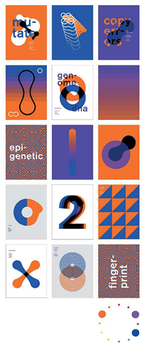
  


  ### Interaction of Color
  - Designers juxtapose colors to create specific climates and qualities, using one color to diminish or intensify another.
  - Understanding how colors interact helps designers control the power of color and systematically test variations of an idea.
    - ```One Color, Different Effects``` The neutral tone passing through these three squares of color is the same in each instance. It takes on a slightly different hue or value depending on its context.

      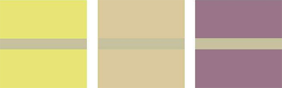

    - ````Bezold Effect``` Johann Friedrich Wilhelm von Bezold was a German physicist working in the nineteenth century. Fascinated with light and color, he also was an amateur rug maker. He noticed that by changing a color that interwove with other colors in a rug, he could create entirely different results. Adding a darker color to the carpet would create an overall darker effect, while adding a lighter one yielded a lighter carpet. This effect is known as optical mixing.

      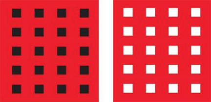

    - ```Vibration and Value``` When two colors are very close in value, a glowing effect occurs; on the left, the green appears luminous and unstable. With a strong value difference, as seen on the right, the green appears darker.

      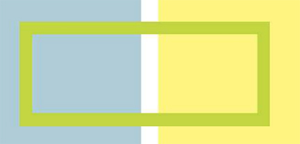

    - ```Black + One``` The yellow is deep enough to allow the white type to read against it.

      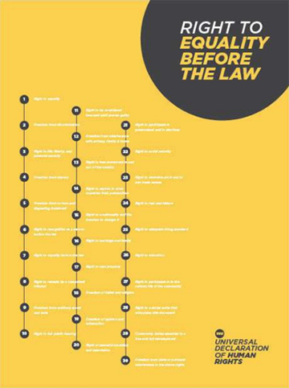

    - ```Black + Two``` The warm salmon red and cool greenish blue bring a satisfying sense of completeness to the palette. 

      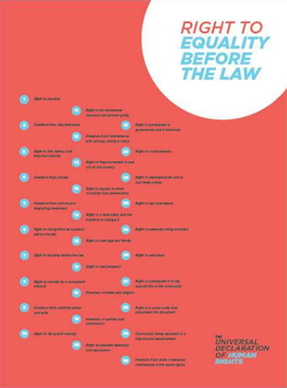

    - ```Black Is a Color``` This interface uses a minimal color range to convey simple actions. Used richly and forcefully, the black and gray tones become full-fledged actors within the color palette.

       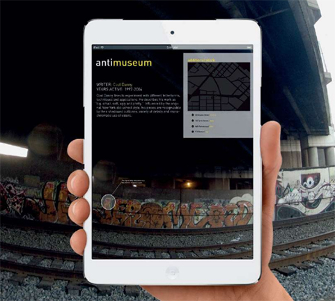 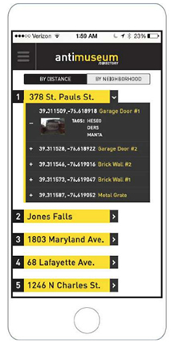
    
    - ```Monochrome``` A single shade of blue expresses a no-nonsense attitude in this branding project. Lighter shades of blue and mixtures of blue and black express a broad range of tonality within a limited spectrum.

      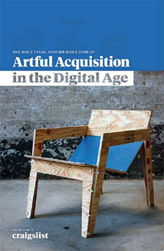 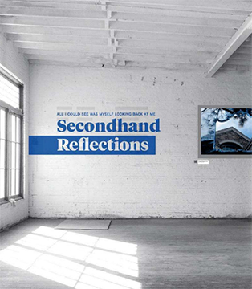 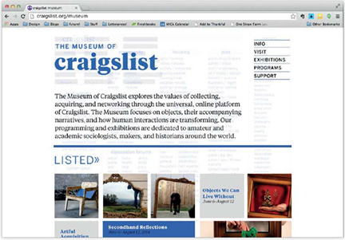

    - ```Hard Light``` This museum identity contrasts an intense, cold blue with pure red to reference the RGB color space. 

      
    
    - ```Hot and colds```Simple primary colors serveas a background for black and white typography.

      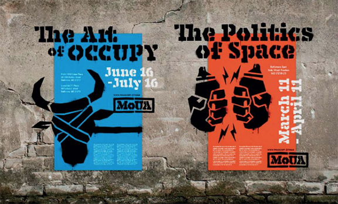

    - ```Analogous Naturals``` The three colors that make up the palette of this museum branding project come from positions located near each other on the color wheel. The gently muted, desaturated hues convey an organic quality. 

      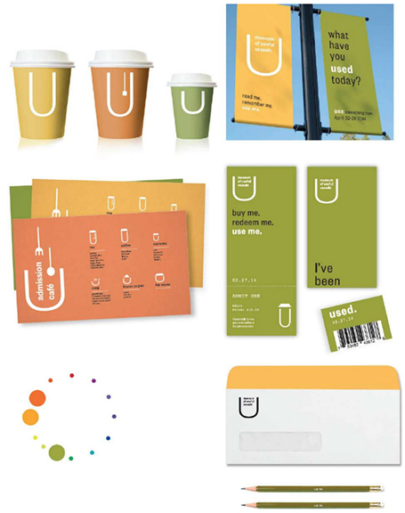
    
    - ```Near Complements``` The rosy orange and deep violet featured in this brand identity sit near each other on the color wheel, creating harmony within a range of warm and cool. 

      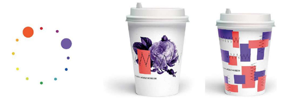 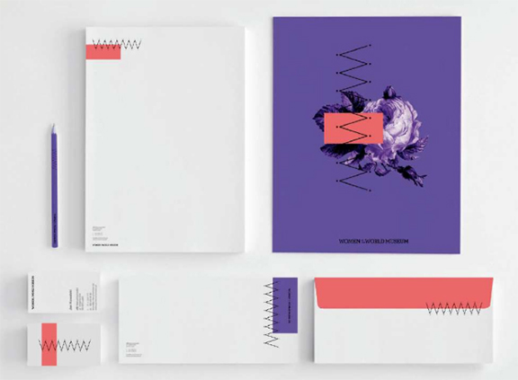

    - ```Selective Emphasis``` These studies use typographic patterns to explore how color alters not just the mood of a pattern, but the way its shapes and figures are perceived. Color affects both the parts and the whole. Each study begins with a black and white pattern built from a single font and letterform. Experiments with hue, value, and saturation, as well as with analogous, complementary, and near complementary color juxtapositions, affect the way the patterns feel and behave. Through selective emphasis, some elements pull forward and others recede. 

      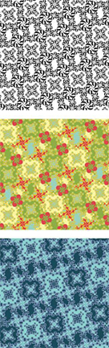 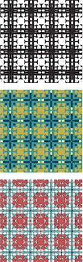 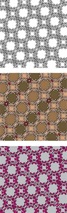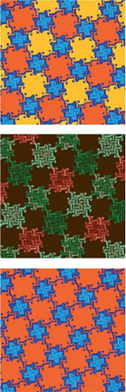

      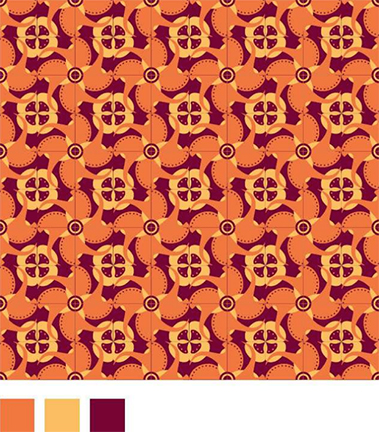 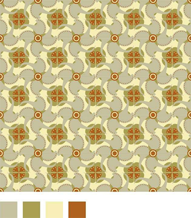 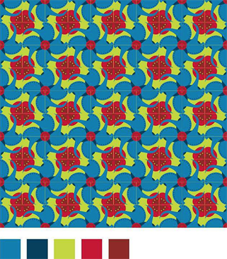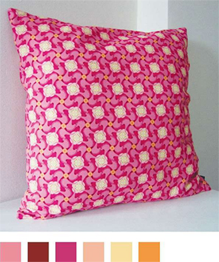


</details>


<details>
  <summary>Texture</summary>

- The tactile quality of a surface or the simulation or representation of such a surface quality is a texture. 
- In the visual arts, there are two categories of texture: tactile and visual.
- ```Tactile textures``` have actual tactile quality and can be physically
touched and felt; they are also called actual textures. 
- ```Visual textures``` are illusions of real textures created by hand,
scanned from actual textures, or photographed. Using skills learned in drawing, painting, photography, and various other image-making media, a designer can create a great variety of textures.

```Five Squares``` Ten Inches All typefaces have an innate optical texture that results from
the accumulation of attributes such as serifs, slope, stroke width, and proportion.
Those attributes interact on the page with the size, tracking, leading, and paragraph
style selected by the designer, yielding an overall texture.
In this exercise, designers composed five justified squares of type inside a ten-inch
frame. Variation of type style, texture, and value were achieved by combining
contrasting characteristics such as old style italic serifs, uniformly weighted sans
serifs, geometric slab serifs, and so on. Light to dark value (typographic color) was
controlled through the combination of stroke width, letterspacing, and paragraph
leading.
Finally, students manipulated the scale and placement of the squares to achieve
compositional balance, tension, and depth. Squares were permitted to bleed off the
edges, reinforcing the illusion of amplification and recession. 

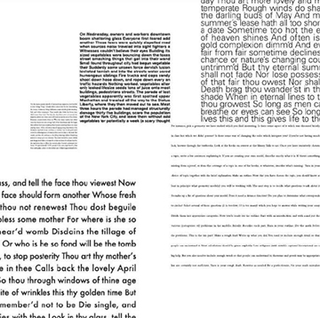

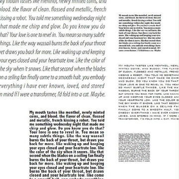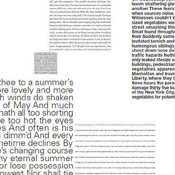

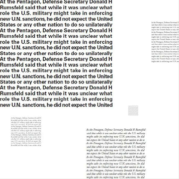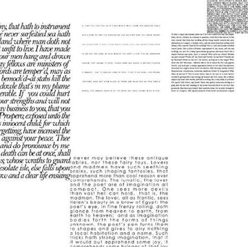

</details>


<details>
  <summary>Pattern</summary>

- Pattern is a consistent repetition of a single visual unit or element within a given area. In all cases, there must be systematic repetition with obvious directional movement. 
- An interesting aspect of pattern is that the viewer anticipates a sequence. If you examine patterns, you will notice that their structures rely on the configuration of three basic building blocks: ```dots, lines, and grids```. 
- In a pattern, any individual small unit, whether a nonobjective or representational shape, can be based on the dot. Any moving path is based on lines, also called stripes. Any two intersecting units yield a pattern grid.
- Why is the pattern important for a brand?
  The pattern is an element that can make a difference within the visual communication; if used well, it can become a distinctive feature of your brand and make you recognizable. The use of customized patterns will help you to give your brand more personality and can become a fundamental element of recognition, especially online or on social media.  the important thing is that it reflects your brand and what you want to communicate.
- How to use It?
A pattern can make a creative work visually more exciting and recognizable. Today,
Applying a pattern on the packaging of different items helps to create a coordinated image between the various products of a brand to make it recognizable at a glance. Furthermore, the use of colour variants can help to differentiate the varieties: in this case, each colour will be associated with a particular taste, aroma, etc ... In the same way, using different textures or graphic motifs but of the same colour can help to identify a specific line of products.
  - ```From Point to Line to Grid``` As dots move together, they form into lines and other shapes (while still being dots). As stripes cross over each other and become grids, they cut up the
field into new figures, which function like new dots or new stripes. Some of the most visually fascinating patterns result from figure/ground ambiguity. The identity of a form can oscillate between being a figure (dot, stripe) to being a ground or support for another, opposing figure.

  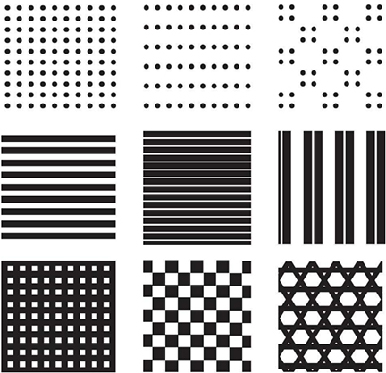
  - ```Repeating Elements```Patterns follow some repetitive principle, whether dictated by a mechanical grid, a digital algorithm, or the physical rhythm of a crafts-person’s tool as it works along a surface. In the series of pattern studies developed here and on the following pages, a simple lozenge form is used to build designs of varying complexity. Experiments of this kind can be performed with countless base shapes, yielding an endless range of individual results. 
  
    ```One Element, Many Patterns``` The basic element in these patterns is a lozenge shape. Based on the orientation, proximity, scale, and color of the lozenges, they group into overlapping lines, forming a nascent grid. 

    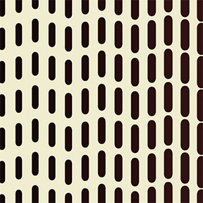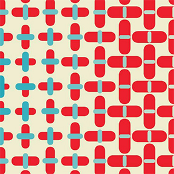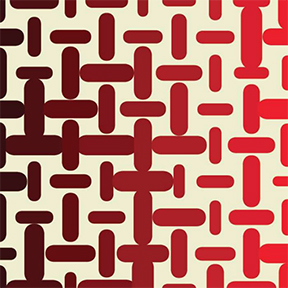
    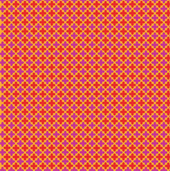
    
    

</details>

<details>
  <summary>Diagram</summary>

A diagram is a graphic representation of a structure, situation, or
process. Diagrams can depict the anatomy of a creature, the
hierarchy of a corporation, or the flow of ideas. Diagrams allow us to
see relationships that would not come forward in a straight list of
numbers or a verbal description.

- ```Mercurial Moods``` This simple diagram charts the upward and downward trajectory of the designer’s well-being based on specific forces that positively and negatively affect her world. 

   
</details>


<details>
  <summary>Time and Motion</summary>

Any word or image that moves functions both spatially and temporally. Motion is a kind of change, and change takes place in time. 

Motion can be implied as well as literal. 

#### Artists have long sought ways to represent the movement of bodies and the passage of time within the realm of static, two-dimensional space. 

Time and motion are considerations for all design work, from a multipage printed book, whose pages follow each other in time, to animations for film and television, which have literal duration.

Any still image has implied motion (or implied stasis), while
motion graphics share compositional principles with print.

Designers routinely work in time-based media as well as print,
and a design campaign often must function across multiple media
simultaneously.

Animation encompasses diverse modes of visible change,
including the literal movement of elements that fly on or off the
screen as well as changes in scale, transparency, color, layer, and
more. These alternative modes of change are especially useful for
designing animated text on the web, where gratuitous movement
can be more distracting than pleasing or informative.

- ```Implied Motion``` Graphic designers use numerous techniques to suggest change and movement on the printed page. Diagonal compositions evoke motion, while rectilinear arrangements appear static. Cropping a shape can suggest motion, as does a sinuous line or a pointed, triangular shape.

  - ```Eruption of Form``` These shapes as well as their explosive arrangement suggest movement and change.
  
  - Implied Time and Motion An effective logotype can be applied to anything from a tiny
business card to a large-scale architectural sign to a computer screen or digital projection.
The logotypes shown here use a variety of graphic strategies to imply motion.
In this project, designers created a graphic identity for a conference about contemporary
media art and theory called “Loop.” Each solution explores the concept of the loop as a
continuous, repeating sequence. The designers applied each logo to a banner in an
architectural setting and to a screen-based looping animation. (Photoshop was used to
simulate the installation of the banners in a real physical space.)

         
            

- Animating Type
  - Change in Position Moving text around the screen is the most basic means of animating type. Commonly, type enters from the right side of the screen and moves left to support the normal direction of reading. Ticker or leader text also tends to move in this direction.
  - Change in Color In the sequence shown here, the type itself is static, but a color change moves across the text letter by letter. Endless variations of this basic kind of change are possible.
  - Change in Transparency White type appears gradually on screen by gradually becoming opaque.
  - Multiple Modes of Change Many animations combine several techniques at once. This sequence features change in position, scale, and transparency.

</details>

<details>
  <summary>Rules and Randomness</summary>

The idea becomes a machine that makes the art. Sol LeWitt
Designers create rules as well as finished pieces. A magazine
designer, for example, works with a grid and a typographic
hierarchy that is interpreted in different ways, page after page, issue
after issue. If the rules are well planned, other designers will be able
to interpret them to produce their own unique and unexpected
layouts. Rules create a framework for design without determining
the end results.

Style sheets employed in print and web publishing (CSS) are rules
for displaying the different parts of a document. By adjusting a style
sheet, the designer can change the appearance of an entire book or
website. Style sheets are used to reconfigure a single body of
content for output in different media, from printed pages to the
screen of a mobile phone.

Rules can be used to generate form as well as organize content. In
the 1920s, the Bauhaus artist and designer László Moholy-Nagy
created a painting by telephoning a set of instructions to a sign
painter. In the 1960s, the minimalist artist Sol LeWitt created
drawings based on simple instructions; the drawings could be
executed on a wall or other surface anywhere in the world by
following the directions. Complex webs of lines often resulted from
seemingly simple verbal instructions.

Designers produce rules in computer code as well as natural
language. C. E. B. Reas, who co-authored the software language
Processing, creates rich digital drawings and interactive works that
evolve from instructions and variables. Reas alters the outcome by
changing the variables. He explains, “Sometimes I set strict rules,
follow them, and then observe the results. More frequently, I begin
with a core software behavior, implement it, and then observe the
results. I then allow the piece to flow intuitively from there.”
1 Reas and other contemporary artists are using software as a medium unto itself rather than as a tool supporting the design process.
Designing rules and instructions is an intrinsic part of the design
process. Increasingly, designers are asked to create systems that
other people will implement and that will change over time. This
chapter looks at ways to use rule-based processes to generate
unexpected visual results.
- ```Cell Phone Symphony``` In the project shown here, students were given a list of phone
numbers from which to generate visual imagery for a poster. The posters promote a
“cell phone symphony,” featuring music composed via interaction among the
audience’s cell phones.
Each poster suggests auditory experience as well as ideas of social and
technological interaction. The students took numerous different approaches, from
turning each phone number into a linear graph to using the digits to set the size and
color of objects in a grid.
Designing the system is part of the creative process. The visual results have an
organic quality that comes from random input to the system. The designer controls
and manipulates the system itself rather than the final outcome.

     
    
    
    
    

- ```Motion Prompt``` How can time and motion be represented on a flat surface? Designers
created a series of “gesture studies” in InDesign based on provided templates and using
fifty-five frames from an animated shapes project they were already working on. Each
template contained a prompt (such as morph, deface, contain, clone, pulverize), a series of
constraints (such as copy, paste, cut, and position), and a time limit (one minute to several
minutes). Each designer sought to capture the spirit of the prompt within the set
constraints. They were asked to embrace motion graphics software not just as a way to
generate animations, but as a way to generate material for developing two-dimensional
imagery. 

    
    
    
- ```Repeat and Rotate```
Repeating and rotating forms are universal principles of pattern
design. The designs shown here were created in the Processing
software language. By altering the input to a set of digital
instructions, the designer can quickly see numerous variations of a
single design. Changing the typeface, type size, type alignment,
color, transparency, and the number and degree of rotations yields
different results.

    

- ```Museum of Insider Art``` To create a visual brand for an imaginary museum, the designer created a code in Processing that converts alphabetic characters into abstract shapes. Theshapes become a private code. 

    
       

- ```Abstract Alphabet``` The Latin alphabet is an inherently abstract code. To create this minimal
typeface, the designer replaced letterforms with dots of varying size. Although rendered
illegible, the resulting texts maintain a familiar sense of rhythm. 

   
</details>

## Principles of Design

<details>
  <summary>Format</summary>

- The format is the defined perimeter as well as the field it encloses—the outer edges or boundaries of a design. 
- Format refers to the field or substrate (piece of paper, mobile phone screen, outdoor billboard, etc.) for the graphic design
project. 
- Designers often use the term format to describe the type of project—that is, a poster, a CD cover, a mobile ads, and so on. Graphic designers work with a variety of formats.
- ```Framing Text and Image``` In this project, designers edited, framed, and cropped a
picture in relation to a passage of text. The challenge was to make the text an equal
player in the final composition, not a mere caption or footnote to the picture.
Designers approached the image abstractly as well as figuratively. Is the picture flat
or three-dimensional? How does it look upside down? Designers edited the image by
blocking out parts of it, changing the shape of the frame, or blowing up a detail. They
found lines, shapes, and planes within the picture that suggested ways to position
and align the text. The goal was to integrate the text with the image without letting
the text disappear. 


</details>


<details>
  <summary>Balance</summary

- Balance is stability or equilibrium created by an even distribution of visual weight on each side of a central axis as well as by an even distribution of weight among all the elements of the composition. 
- When a design is balanced, it tends toward harmony. A balanced composition affects the viewer—communicating stability. The average viewer is averse to imbalance in a composition and reacts negatively to instability. 
- Understanding balance involves the study of several interrelated visual factors: 
  - Visual weight
  - Position
  - Arrangement.
  #### Visual Weight
  

  Factors Affecting Visual Weight
  - Orientation and location of an element within the format
  - Line of vision (directional pull)
  - Size and shape of an element
  - Whether the element is figure or ground
  - Color: hue, value, saturation, and temperature
  - Texture
  - Density or number of elements in a given area
  - Isolation and emphasis of an element in the composition (focal point)
  - Groupings (equal groups; group of several small shapes could counterbalance one large shape)
  - Actual movement (in time-based/screen-based media, motion graphics)
  
    ##### In two-dimensional design, weight is defined as a visual force or as visual weight. 
    ##### This visual weight refers to the relative amount of visual attraction, importance, or emphasis the element carries in a composition. 
    ##### ```Every element in a composition carries energy``` — an impression of force, strength, or weight.
    - The size, shape, value, color, and texture of a mark all contribute to an element’s visual weight. 
    - Where you position the mark on the page also affects its visual weight. The same mark positioned at different points on a page—bottom left, center, top right, or top left—will appear to change in visual weight because of its position. 
    - In visual perception, different areas of the page seem to carry more or less visual weight. 
      ##### Symmetry 
      Symmetry is an equal distribution of visual weights, a mirroring of equivalent elements on either side of a central axis; it is also called reflection symmetry. Symmetry and approximate symmetry can communicate harmony and stability.
      ##### Asymmetry 
      Asymmetry is an equal distribution of visual weights achieved through weight and counterweight by balancing one element with the weight of a counterpointing element without mirroring elements on either side of a central axis (Figure 2-8). To achieve asymmetrical balance, the position, visual weight, size, value, color, shape, and texture of a mark on the page must be considered and weighed against every other mark. Every element and its position contribute to the overall balancing effect in a composition. （Most designer use asymmetry to their artworks.）
       
      

      ```Disrupted Symmetry``` The designer has disrupted this symmetrical cross form to signify political unrest among factions in Uganda around the HIV/AIDS crisis. Narrative text lines alternate between clarity and obfuscation, ultimately erupting in chaos, yielding a dynamic counterpoint balance. 

      
      ##### Radial balance 
      Radial balance is symmetry achieved through a combination of horizontally and vertically oriented symmetry (Diagram2-15). Elements radiate out from a point in the center of the composition.
      
      
</details>

<details>
  <summary>Visual Hierarchy</summary>

  <details>
    <summary>Emphasis</summary>

- One of the primary purposes of graphic design is to ```communicate information```, and visual hierarchy is the primary principle for ```organizing information```. 
- To guide the viewer, the designer uses visual hierarchy, ```the arrangement of all graphic elements according to emphasis```. 
  - Emphasis is the arrangement of visual elements according to importance, stressing some elements over others, making some superordinate (dominant) elements and subordinating other elements. 
  - Basically, the designer determines which graphic elements the viewer will see first, second, third, and so on. 
  #### The designer must determine what to emphasize and what to de-emphasize. if you give emphasis to all elements in a design, you have given it to none of them; you end up with visual chaos. 
  #### Emphasis is directly related to establishing a point of focus.
  ```The focal point``` is the part of a design that is most emphasized or accentuated, where the green chair is the focal point. ```Position, size, shape, direction, hue, value, saturation, and texture of a graphic element``` all contribute to establishing a focal point.
               

- ```Content Vacuum``` In this project the designer purposefully abstracted the content of newspaper pages, thereby drawing attention to the visual hierarchy. 

      

      

- ```Five Fonts``` In this twist on the classic type specimen book,
designers curate a collection of five typefaces and design a
typographic hierarchy. Key content includes the typeface name,
designer, year created, and descriptive or historical text. The
compositional landscapes also contain a character set and
some visual element focusing attention on the typeface’s
expressive or formal qualities. In structuring multiple pages,
students consider continuity and pacing. Covers and colophons
become graceful extensions of the interior.

      

- ```Dimensional Hierarchy```
Messages applied to three-dimensional form have the added
challenge of legibility across and around planes. Objects sitting in an
environment are bathed in shadow and light. Unlike books that can
conceal elaborate worlds inside their covers—automatically
separated from exterior contexts—environmental messages must
interact beyond their boundaries and become either a harmonious
or poignant counterpoint to their neighbors.
Notice in these examples how type, color fields, and graphic
elements carry the viewer’s eye around the dimensional form, often
making a visual if not verbal connection with neighboring packages
when stacked side by side or vertically.

     
  #### Ways to Achieve Emphasis
  To establish a visual hierarchy, decide on the importance of the graphic elements (images and type) of your design. Create a flow of information from the most important graphic element to the least.
  - ###### Emphasis by Isolation
  Isolating a shape focuses attention on it (focused attention equals more visual weight). Please note that a focal point usually carries a good amount of visual weight and must be counterbalanced accordingly with other elements in a composition.
  
  

  - ###### Emphasis by Placement
  How the viewer moves visually through a spatial composition is an ongoing topic of study. It has been shown that viewers have preferences for specific regions of a page. Placing a graphic element at a specific position in a composition, such as the foreground, the top-left corner, or the center/middle of a page, attracts most viewers' gaze most easily.
  - ###### Emphasis Through Scale
  The size and scale of shapes or objects play an important role in emphasis and creating the illusion of spatial depth. Used effectively, the size of one shape or object in relation to another—what we call scale—can make elements appear to move forward or backward on the page. Large shapes and forms tend to attract more attention. However, a very small object can also attract attention if it is seen in contrast to many larger ones.
  - ###### Emphasis Through Contrast
  Through contrast—light versus dark, smooth versus rough, bright versus dull—you can emphasize some graphic elements over others. For example, a dark shape amid a field of lighter shapes might become a focal point. Contrast also depends on and is aided by size, scale, location, shape, and/or position.
  - ###### Emphasis Through Direction and Pointers 
  Elements such as arrows and diagonals use direction to point viewers’s eyes to where they should go.
  - ###### Emphasis Through Diagrammatic Structures
    - ```Tree structures```. Positioning the main or superordinate element at the top with subordinated elements below it in descending order creates hierarchical relationships. Another tree structure looks similar to a tree trunk with branches; subordinate elements stem out from the main element carried by lines.
    - ```Nest structures```. This can be done either through layering(the main element is the first layer and other layers move behind it) or through containment (the main element contains the less significant elements). Layering for the purpose of hierarchy is critical to understand in relation to websites and information design.
    - ```Stair structures```. To illustrate hierarchy, this structure stacks elements, with the main element at the top and subordinate elements descending like stairsteps.
  
  
    </details>
    <details>
      <summary>Layer</summary>

    The designer or paste-up artist adhered each element of the page—type, images, blocks of color—to a separate layer, placing any element
    that touches any other element on its own surface.
    This same principle is at work in the digital layers we use today,
    mobilized in new and powerful ways. 

    Layers allow the designer to treat the image as a collection of
    assets, a database of possibilities. Working with a layered file, the
    designer quickly creates variations of a single design by turning
    layers on and off. Designers use layered files to generate
    storyboards for animations and interface elements such as buttons
    and rollovers.
- ```This typographic exercise presents three narratives``` taking place during a two-minute
period: a news story broadcast on a radio, a conversation between a married couple, and
the preparation of a pot of coffee. Typography, icons, lines, and other elements are used to
present the three narratives within a shared space. The end result can be obvious or poetic.
Whether the final piece is an easy-to-follow transcription or a painterly depiction, it is made
up of narrative elements that define distinct layers or visual channels. 

         

- ```Temporal Layers``` This publication records a collaboration between two universities in China
and Russia. The large-scale numerals reference numbers in a calendar. Overlapping forms,
images, and text blocks suggest depth and motion. 

          

- ```Life History``` Historical and contemporary photographs and documents are layered over a
satellite image from Google Earth of the land these people have inhabited. Transparency is
used to separate the elements visually. 

 

  </details>

  <details>
    <summary>Transparency</summary>
      
  Transparency means a simultaneous perception of different spatial
  locations. . . . The position of the transparent figures has equivocal
  meaning as one sees each figure now as the closer, now as the
  farther one.

   
  </details>
</details>

<details>
  <summary> Rhythm </summary>


- In graphic design, a strong and consistent repetition, a pattern of elements can set up a rhythm, which causes the viewer’s eyes to move around the page. Timing can be set by the intervals between and among the position of elements on the page. 
- Many factors can contribute to establishing rhythm — ```color,texture, figure/ground relationships, emphasis, and balance.```
    
  #### Repetition and Variation
  - The key to establishing rhythm in design is to understand the difference between repetition and variation. 
  - In graphic design, the repetition of rhythm is interposed by variation to create visual interest. 
  - Repetition occurs when you repeat one or a few visual elements a number times or with great or total consistency. 
  - Variation is established by a break or modification in the pattern or by changing elements, such as the color, size, shape, spacing,position, or visual weight. 
  - Variation creates visual interest to engage a viewer and add an element of surprise. However, too much variation will dilute a visual beat.
    
    

</details>

<details>
  <summary> Unity  </summary> 
All the graphic elements in a design are so interrelated they form a greater whole. All the graphic elements look as though they belong together.Viewers best understand and remember a composition that is unified. 
  
  #### Gestalt
  German for “form,” which places an emphasis on the perception of forms as organized wholes, primarily concerned with how the mind attempts to impose order on the world, to unify and order perceptions. 
  
  

```Six Modes of Grouping```
Psychologists have identified various principles of grouping; six
common ones are diagrammed above. Designers often manipulate
one or more principles of grouping in order to create images or
compositions that are clear and focused or unsettled and surprising.
Interesting effects emerge when we use our powers of perception to
reassemble lines, shapes, or images that have been pulled apart or
interrupted. Grouping prompts the observer to build parts into
wholes.
  - Simplicity - We see two circles rather than three odd shapes.
  - Similarity - We see two groups based on the size of the elements.
  - Proximity - We see two groups based on the closeness of the elements.
  - Closure - We close the gap in the shape.
  - Continuity - We see two long lines crossing rather than four short lines converging.
  - Symmetry - We tend to close symmetrical forms to make a single object.

  
  

  

  

```Grouping + Typography```
At its most basic level, all typography employs principles of
grouping. Letters cluster into words (proximity). Shifts in
weight, style, or size signal differences and hierarchies
(similarity). When we create “lines” of text out of letters and
words, we exploit the power of continuity, which sustains the
illusion of a single gesture or path.
This project encourages designers to experiment with the
basic principles of typography. Each student creates multiple
interpretations of a given text by using spacing, composition,
and alignment. Designers explore the impact of principles such
as proximity, similarity, continuity, and closure to create new
patterns of meaning that exploit the mind’s ability to reconnect
fragments and build wholes out of parts. The text in this project
comes from the Bill of Universal Human Rights.

 
  
   
     
       
         

  - ##### From gestalt, we derive certain laws of perceptual organization that govern visual thinking, profoundly affecting how you construct unity in a composition. 
  - The mind attempts to create order, make connections, and to seek a whole by grouping—perceiving visual units by ```location, orientation, likeness, shape, and color.``` 
  - ##### [the law of prägnanz](https://lawsofux.com/law-of-pr%C3%A4gnanz/)
    German for “precision” or “conciseness”— which means we seek to order our experience as a whole in a regular, simple, coherent manner.

    
      - The human eye likes to find simplicity and order in complex shapes because it prevents us from becoming overwhelmed with information.
      - Research confirms that people are better able to visually process and remember simple figures than complex figures.
      - The human eye simplifies complex shapes by transforming them into a single, unified shape.
  
  #### Laws of Perceptual Organization
  
  - ##### Similarity
    like elements, those that share characteristics,are perceived as belonging together. Elements can share likeness in shape, texture, color, or direction. Dissimilar elements tend to separate from like elements.
  - ##### Proximity
    elements near each other, in spatial proximity, are perceived as belonging together.
  - ##### Continuity
    perceived visual paths or connections (actual or implied) among parts. Elements that appear as a continuation of previous elements are perceived as linked, creating an impression of movement.
  - ##### Closure
    the mind’s tendency to connect individual elements to produce a completed form, unit, or pattern.
  - ##### Common fate
    elements are likely to be perceived as a unit if they move in the same direction.
  - ##### Continuing line
    lines are always perceived as following the simplest path. If two lines break, the viewer sees the overall movement rather than the break; also called implied line.
  #### Modular grid 
  Structure and Unity - Viewers will perceive a greater sense of unity in a composition when they see or sense visual connections through the alignment of elements, objects, or edges. Because people seek order, their eyes easily pick up these relationships and make connections among the forms. 
  
  
</details>


<details>
  <summary>Scale</summary>

  ```Scale, Depth, and Motion``` In the typographic compositions shown here, designers worked with one word or a pair of words and used changes in scale as well as placement on the page to convey the meaning of the word or word pair. Contrasts in scale can imply motion or depth as well as express differences in importance.
    
  

  ```Extreme Heights``` In the poster for a lecture at a college, designer Paul Sahre put his typography under severe pressure, yielding virtually illegible results. (He knew he had a captive audience.) 

  
</details>
  

