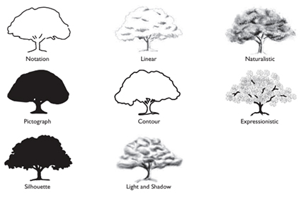
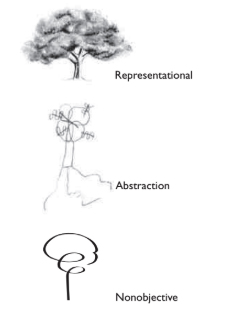
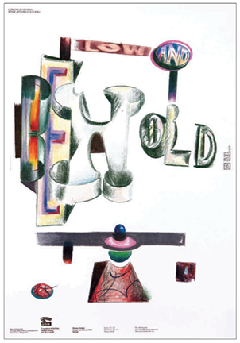
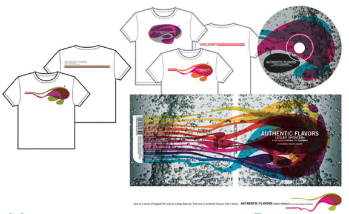
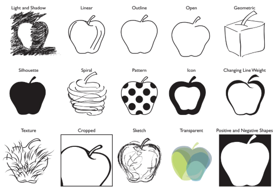

# Visualization
#### Visualization and composition, major components in the design process, are driven by a design concept and communication goals.

As Alice E. Drueding, Professor, Graphic and Interactive Design and Area Head of the BFA Program at Tyler School of Art, Temple University, points out, steps in the design process may not progress in an orderly fashion: “The order I emphasize with students is
- Concept
- General visualization (content, medium, style) 
- Organization (composition, grid, golden section, etc.)—with the caveat that things don’t always work in such a linear manner.”

<details>
  <summary>Image Classifications and Depictions</summary>

  #### Graphic designers work with two main components: type and images. 
  - Type can be created in a variety of ways—computer generated, hand drawn, handmade, found, or photographed. 
  - Images is a broad term encompassing a great variety of representational, abstract, or nonobjective images—photographs, illustrations, drawings, paintings, prints, pictographs, signs, symbols, maps, diagrams, optical illusions, patterns, and graphic elements and marks; images are also called visuals.
  - Classifying images helps you understand the range and how to depict them to meet your communication goals.

    
    - Notation: a linear, reductive visual that captures the essence of its subject, characterized by its minimalism.
    - Pictograph: an elemental, universal picture denoting an object, activity, place, or person captured through shape—for example, the images denoting gender on restroom doors.
    - Silhouette: the articulated shape of an object or subject taking its specificity into account (as opposed to the more elemental form of a pictograph).
    - Linear: a shape or form described predominantly by use of line.
    - Contour: a shape or form depicted through the linear outline of an object’s or subject’s boundaries.
    - Light and Shadow: using light and shadow to describe form and the illusion of three-dimensional space. This most closely simulates how we perceive forms in nature. Also, a logical flow of light, as it touches and describes forms, can help unify a composition. An extreme use of light and shadow is called chiaroscuro (also called claire-obscure).
    - Naturalistic: a visual appearance or style created by full color or tone using light and shadow that attempts to replicate an object or subject as it is perceived in nature; also called realistic. (Please note, in modern and contemporary fine art theory and criticism, the terms naturalism and realism are defined differently and represent different
    schools of thought.)
    - Expressionistic: a style of visualization characterized by a highly stylized or subjective interpretation, with an emphasis on the psychological or spiritual meaning. There is no strict adherence to things as they appear in nature, as opposed to naturalism.

    There are three basic classifications of depiction as they directly refer to and then move away from what we see in nature:

    
    - Representational: a rendering that attempts to replicate actual objects as seen in nature. The viewer recognizes the image; also called pictorial or figurative.
    - Abstraction: a simple or complex rearrangement, alteration, or distortion of the representation of natural appearance, used for stylistic distinction and/or communication purposes.
    - Nonobjective: a purely invented visual that is not derived from anything visually perceived. It does not relate to any object in nature and does not literally represent a person, place, or thing; also called nonrepresentational.
  
</details>


<details>
  <summary>About Signs and Symbols</summary>

  Graphic design signifies. 
  Graphic design represents. 
  Graphic design communicates. 

  From the theory of semiotics, the study of signs and symbols, we have a classification of signs—what they mean and how they are used in graphic design.

  - Sign: a visual mark or a part of language that denotes
another thing. For example, the word dog and a pictograph
of a dog are both signs used to represent “dog”; the $ denotes
money; the written letter H is a sign for a spoken sound.
  - Icon: a visual (pictorial image or symbol) to represent
objects, actions, and concepts. An icon resembles the thing
it represents or, at a minimum, shares a quality with it. It
can be a photograph, a pictorial representation, an elemen-
tal visual (think magnifying glass desktop icon), arbitrary
(think radioactive sign), or symbolic (think lightning bolt
to represent electricity).
  - Index: a sign that signifies through a direct relationship
between the sign and the object, without describing or
resembling the thing signified. There are a variety of ways
this happens: whether as a cue that makes the viewer think
of the reference (for example, a pacifier is an indexical sign
for an infant), by its proximity to it (for example, a diver
down flag means someone is under water and you must
steer clear of the area), by actually pointing to the thing
signified (an arrow at an intersection on a roadside), or by
being physical evidence of it (for example, a photogram of
a hand or a hoof print on the ground).
  - Symbol: a visual that has an arbitrary or conventional
relationship between the signifier and the thing signi-
fied. We decode meaning through learned associations
(for example, a dove has become accepted as a symbol of
peace). Spoken or written words are symbols as well.
  - Some symbols take on greater meaning than most other
symbols due to their context and roles in religion, cul-
ture, history, or society. Examples include the cross in
Christianity, the phoenix for eternal life, the ankh for
life associated with ancient Egypt, the Star of David in
Judaism, and the yin–yang, which is the Chinese symbol of
the interplay of forces in the universe. It is hard to think of
antiwar protest posters without thinking of the nuclear dis-
armament symbol designed by Gerald Holton in 1956. This
graphic, a circle with a few lines in it, stands for something
as profound as the idea of peace.

   #### Signs and symbols—reductive images—serve many functions in graphic design. 

   - ```They can be stand-alone images``` such as a pictograph of a woman on a restroom door, a desktop or mobile icon, 
   - ```or components of a broader design solution``` such as a sign system that is part of a visual identity program. They serve as icons for mobile web and apps. Icons are also referred to as symbol signs.

   #### So much information must be universally understood crossing language and cultural barriers. 

   - Signs or icons in the form of pictographs—visual, nonverbal communication—are characterized by elemental forms. These graphics depict universal, immediately recognizable objects, places, human gestures, and actions, which are easily deciphered by all; they are also called pictograms.

   #### [ISOTYPE](http://www.gerdarntz.org/isotype.html)

   The International System Of Typographic Picture Education was developed in the twentieth-century by the Viennese social scientist and philosopher Otto Neurath as a method for visual statistics. Gerd Arntz was the designer tasked with making Isotype’s pictograms and visual signs. Arntz designed around 4000 such signs, which symbolized key data from industry, demographics, politics, and economy. The pictograms designed by Arntz were systematically employed in combination with stylized maps and diagrams. Neurath and Arntz made extensive collections of visual statistics in this manner, and their system became a world-wide emulated example of what we now term: infographics.

   Otto Neurath’s goals were to aid people by directly illustrat-
ing information about the world for those who were illiterate,
or could just barely read, as well as by designing information
that could be universally understood, overcoming barriers of
language and culture.

   - Information graphics in the form of icons are also used to
help people navigate spaces or life issues. Wayfinding systems,
used internationally, assist and guide visitors and tourists to find what they are looking for in museums, airports, zoos, and
city centers. The Talk Chart, a communication device, is an
example of information design . Using the 81
⁄2" 311" laminated pointing chart, people in healthcare facilities
who cannot speak due to stroke, aphasia, or other physical
challenges can now make their needs known to family and
staff by pointing to the graphic symbols or letters of the alpha-
bet that appear on the chart.

   - The primary objective of the Disability Access Symbols Project
is for organizations to use these to better serve their audiences with disabilities. The Graphic Artists Guild

   Foundation explains:
   “The project was extremely challenging in terms of design
because the client insisted on having organizations representing
people with various disabilities review and comment on the
proposed symbols. With the help of a disability consultant, we
were able to reach consensus among all these groups and still
achieve the primary objective—for organizations to use these
symbols to better serve their audiences with disabilities.
“Several existing symbols did not meet the standards we
established and needed redesign. For example, the old symbol
for Assistive Listening Systems focused on the disability (an
ear with a diagonal bar through it). The new symbol focuses on
the accommodation to the disability, i.e., a device that amplifies
sound for people who have difficulty hearing. Other upgraded
symbols include Sign Language Interpreted, Access (Other than
Print or Braille) for Individuals Who Are Blind or Have Low Vision,
and the International Symbol of Accessibility. A new symbol for
Audio Description for TV, Video and Film was developed which,
through design, proved less likely to degenerate when subjected
to frequent photocopying.”


#### Use of Signs and Symbols


  
</details>


<details>
  <summary>Icon Design</summary>

  Icons and icon systems are used for print, environmental graphics, or screen. They have become more ubiquitous due to the proliferation of screen media and their significant roles in websites, mobile apps and more. Across media, you have many of the same considerations:
- Who is the audience?
- At what size will the icons be seen?
- What is the context and where will the icons be seen—on screen, close-up, lighted, from a distance, in print? At which perspective or angle? What are the communication goals? What do the icons
- represent—actions, figures, places, objects, creatures?
- How reductive or elemental do they need to be to work? Totally no-frills?
- Are the icons part of a system?
- Which style will work across the system and is appropriate for the entire design project?

  #### Icon Design Tips
    - Accurately depict the shape of the object to allow users to recog-
    nize and decipher the icon at a glance.
    - Aim for elemental form. Economy of form trumps intricacy
    or complexity. Details and any excess information may
    confuse the user, especially on smaller screens.
    - Represent an image from its most characteristic angle.
    - Select commonly recognizable images that people around the
    world will be able to understand.
    - Select color and/or values for impact, legibility, meaning, brand
    storytelling, and context (for example, icons inside toolbar
    buttons are not in color).
    - Treat all icons in a system consistently in terms of style of
    visualization, perspective, and near and far. For example,
    as a general rule, if one icon is cropped, they should all be
    cropped. If one icon is seen in full view from straight on, all
    should be depicted similarly.
    - Use a consistent single light source on all icon objects, if using
    light and shadow to depict form.
    - Icons should work well on both white and black backgrounds.
    - Scale the icon for different sizes (1,024 3 1,024 pixels; 512 3 512 pixels; 256 3 256 pixels; 128 3 128 pixels; 32 3 32 pixels; 16 3 16 pixels).

When icons function as part of a larger design solution, such as a mobile app, a desktop application, a wayfinding program, or a website, their design is considered in relation to the broader context and project, ensuring they function as standalone solutions, achieving communication goals, and within the broader context.

Designing a system requires a clear design concept and a consistent use of scale, perspective, shapes, and formal elements, such as line, color, and texture. The signs or icons in a system must look as if they belong to the same family. At times, more than one designer in a design studio will work to produce a system. It is imperative to establish a firm design concept, style, and vocabulary of shapes for the system to look like it was created by one hand and mind, as in the complete set of fifty passenger and pedestrian symbols developed by the AIGA (American Institute of Graphic Arts).

  
</details>


<details>
  <summary>Media, Methods, and Visualization</summary>

  After you generate a design concept or several concepts for an assignment, you consider the content, which is the required ```text and image components```. Then you make preliminary decisions about:
 - ```Media and Methods:``` How the graphic components will be
created, visualized, and displayed on screen or in print.
Some media and methods include illustration, drawing
and painting, photography, graphic illustration, collage,
photomontage, layering, and type as an image.
- ```Mode of Visualization and/or Style:``` This is how you will render
and execute the visuals and type for a project, including decisions about the characteristics of the form.
 
 You can create imagery using a multitude of tools and media. The following list explains broad categories of producing and creating images.
 - #### Illustration: 
    A handmade unique image that accompanies or complements printed, digital, or spoken text, which clarifies, enhances, illuminates, or demonstrates the message of the text. Some designers among many others, also illustrate. Professional illustrators work in a variety of media and most often have uniquely identifiable styles. 

    The AIGA notes, “Each illustrator brings a different perspective, vision and idea to play that, when married with
    great design, becomes an original art form.” When you are working professionally and need to hire an illustrator, you
    can find one through their representatives (agents) or in annuals, in sourcebooks, and through professional organizations. (On a historical note, prior to the invention of photography, and also when photography was in its infancy and the equipment cumbersome, illustration was the most popular form of imagery in visual communication.)
 - #### Photography: 
    A visual created using a camera to capture or record an image. Commercial photographers specialize in various genres, such as still life, portraiture, sports, outdoor imagery, fashion, journalist, aerial, landscape, urban, moving image, events, food, and others. When you are working professionally and need to hire a photographer, you can find one in annuals, sourcebooks, on the Internet, or through their agents. Fine art photography and journalistic photography are also utilized in graphic design. (Today, photography is probably the most popular form of image in visual communication.)
 - #### Graphic interpretation: an elemental visualization of an
    object or subject, almost resembling a sign, pictograph, or symbol in its reductive representation. Although a graphic interpretation employs economy (stripping down visuals to fundamental forms), what differentiates a graphic interpretation from a sign or pictograph is its expressive quality; it is often more descriptive. With the same skill set used to design logos or pictographs, graphic designers can capably create graphic interpretations.
 - #### Collage: 
    A visual created by cutting and pasting bits or pieces of paper, photographs, cloth, or any material to a two-dimensional surface, which can be combined with handmade visuals and colors. A conventional collage technique can be simulated and rethought for digital media using computer software (and its tools and capabilities) and hardware, a digital camera, a digital pen and tablet, and/or a scanner.
 - #### Photomontage: 
    A composite visual made up of a number of photographs or parts of photographs to form a unique image.

 - #### Mixed media: 
    A visual resulting from the use of different media—for example, photography combined with illustration.
 - #### Motion graphics: 
   Time-based visual communication that integrates visuals, typography, and audio; it is created using film, video, and computer software, including animation, television commercials, film titles, and promotional and informational applications for broadcast media and screen media.
 - #### Diagram: 
    A graphic representation of information, statistical data, a structure, environment, or process—the workings of something. A chart is a specific type of diagrammatic representation of facts or data. A graph is a specific
type of diagram used to indicate relationships between two (or more) variables, often represented on axes. A map is a specific type of diagrammatic representation used to depict a route or geographic area—to show location.

  
</details>


<details>
  <summary>Creating, Selecting, and Manipulating Images</summary>
  
</details>


<details>
  <summary>Basics of Visualizing Form</summary>
  
  #### Sharpness VS Diffusion
   - Sharpness is characterized by clarity of form, detail, clean and clear edges and boundaries, saturated color, readable and legible typography, hyperrealism, photorealism, closed compositions, and limited type alignment. 
   - Diffusion is characterized by blurred forms and boundaries, transparencies, muted color palettes, layering, open compositions, and painterliness.
  #### Accuracy VS Distortion
   Viewers believe an object or subject to be accurately depicted when it conforms with what they know or to common knowledge of that form. When an object or subject is twisted, stretched, bent, warped, buckled, or significantly altered from its normal appearance, it is distorted. In the poster promoting a concert by The Pretenders, the image of Chrissie Hynde and the typography are pixelated, expressively distorting them.
  #### Economy VS Intricacy
   - Economy refers to stripping down visuals to fundamental forms, reducing them, using as little description and as few details as possible for denotation. It is employed for icons, pictographs, and symbols, for instance. 
   - Intricacy is based on complexity, on the use of many component parts and/or details to describe and visually communicate.
  #### Subtle VS Bold
   - Using a subtle visualizing treatment is about restraint. Subtlety can be created through low contrast, muted color palettes or tints, static compositions, transparencies, layering, limiting typefaces and alignment, and atmospheric perspective.
   - Boldness can be conveyed with big, brassy, aggressive movements and compositions, saturated color palettes, thick lines, high contrast, cropping, or images that are near. Related to this is understatement versus exaggeration. An understated visual is less dramatic, subtle, and restrained, whereas an exaggerated depiction uses visual hyperbole and might be bigger, grander, more prominent, more dramatic, embellished, or amplified.
  #### Predictable VS Spontaneous
   Pattern, symmetry, absolute consistency of elements and their treatment, stable compositions, even weights, among other things would be considered predictable. Sketchiness, abrupt movements, asymmetry, changes in pace, staccato lines, open forms, changes in case, or blurring of edges could communicate spontaneity. The spontaneous quality in Ed Fella’s Low and Behold poster is conveyed through whimsical changes in the sizes of letters, hand-drawn letters, and forms. You can see why in Graphis, Stuart Frolick titled his article about Fella “Design Doodler.”

   
  #### Opaque VS Transparent
   Opaque elements are dense, seemingly solid, and not seen through. Elements, type, and visuals can be transparent, which means see-through from one image to another, from
one letterform to another, or from one color to another, as in the free-form shapes constituting the visuals in Figure 6-8. Seeing through could imply space to various degrees of graphic depth. Digital transparency involves altering the opacity of any graphic element or image in print or motion.

   The contrast of an element is lowered so that it appears transparent in relation to its original opaque form. You also can juxtapose transparent and opaque elements for contrast or another expressive purpose.
Patterns often employ graphic transparency where layers of lines, shapes, textures, forms, letterforms, or fields or bands of color overlap. Related to graphic transparency, linear transparency refers to transparent layering of linear forms or lines or outline type.

   
  #### Linear VS Painterly Modes
   A linear mode is characterized by a predominant use of lines to describe forms or shapes within a composition. In graphic
design, painterly modes are characterized by the use of color and value to describe shapes and forms, relying on visible,
broad, or a sketchy description of form rather than the specificity of lines. Utilizing a linear or painterly mode can also
contribute to unifying a composition.
In his seminal work Principles of Art History: The Problem
of the Development of Style in Later Art, Swiss art historian
Heinrich Wölfflin describes linear versus painterly modes of representation in fine art, which help us understand how form
and style communicate meaning and how they are shaped by
culture, time period, and context.

  #### Hard Edge VS Brushy
   In painting, hard-edge visualization is almost diametrically opposed to works in a brushy, painterly style. For the unique “Day Without Art” symbol, by contrasting a brushstroke X with the hard-edge delineation of the square representing a picture frame, meaning is enhanced.
  #### Proximate VS Versus Distant Vision: 
   Modes of Representation In this must-read essay “On Point of View in the Arts,” philosopher José Ortega y Gasset offers “proximate vision” and “distant vision” modes, accounting for the difference in how visual artists describe forms that they see. He explains the point of view of artists in relation to what is seen, representative of changes during eras reflecting the culture, religious beliefs, and philosophy of their time periods.
All images are rendered in focus and in detail in proximate
vision regardless of whether they are near or far in space.
There is no evidence of the effect of the atmosphere on what
is seen. We see every form and shape with clarity and in detail
no matter how far from us it is.
In distant vision, the effect of the atmosphere between the art-
ist’s (and viewer’s) vision and the thing seen is in evidence.
There is one point of focus (in any given moment, we can
only focus on one thing at a time) with surrounding elements
somewhat obscured. Distant vision is usually partnered with a
painterly mode.
   #### Singularity VS Juxtaposition
   Whether you look at any religious icon—for example, any
saint depicted during the Middle Ages—or at a contemporary
poster using a single visual, you can see how a singular image
can be employed to communicate a message or to symbolize
or represent an idea. You can juxtapose two or more images
for contrast or in a synergistic way.
</details>


<details>
  <summary>Drawing for Designers and Graphic Interpretations</summary>

  Drawing as visualizing for graphic design, in which communication is primary, is different from drawing as a fine art
discipline, in which form and personal expression are primary, although similar competencies are necessary. Designers

utilize a variety of visualizing techniques. They
also use visualizing as a creative process of visual thinking
and during concept development and design development.
Creative visualization gives expressive form to an idea.

   
  #### Visualizing techniques include:
- Line Drawing: An image created with line, using a tool such
as a stylus or pencil, with no solid areas or shading effects
other than cross-hatching; it is also called line art. Lines can
stay on a surface or extend into an environmental space.
Line can be created by unconventional materials and tools
as well.
- Contour Drawing: Emphasis is given to the outline of an
object or figure, to its specific contour, to render mass and
form.
- Elemental Flat Shape: Basic shape rendering of a form using
flat colors or neutrals.
- Tonal Drawing: A form is depicted through varying tonal
values, through shading, rather than through line.
- Sketches: A rapid visualization technique; a quick, rough
drawing method used to communicate concepts and to
present layouts and plans.
- Rendering: Drawing to define three-dimensional spaces or
objects.
- Cartoon Drawing: Simple rendering of figures and situations.
- Caricaturing: Drawing that captures particular expressions
and features.

##### Light and Shadow Linear Outline Open Geometric
##### Silhouette Spiral Pattern Icon Changing Line Weight

Texture Cropped Sketch Transparent Positive and Negative Shapes Presentation: Margins, Rules,
Borders, Cropping, and Bleeds
How you present an image affects communication. How will
you use the visual as an independent entity? Will you crop
it? Bleed it? Isolate it? Combine it? Juxtapose it? Frame it?
Silhouette it? You also need to plan how you will utilize it
within the format’s entire visual field. How will the visual be
composed on the page? Considerations include:
- Margins: the blank space surrounding a visual on the left,
right, top, or bottom edge of a page can frame a visual,
almost presenting it in a formal manner. Margins also
afford space for page numbers, running heads in publica-
tions, notations, captions, headings, titles, and credits.
- Rules: thin stripe(s) or line(s) used for borders or for separating text, columns of text, or visuals. Most often, rules
function best when used to separate, as dividers, attracting
little notice.
- Borders: a graphic band that runs along the edge of an
image, acting to separate the image from the background,
like a frame, by something as simple as a thin rule or as
ornate as a Baroque frame. Borders can also act to emphasize the boundaries of an image. A border should never overwhelm or distract from what it frames.
  
</details>

