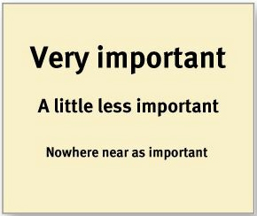
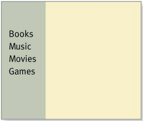
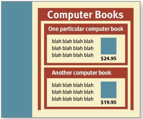

# A Common Sense Approach to Web Usability

<details>
  <summary>Don’t make me think! - First Law of Usability</summary>

#### “What’s the most important thing I should do if I want to make sure my site or app is easy to use?”
#### “Nothing important should ever be more than two clicks away” or “Speak the user’s language” or “Be consistent.”
- Links and buttons that aren’t obviously clickable. As a user, I should never have to devote a millisecond of thought to whether things are clickable—or not.
- The fact that the people who built the site didn’t care enough to make things obvious—and easy—can erode our confidence in the site and the organization behind it.
- Your goal should be for each page or screen to be self-evident, so that just by looking at it the average user will know what it is and how to use it. 

</details>

<details>
  <summary>How we really use the Web - Scanning, Satisficing, and Muddling Through</summary>

  What they actually do most of the time (if we’re lucky) is glance at each new page, scan some of the text, and click on the first link that catches their interest or vaguely resembles the thing they’re looking for. There are almost always large parts of the page that they don’t even look at. We’re thinking “great literature” (or at least “product brochure”), while the user’s reality is much closer to “billboard going by at 60 miles an hour.

  You have to learn to live with three facts about real-world Web use.
  - FACT OF LIFE #1: We don’t read pages. We scan them.
    - Web use is that people tend to spend very little time reading most Web pages. 
    - Most Web use involves trying to get something done, and usually done quickly. 
    - We just don’t have the time to read any more than necessary.
    - We’re just looking for the bits that match our interests or the task at hand.
  - FACT OF LIFE #2: We don’t make optimal choices. We satisfice.
    - Most of the time we don’t choose the best option—we choose the first reasonable option, a strategy known as satisficing.
    - As soon as we find a link that seems like it might lead to what we’re looking for, there’s a very good chance that we’ll click it.
    - Faced with a problem, a person gathers information, identifies the possible solutions, and chooses the best one. 
    - Why don’t Web users look for the best choice?
      - ```We’re usually in a hurry```. 
      - ```There’s not much of a penalty for guessing wrong```. 
      The penalty for guessing wrong on a Web site is usually only a click or two of the Back button, making satisficing an effective strategy. (Back is the most-used button in Web browsers.)
      - ```Weighing options may not improve our chances```. On poorly designed sites, putting effort into making the best choice doesn’t really help.
      You’re usually just as well off going with your first guess and using the
      Back button if it doesn’t work out.
      - ```Guessing is more fun```. It’s less work than weighing options, and if you guess right, it’s faster. And it introduces an element of chance—the
      pleasant possibility of running into something surprising and good.
      Of course, this is not to say that users never weigh options before they click.It depends on things like their frame of mind, how pressed they are for time, and how much confidence they have in the site.
  - FACT OF LIFE #3: We don’t figure out how things work. We muddle through.
    - One of the things that becomes obvious as soon as you do any usability testing—whether you’re testing Web sites, software, or household appliances is the extent to which people use things all the time without understanding how they work, or with completely wrong-headed ideas about how they work. Faced with any sort of technology, very few people take the time to read instructions. Instead, we forge ahead and muddle through, making up our own vaguely plausible stories about what we’re doing and why it works.

  #### You have a better chance of steering them to the parts of your site that you want them to see.
  #### They’ll feel smarter and more in control when they’re using your site, which will bring them back. 

</details>

<details>
  <summary>Billboard Desig - Design for scanning, not reading</summary>
  
  Faced with the fact that your users are whizzing, Making sure they see and understand as much of what they need to know.
<details>
  <summary>Take advantage of conventions</summary>

  ### One of the best ways to make almost anything easier to grasp in a hurry is to follow the existing conventions—the widely used or ```standardized design patterns```. 

  Conventions have also evolved for different kinds of sites—commerce, colleges, blogs, restaurants, movies, and many more—since all the sites in each category have to solve the same set of problems.

  These conventions didn’t just come out of thin air: They all started life as somebody’s bright idea. If an idea works well enough, other sites imitate it and eventually enough people have seen it in enough places that it needs no explanation.
  When applied well, ```Web conventions make life easier for users because they don’t have to constantly figure out what things are and how they’re supposed to work as they go from site to site.```
  
  ##### ```One problem with conventions: Designers are often reluctant to take advantage of them. ```
  Faced with the prospect of following a convention, there’s a great temptation for designers to try reinventing the wheel instead, largely because they feel (not incorrectly) that they’ve been hired to do something new and different, not the same old thing. Not to mention the fact that praise from peers, awards, and high-profile job offers are rarely based on criteria like “best use of conventions.”
  - ```If you’re going to innovate, you have to understand the value of what you’re replacing``` (or as Dylan put it, “To live outside the law, you must be honest”), and it’s easy to underestimate just how much value conventions provide. 
  - If you’re not going to use an existing Web convention, you need to be sure that what you’re replacing it with either is so clear and self-explanatory that there’s no learning curve—so it’s as good as the convention, or adds so much value that it’s worth a small learning curve.
  - My recommendation: Innovate when you know you have a better idea, but take advantage of conventions when you don’t.

  #### Consistency is always a good thing to strive for within your site or app.
  #### CLARITY TRUMPS CONSISTENCY
  If you can make something significantly clearer by making it slightly inconsistent, choose in favor of clarity.

</details>

<details>
  <summary>Create effective visual hierarchies</summary>

  Another important way to make pages easy to grasp in a hurry is to make sure that the appearance of the things on the page—all of the visual cues— accurately portray the relationships between the things on the page: which things are most important, which things are similar, and which things are part of other things. In other words, each page should have a clear visual hierarchy.

  Pages with a clear visual hierarchy have three traits:
  - The more important something is, the more prominent it is.

      
  - Things that are related logically are related visually.

       
  - Things are “nested” visually to show what’s part of what.

       
</details>

<details>
  <summary>Break up pages into clearly defined areas</summary>
  
  Dividing the page into clearly defined areas is important because it allows users to decide quickly which areas of the page to focus on and which areas they can safely ignore. Eye-tracking studies of Web page scanning suggest that users decide very quickly in their initial glances which parts of the page are likely to have useful information and then rarely look at the other parts— almost as though they weren’t there. (Banner blindness—the ability of users to completely ignore areas they think will contain ads—is just the extreme case.)

</details>

<details>
  <summary>Make it obvious what’s clickable</summary>

  #### Since a large part of what people are doing on the Web is looking for the next thing to click, it’s important to make it easy to tell what’s clickable.
  As we scan a page, we’re looking for a variety of visual cues that identify things as clickable (or “tappable” on touch screens)—things like shape (buttons, tabs, etc.), location (in a menu bar, for instance), and formatting (color and underlining).

</details>

<details>
  <summary>Eliminate distractions</summary>

  ### One of the great enemies of easy-to-grasp pages is visual noise.
  There are really three different kinds of noise:
  - #### Shouting
    When everything on the page is clamoring for your attention, the effect can be overwhelming.
  - #### Disorganization. 
    Some pages look like a room that’s been ransacked, with things strewn everywhere. 
    #### This is a sure sign that the designer doesn’t understand the importance of using grids to align the elements on a page.
  - #### Clutter 
    When you’re editing your Web pages, it’s probably a good idea to start
    with the assumption that everything is visual noise (the “presumed
    guilty until proven innocent” approach) and get rid of anything that’s
    not making a real contribution. In the face of limited time and attention,
    everything that’s not part of the solution must go.
</details>

<details>
  <summary>Format content to support scanning</summary>
  
  ### The way your text is formatted can do a lot to make it easier for them and saving reading time.
  Here are the most important things you can do to make your pages scanfriendly:
  - Use plenty of headings. 
    Well-written, thoughtful headings interspersed in the text act as an informal outline or table of contents for a page. Also, be sure to format headings correctly. 

    Two very important things about the styling of headings that people often overlook:
    - If you’re using more than one level of heading, make sure there’s an obvious, impossible-to-miss visual distinction between them. You can do this by making each higher level larger or by leaving more space above it.
    - Even more important: Don’t let your headings float. Make sure they’re closer to the section they introduce than to the section they follow. This makes a huge difference.
  - Keep paragraphs short. 
    Long paragraphs confront the reader with daunting, they make it harder for readers to keep their place, and they’re harder to scan than a series of shorter paragraphs.

    If you examine a long paragraph, you’ll almost always find that there’s a reasonable place to break it in two. Get in the habit of doing it.
  - Use bulleted lists. 
    Think of it this way: Almost anything that can be a bulleted list probably should be. Just look at your paragraphs for any series of items separated by commas or semicolons and you’ll find likely candidates. And for optimal readability, there should be a small amount of additional space between the items in the list.
  - Highlight key terms. 
    Much page scanning consists of looking for key words and phrases. Formatting the most important ones in bold where they first appear in the text makes them easier to find. (If they’re already text links, you obviously don’t have to.) 
</details>
</details>

<details>
  <summary>Why user like mindless choices</summary>
  
  When you can’t avoid giving me a difficult choice, you need to go out of your way to give me as much guidance as I need—but no more.

  This guidance works best when it’s
  - #### Brief
    The smallest amount of information that will help me
  - #### Timely
    Placed so I encounter it exactly when I need it
  - #### Unavoidable
    Formatted in a way that ensures that I’ll notice it

  All the time on the Web and making those choices mindless is one of the most important things you can do to make a site easy to use.

</details>

<details>
  <summary>Omit needless words</summary>
  
  Vigorous writing is concise. A sentence should contain no unnecessary words, a paragraph no unnecessary sentences, for the same reason that a drawing should have no unnecessary lines and a machine no unnecessary parts.

  Getting rid of all those words that no one is going to read has several beneficial effects:
  - It reduces the noise level of the page.
  - It makes the useful content more prominent.
  - It makes the pages shorter, allowing users to see more of each page at a glance without scrolling.
  ### Happy talk must die
  Most Web users don’t have time for small talk; they want to get right to the point. You can—and should—eliminate as much happy talk as possible.
  ### Instructions must die
  Your objective should always be to eliminate instructions entirely by making everything self-explanatory, or as close to it as possible. When instructions are absolutely necessary, cut them back to the bare minimum.
  
</details>

### Things You Need to Get Right
<details>
  <summary>Designing navigation</summary>

  In the shop, you use the store’s navigation systems (the signs and theorganizing hierarchy that the signs embody) and your ability to scan shelves full of products to find what you’re looking for.
  - “search-dominant” users will almost always look for a search box as soon as they enter a site. (These may be the same people who look for the nearest clerk as soon as they enter a store.)
  - “link-dominant” users will almost always browse first, searching only when they’ve run out of likely links to click or when they have gotten sufficiently frustrated by the site.
  - For everyone else, the decision whether to start by browsing or searching depends on their current frame of mind, how much of a hurry they’re in, andwhether the site appears to have decent browsable navigation.

</details>