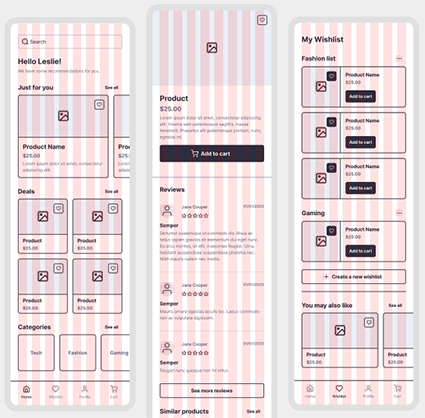
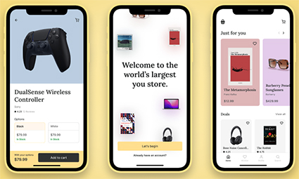
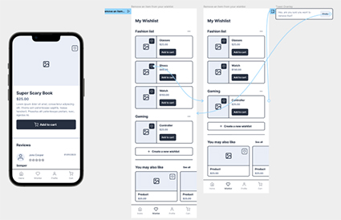

# Explore & iterate

### Wireframes
- Definition: A wireframe is a low-fidelity visual guide that represents the skeletal framework of a website or app.
    - Focus on layout and structure without visual details.
    - Map out user flow and content hierarchy.
    - Black-and-white or grayscale.
    - Placeholder text and simple shapes (boxes for images, lines for text).

 

### Feedback
Getting feedback throughout the design process is a great way to help find potential issues. Finding these issues earlier in the process can make the whole project be more efficient and better for users in the long run.

There are two types of feedback that can impact your design, constructive and destructive. Constructive feedback can be positive or negative, but will still aid in the design process. Destructive feedback impedes the design moving forward. It is mostly caused by asking users the wrong questions or by misleading them. Clients can even go off on a tangent that is not relevant to the current stage of the design process.

You need to be the one that gets others to give constructive feedback. Be as clear as possible when explaining the context of what you want feedback on. You can send a message ahead of time to inform them of what you need. Another thing you can do is set goals that you want to accomplish at each stage. Break down which aspects need to be focused on and what questions need to be answered. Make sure to explain what stage of the design process you are in so that they know what to expect. In a meeting format, it can be overwhelming to have too many people giving feedback at one time so only invite the people you need to. Think about who would have the answers to your questions. Try to get the group involved by generating, voting, and then discussing all of the ideas. Make sure to stay focused and keep on track. If good feedback is off topic, remember to bookmark it for a later time.

### Mockups
- Definition: A mockup is a high-fidelity static representation of a design that includes visuals like colors, typography, and imagery.
    - Present the look and feel of the final product.
    - Showcase the design to stakeholders for approval.
    - Full-color designs with branding, fonts, and UI elements.
    - Non-interactive (static).

 

### Prototypes
- Definition: A prototype is an interactive model of a design that simulates user interactions and functionality.
    - Test user flows and interactions.
    - Gather feedback on usability and functionality.
    - Clickable links, hover states, animations, and dynamic elements.
    - Simulates the final product’s user experience.

 
