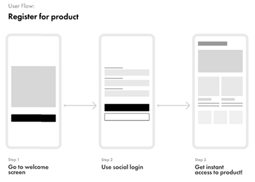

# Getting Started
## Sketching
Sketching is the first part of the design process. It is where you generate as many ideas as you can quickly and get them down on paper. Details are not important at this stage. After gathering your ideas together, you can then decide which is the best and most efficient strategy to work with.
- You will need to sketch out your ideas into wireframes. 
- In this step, you will add details, refine the design, and cut out ideas that don't work. 
- Finally, you will want to pull out the elements of the design that are the most important or repeated throughout the design. 
- These components will really help when building the project.

 

## User Flows
A user flow shows the steps a user takes to achieve a goal. Sketching these flows is intended to communicate the steps the user takes through different screens and actions. They should include a name, step number, and type of user for each flow.

As with your initial sketches, user flows don’t need to be pixel perfect or contain a lot of detail. In fact the simpler the better! You only need to show the steps you think users will take to complete their task with minimal visuals. It’s better to quickly construct flows that you can communicate with your team rather than spend a lot of time developing visuals that may not be technically feasible or impactful to the user experience.
User flows go in one direction, from the start of the task to its completion. They don't go backwards, that is prototyping. Name each flow and label each screen descriptively based on its purpose.

 

## Sitemaps
Sitemaps are diagrams in a specific order that show how pages are organised. Sitemaps should be created pretty early in the design process, to get a better understanding of components that are needed to build up the product. They communicate the structure of the product you're building so they’re not just helpful for you as the designer, but also for the people you’re working with (from developers to content creators).

Sitemaps are a valuable step because it helps to strategically place content where users can find it and aids in the navigation of your product. Use the sketches and user flows you created to help you build out your sitemap.

 