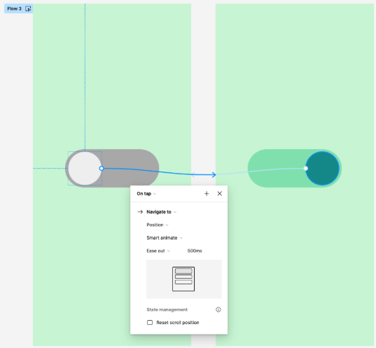

# Motion Design

  
Motion in UX Design

Motion design combines graphic design principles with animation techniques to create dynamic and meaningful visuals. Here are common misconceptions about the field, along with the realities:

#### 1. Motion Design Is Just Animation
**Misconception:** It's simply about moving objects.  
**Reality:** Motion design integrates graphic design, typography, storytelling, and interaction to enhance user experiences and convey information clearly.

#### 2. Motion Design Is Easy
**Misconception:** Motion graphics are quick and simple to produce.  
**Reality:** Motion design demands deep understanding of timing, physics, storytelling, and design software. It often includes planning, storyboarding, and refining.

#### 3. Motion Design Doesn't Require Strong Design Skills
**Misconception:** Animated design doesn't need the same visual skills as static design.  
**Reality:** Strong graphic design skills (color theory, typography, layout) are essential. Motion designers must create visuals that are both attractive and functional.

#### 4. Motion Design Is Only for Videos
**Misconception:** It’s limited to film and TV production.  
**Reality:** Motion design appears in UI/UX, mobile apps, websites, and digital interactions. It enhances usability by guiding users and providing visual feedback.

#### 5. Motion Design Is Expensive and Time-Consuming
**Misconception:** It always requires large budgets and lots of time.  
**Reality:** While high-end projects are intensive, many effective animations can be created quickly with modern tools and workflows.

#### 6. Motion Design Is Just a Trend
**Misconception:** It’s a temporary phase in digital design.  
**Reality:** Motion design is a foundational element of digital communication today and will continue to grow with advances in tech and interactivity.

#### 7. Anyone Can Do Motion Design
**Misconception:** Anyone can make motion graphics with tools like After Effects.  
**Reality:** While tools are accessible, professional motion design requires creative thinking, technical knowledge, and refined visual storytelling skills.

**Conclusion:**  
Understanding these misconceptions helps clarify the depth, skill, and significance required in modern motion design. It’s more than just movement—it’s intentional, strategic, and central to the way we design digital experiences today.

  
What is a Microinteraction?

**microinteraction** is a small, single-use interaction that performs a specific, often functional purpose within a user interface. While subtle, microinteractions are essential because they improve the overall user experience by providing feedback, guiding tasks, or enhancing the visual appeal of a product. They typically consist of four parts: triggers, rules, feedback, and loops or modes.

### Key Components of a Microinteraction

#### Trigger
- The event that initiates the microinteraction.
- This could be a **user action** (e.g., clicking a button or hovering over an element) or a **system-generated event** (e.g., receiving a notification).

#### Rules
- The logic that defines what happens after the trigger occurs.
- Rules determine **how the microinteraction functions** and **what steps are taken** after it is triggered.

#### Feedback
- The response the user sees, hears, or feels after the trigger.
- Feedback is critical because it lets the user know their action has been recognized and informs them of the result.
- It can be:
  - **Visual**: color changes, animations
  - **Auditory**: sounds
  - **Tactile**: vibrations

#### Loops and Modes
- Optional elements that define what happens next.
- **Loops** determine whether a microinteraction repeats, ends, or changes over time.
- **Modes** change the interaction based on specific conditions (e.g., a toggle switch changing state).

Examples of Microinteractions
- **Liking a post**: Clicking a "like" button may change its color, trigger a small animation, or update a count.
- **Password strength indicator**: As you type, the bar or message updates to show password strength.
- **Pull to refresh**: A common mobile interaction where pulling down a list triggers an animation and content reload.
- **Loading spinner**: An animated icon that indicates a process is happening.
- **Toggle switch**: Smooth animation when switching states (on/off), providing clear feedback.

### Importance of Microinteractions

#### Enhance Usability
- Offer immediate feedback to make interfaces more intuitive
- Help users understand the result of their actions

#### Increase Engagement
- Make apps or websites feel polished and enjoyable
- Encourage users to spend more time interacting

#### Communicate Status
- Inform users of system states (downloads, submissions, etc.)
- Reduce uncertainty and anxiety

#### Guide User Behavior
- Subtle visual or functional cues direct users toward desired actions
- Avoid overwhelming users with instructions

### Conclusion
Overall, microinteractions play a crucial role in creating seamless and engaging user experiences by adding a layer of responsiveness and delight to digital products.

### Further Reading
- "Microinteractions: Designing with Details" by Dan Saffer
- [Nielsen Norman Group on Microinteractions](https://www.nngroup.com/articles/microinteractions/)

  
Introduction to Smart Animate

  

  
Motion Design Principles

### Purpose of Motion in UI
Motion design shows transitions between screens, explains how to use the app, and guides user attention. It should describe all animation rules clearly and practically.

### Animation Duration and Speed
- Animations must be **slow enough** for users to notice, but **fast enough** to avoid delays.
- Research shows the optimal speed range is **200–500 ms** based on human perception.
- Animations **under 100 ms** are too fast to be noticed.
- Animations **over 1 second** feel slow or boring.

#### Platform-Specific Timing
- **Mobile**: 200–300 ms (recommended by Material Design)
- **Tablet**: Add ~30% more → 400–450 ms
- **Wearables**: Reduce ~30% → 150–200 ms
- **Web**: Should be shorter, around **150–200 ms** for transitions due to user expectations of speed

For **decorative animations or attention grabbers**, these rules can be ignored.

#### Factors Influencing Duration
- Duration depends on **travel distance** and **object size**
- **Smaller changes** = faster animation
- **Larger elements or complex changes** = slightly longer durations look better
- When **multiple objects move**, the shortest path should finish first

📉 Avoid using motion blur—it's hard to reproduce on most devices and not suitable for UI

⏳ When list items appear (e.g., news cards), each item should be delayed by **20–25 ms**. If slower, it may irritate users.

---

### Easing Curves: Make Motion Feel Natural
**Easing** helps objects move naturally, not mechanically. Inspired by Disney’s "Illusion of Life".

#### Linear Motion
- Moves at a constant speed — unnatural to the human eye
- Only use for changes in **color** or **opacity**, not position

#### Ease-In (Acceleration)
- Starts slow and speeds up
- Use when an object exits the screen and won't return (e.g., dismissing a card)

#### Ease-Out (Deceleration)
- Starts fast and slows down
- Use when elements appear on screen from the outside

🎭 Even small curve adjustments change the feel of the animation dramatically. Use curves that mimic real-world physics.

---

### Motion Choreography
Think of UI motion like **ballet choreography** — transitions guide the user’s attention.

#### Types:
1. **Equal Interaction**
   - All elements follow the same animation rule
   - Items (e.g., cards) appear one by one in sequence (top to bottom)
   - Avoid showing everything at once or out of order — this distracts users

2. **Subordinate Interaction**
   - One central object gains focus, other elements animate in relation to it
   - Helps keep user attention where it matters
   - Useful for highlighting main content in complex layouts

📌 If animating many items, define a clear sequence and minimize simultaneous animations.

---

### Summary
UI animation should reflect the physical world: friction, acceleration, etc.
- Mimic natural motion to help users understand the interface
- If animation draws too much attention, **soften or remove** it
- Animation should never slow down the user

Remember: **Animation is more art than science** — always **test with real users**

- [12 Principles of Motion Design](https://app.uxcel.com/lessons/principles-of-ux-in-motion-959)

  
The Motion Design Process

The motion design process involves several key steps that help ensure the final product is not only visually appealing but also effective in communicating the desired message.

### Step 1: Discovery and Research

This initial phase is all about understanding the project’s goals, the target audience, and the context in which the motion design will be used.
- **Understanding the Objectives**: Identify the purpose of the motion design (e.g., product demo, brand promotion, UI animation).
- **Audience Analysis**: Research the target audience to understand their preferences and behaviors.
- **Competitive Analysis**: Study what competitors are doing to find inspiration and identify ways to stand out.
- **Moodboards and Inspiration**: Collect visual references, color schemes, and animation styles to set the visual tone.

### Step 2: Design and Storyboard

Once research is complete, begin designing and creating storyboards.
- **Concept Development**: Create a concept that aligns with the project's goals.
- **Storyboarding**: Illustrate the animation sequence using visual frames to show timing and flow.
- **Designing Key Frames**: Create the major scenes or transition visuals that guide the animation.
- **Client Feedback**: Share the storyboard and key frames with stakeholders to align before animation.

### Step 3: Prototype

After design approval, start creating an animated prototype.
- **Animation**: Animate key frames with transitions and effects.
- **Interactivity (if needed)**: Add interaction to showcase user engagement (for UI/UX).
- **Tools and Software**: Use tools like After Effects, Adobe Animate, CSS, or JavaScript.
- **Refinement**: Iterate to fine-tune timing, pacing, and flow.

### Step 4: Testing

Ensure the prototype functions effectively and delivers the intended experience.
- **User Testing**: Test usability and user understanding, especially for UI animations.
- **Performance Testing**: Ensure smooth animation on various devices/platforms.
- **Client Review and Feedback**: Gather final input from stakeholders.
- **Final Adjustments**: Make last tweaks like timing fixes or sound effects.

### Conclusion

With testing and final adjustments complete, the motion design is ready for launch. Whether implemented in a website, app, or video, this structured process ensures the motion design is visually polished, functional, and impactful.

The steps of discovery, design, prototyping, and testing guarantee both aesthetic quality and communication effectiveness.

