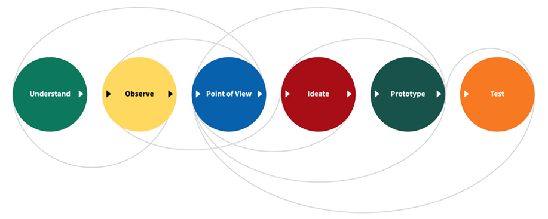
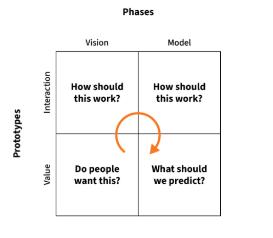

## Module 2: Prototyping AI Designs

- **Prototyping** is the activity of creating rapid approxim Prototyping lies at the heart of innovation, involving the **quick building of rough versions of ideas** to **gather internal and external feedback**. This iterative process fuels creativity, collaboration, and design, bridging the gap between conceptualization and realization. Prototyping is fundamentally about rapidly approximating your ideas to facilitate iteration. 
- Beyond visualization, **prototyping explores the design's functionality and target audience**, fostering a deeper understanding to ensure the final product resonates with users.
---
- Prototyping is actually a quick and low-cost way to simulate and test your ideas and designs during product development.
- AI prototyping is about using artificial intelligence technology to see how AI can help improve user experience and interaction during product design and testing.
- If you are designing an AI-driven chatbot application, you can first use a large language model (such as a model like GPT) to create a preliminary prototype.
- Then you can let some users experience the prototype and collect their feedback to see if the questions answered by AI meet the requirements.
- You can continuously adjust and optimize the model based on user feedback to make its answers more in line with user needs. After repeated iterations, your AI product will be more and more in line with the original design intention and more able to meet user expectations.
- This prototype can be presented in many ways, for example, it can be a simple interactive interface that allows users to interact with AI by clicking, entering text or voice.
- It may also be a very basic model that just runs in the background to let users experience its reactions and results. In short, the purpose of this prototype is to allow users to experience the approximate functions and effects of the product as early as possible, and give feedback so that the design team can continue to improve.
- Prototype design is actually like an early sketch or prototype. It is mainly used to test and verify the feasibility of ideas, not the final product. So it will be relatively simple, and the focus is on rapid iteration and collecting feedback so that the product can be continuously optimized.
- You can use Figma to build a simple wireframe diagram to let customers experience the overall process and functions first, without having to invest a lot of energy in designing colors, fonts or other visual elements at the beginning. In this way, customers can focus more on the core functions and interactive experience of the product!
- In fact, the prototype design method of "The Wizard of Oz" can also be understood as a process of continuous exploration and experimentation in AI products. Just like the protagonists in the story constantly discover new possibilities in their adventures, in AI prototype design, we also make the product more perfect and closer to user needs through continuous trials, testing and adjustments. Therefore, this method is actually a spirit that encourages us to explore and innovate in the design process.

  
1. Human-Centered Design and AI

## Why Prototype? Understanding the Design Process
 
### human-centered design (HCD)
- Human-centered design (HCD) is a creative problem-solving approach that flips the script on traditional development. Instead of focusing solely on technical feasibility, human-centered design prioritizes the people we are designing for. **This iterative process starts by understanding their needs and behaviors, and then uses those insights to craft tailor-made solutions**.
- The core of human-centered design lies in empathy. **By observing users and gathering feedback throughout the process (understanding, ideation, prototyping, testing), designers continuously refine their solutions**. This ensures the final product is not only intuitive and accessible but also resonates with the target audience's wants and pain points.
- Ultimately, human-centered design leads to products that users feel invested in, because they have been part of the journey. This translates into higher user satisfaction and potentially, greater profitability.

### the challenges in AI-based product design
- ntegrating AI into human-centered design introduces new challenges, especially in understanding AI capabilities during need-finding, ideation, and prototyping. Traditional methods often fall short for AI systems, requiring innovative strategies for effective evaluation. AI has the potential to revolutionize product development by enhancing user experiences and driving business growth, but **it demands a deep understanding of technologies, substantial resources, and skilled teams**.
- For example, integrating AI into an e-commerce platform to analyze customer behavior and offer personalized recommendations involves **training algorithms on vast data, optimizing infrastructure, and ensuring seamless integration**. This process can disrupt workflows, so it requires careful planning and team training. Close collaboration between developers, AI experts, and stakeholders is essential.
- While AI integration in product development poses challenges, adopting the right strategies allows businesses to unlock AI's full potential, by ultimately creating products that meet consumer needs and drive growth.

  
2. Prototyping AI-Powered Systems

- By creating tangible representations, **teams can rigorously test assumptions, refine designs, and ensure that the final product aligns with user needs**. It saves time and resources while sparking innovation through experimentation.
- In AI development, for example, prototyping can uncover challenges early, allowing for course corrections before full-scale production.

## Why Prototyping is Particularly Challenging for AI-Based Designs

We often follow a structured process. One widely recognized framework comes from the Hasso Plattner Institute of Design at Stanford University, also known as d.school. 

- **Understand**: Gain a comprehensive understanding of the problem space
- **Observe**: Conduct thorough observations to gather insights about the users and their needs
- **Point of View**: Formulate a unique perspective on the problem, which serves as an angle to approach the solution
- **Ideate**: Generate a wide range of ideas and concepts that could potentially solve the problem
- **Prototype**: Create tangible representations of the ideas to test their viability
- **Test**: Evaluate the prototypes with real users to gather feedback and refine the solution

### **prototyping is the most problematic stage in the context of AI**
- Traditionally, you can get feedback on a prototype just by creating static mocks of the system. 
- with AI, **we need to prototype the AI's behavior**. 
- Prototyping AI systems requires a different approach. The complexity of developing functional AI prototypes, which **involve sophisticated algorithms and data processing**, significantly increases the difficulty of this step. As such, effective prototyping in AI requires adapting traditional methods to accommodate these unique challenges.

### **The Need for Prototyping in AI Development**
- AI tools can exhibit unexpected behavior because they are designed to **respond to open-ended inputs**, and in the case of generative AI, to produce open-ended responses as well. Consequently, **AI tools require more comprehensive testing strategies to mock in their complexity and potential unpredictability**. 
- **AI systems learn and adapt from data, which introduces a level of variability that can lead to unforeseen outcomes**.
- **Prototyping allows developers to simulate AI functionality to provide preliminary insights into the system's performance and the user experience**.

### AI projects typically unfold in two major phases: **product vision** and **model development**

- **Product vision**: **In the product vision phase, prototypes help answer fundamental questions about what product to make and how humans should interact with the AI**. Although prototypes do not directly provide these answers, they help test hypotheses by offering a cheaper alternative to building the full product. This allows the development team to explore multiple options and gather feedback from stakeholders and users about the potential of each. Prototyping in this phase is crucial for aligning the product with user needs and expectations.
- **Model development**: **The model development phase focuses on the detailed workings of the AI system itself**. Here, prototypes are used to determine the specific functionalities the system should have and to identify the areas where AI is needed versus where heuristics or human intervention might be more effective. This phase is more granular, involving the testing of specific components and interactions within the model. Prototypes in this phase **help developers pinpoint the key areas that require AI's capabilities, ensuring that the final system is both efficient and effective**.
- **Value prototypes**: **Value prototypes aim to identify the potential value and feasibility of AI functionalities**. 
  - During the product vision phase, **they assess the overall potential of the product and gather feedback from users and stakeholders**. 
  - In the model development phase, **value prototypes help determine where AI should be applied versus where simpler solutions might suffice**.
- **Interaction prototypes**: **Interaction prototypes focus on understanding how users interact with AI**. 
  - In the product vision phase, **they explore different ways users might provide inputs and interact with the system, helping developers refine the design**. 
  - During the model development phase, **interaction prototypes ensure that the design is practical and grounded, avoiding overly ambitious expectations that the AI might not be able to meet**.

### **iterations and prototyping are in creating innovative and user-friendly technology**

  
3. Principal Techniques for Prototyping AI-Powered Systems

- As we test our prototype, we can reflect on its performance—recognizing **what works well and what does not**. 
- It is important to remember that the true goal of prototyping is not the prototype itself, but **the feedback and insights we gain throughout the process**.

**when it comes to AI-powered designs, prototyping can become more complex**

**dig deeper into the importance of iteration and prototyping in design**

## Two essential techniques for prototyping AI-powered systems
- **Experience prototype**: you're trying to prototype how it feels to use the system.
- **Technical prototype**: you're trying to prototype whether it's possible to build the system.

## Large Language Model Prototyping
- The fact that LLMs can effectively perform a wide range of tasks, all at frontier (state of the art) levels and without additional finetuning, opens it up as an extremely powerful prototyping tool. 
- **An experience prototype** focused on what it's like to use the application rather than how it looks and interacts.
- For these purposes, you can often rapidly approximate the experience by asking ChatGPT or another LLM without ever building the product itself, allowing for rapid feedback.
  - For example, imagine that you are creating a dinner-planning app for families. 
    - In a paper prototype or a Google Form, you might ask some potential users to describe the input you might ask for in such an app (e.g., kids' food preferences, any constraints). 
    - Then write a prompt to ChatGPT asking it to turn those constraints into a meal plan for the family and a grocery shopping list. 
    - Show that output back to the user and get their reactions—is this the kind of thing that would be helpful? Viola, you've now got a "headless" user experience that has no actual user interface, but which can let you iterate on the goals and experience of your envisioned design!
- **An out-of-the-box LLM** can help us determine whether a problem is even solvable.
  - we wanted to create a design tool to **help forum moderators quickly moderate comments on theira forums**. 
  - We can build a custom model like Google's Perspective API, which takes years, 
  - or, we can simply ask Gemini, ChatGPT, Claude, or another model to directly classify these comments as "civil" or "uncivil", and build our prototype interface around that. 
  - This approach allows us to craft a working prototype in just a few minutes, which lets us gather feedback on the design from users immediately.
  - we could utilize OpenAI's APIs as a foundation for our prototyping process. By pasting a comment into a prompt and asking the model to evaluate its civility, we would have a functioning prototype in under five minutes. This rapid development showcases the potential of LLMs to provide immediate insights into whether our AI concept is viable.

### **creating technical prototypes**
- If you can get it to work out of the box with a large language model, you can definitely build a custom AI to perform the task if you want—or continue to tweak the LLM if desired
- If you can get the task to sort of work with a LLM, you can assume that it will get slightly to moderately better if you continue to invest time and resources into the task
- If the LLM simply cannot do the task, it's less likely that you'd be able to get something working with more resources. (Remember, these LLMs are frontier models that are essentially state of the art on nearly every task right now—so if they can't do it, it's unlikely that others will do much better.)

**Let's break down LLM technical prototyping in five steps:**
- 1. The first step involves clearly defining the problem our AI is intended to solve. What specific goals do we envision for it? What kind of data will it need to learn and process effectively? Answering these questions helps determine the overall direction and feasibility of our AI, and ultimately, whether prototyping is the best course of action.
- 2. AI prototyping focuses on building a simplified version that explores a specific aspect of the AI's capabilities. This could be a particular algorithm we want to test, a method for processing data, or even how users might interact with the final product.
- 3. Pick one of numerous tools and frameworks available to quickly build an experiment with the AI. Cloud-based platforms, pre-trained models, and even low-code development tools can be leveraged to create a basic version and test various approaches without extensive coding expertise. Since this is a prototype, you can even just try giving the task and example inputs to your favorite LLM chatbot, without using an API at all.
- 4. The core of AI prototyping lies in the iterative cycle of building, testing, and refining. Once we have a basic prototype, we can test it with relevant data to make sure that the AI is operating roughly to spec. Your goal isn't to make a production-ready AI, it's just to make it good enough to be able to establish feasibility and to test the design with users. If the design gets positive feedback, then it's time to invest time and resources into performance.
- 5. Now, it's time to share the prototype with relevant experts or stakeholders. Their feedback can provide valuable insights to further refine our prototype and guide the development of the full product.

### Conclusion
In summary, leveraging large language models for prototyping offers a powerful and efficient way to explore AI concepts. By starting with LLMs, we can quickly assess the viability of our ideas, iterate on designs, and ultimately build a more effective AI system. This approach not only saves time but also enhances the overall development process, making it easier to navigate the complexities of AI design.

## Wizard of Oz Prototyping

- Wizard of Oz prototyping lets us build these products without writing a single line of code, allowing developers to save time and resources while gathering valuable user feedback.
- Wizard of Oz prototyping involves **a human simulating the behavior of an AI system, effectively pretending to be the AI to test its functionality**.
- To create a Wizard of Oz prototype, we start by **mapping out scenarios and application** flows. It is important to determine **what should happen in response to user actions** and create basic interface sketches that could even be paper prototypes.
- For successful Wizard of Oz prototyping, at least two people are needed: **one to facilitate the participant study** and **another to act as the “wizard,” ideally hidden from the participant’s view**.
- After testing, gather user feedback through traditional UX methods, such as retrospective debriefing sessions, to refine our design based on real user interactions.

### The advantages and potential drawbacks of Wizard of Oz prototyping
- **Advantages**: It enabled faster iteration, lower costs, and a more user-centered design process compared to traditional prototyping methods. The designers also gained valuable insights by directly experiencing how users interacted with the system. 
- **Drawbacks**: The approach also required maintaining the illusion of an AI system while manually handling user interactions, which could be labor-intensive and unsustainable in the long run.

**By simulating complex functionality with human intervention, designers can explore ideas, identify key features, and make more informed decisions about which technologies to invest in for the final product.**

