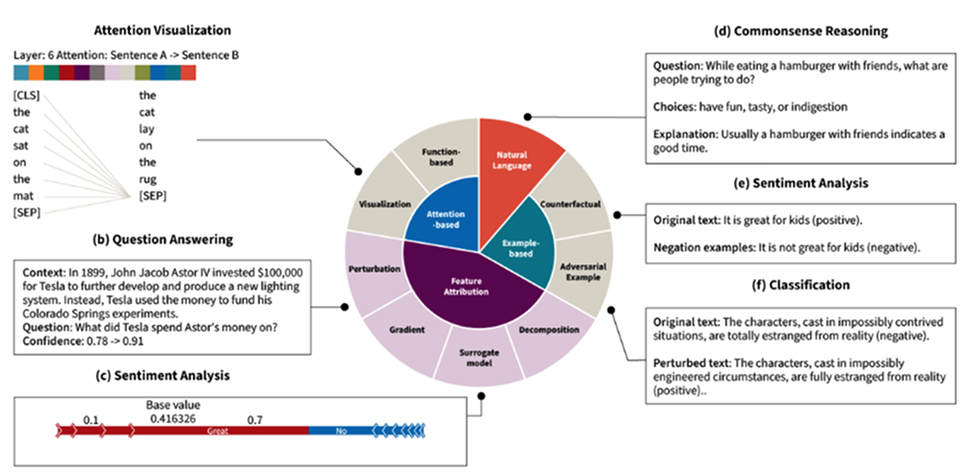
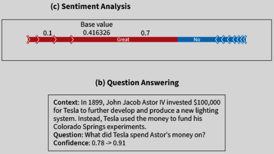
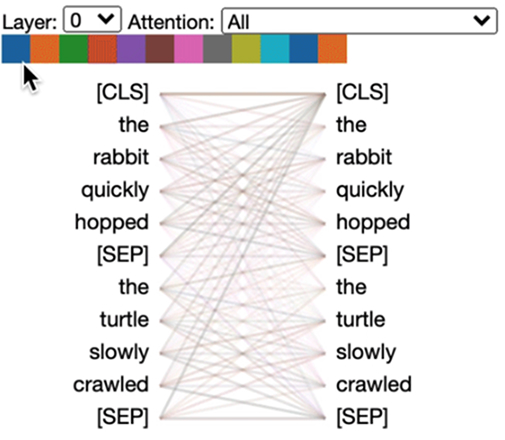

# MODULE 4: User Trust and Explainability in AI Systems
We will learn how brittle user trust in AI can really be, and how that trust can significantly impact the adoption of generative AI models. We will explore how user trust impacts the way these models are viewed and learn about the concept of complementarity in the field of human-computer interaction.

- **Algorithm aversion**: Tendency for people to distrust and avoid using algorithms after observing them make mistakes.  
- **Complementarity**: Refers to the collaborative relationship between humans and AI systems where both contribute their unique strengths to achieve better outcomes than either could alone.  
- **Local Interpretable Model-agnostic Explanations (LIME)**: Explainability technique focused on explaining specific generative AI decisions by trying to convey what would have moved a particular input to a different outcome. This means that the model is not completely describing what makes it decide the way it does, but it does explain what would have made it provide a different answer in case it got it wrong.  
- **Mechanistic interpretability**: Explainability technique focused on understanding the fundamental behaviors of algorithms by analyzing patterns of neuron activations. It helps to ensure that the AI model is learning and making decisions for the right reasons.  
- **Overreliance**: A situation where users depend excessively on AI outputs, often accepting them without sufficient scrutiny, even when the AI's suggestions are incorrect.  

  
User Trust in AI and Why It Matters

Human-AI interaction is **to achieve better results through people using AI than through through people trying to solve the same problems themselves** - complementarity and intelligence augmentation. 

-  designers need to identify those situations 
    - **where artificial intelligence should be responsible for making certain actions easy (accelerators)** 
    - **where it should double check the person's actions (verifiers)**
    - **where it should lay out a set of options (design galleries)**
    - **where the AI should act without any human intervention at all**
        - For example, we would not want humans in charge of deploying a vehicle’s airbag. This should be an automated task instead. 
        - Whereas when wording an email, you'd certainly want to be able to make final edits before sending to a recipient.
    - To achieve complementarity, we need to focus on situations where there is a legitimate possibility that a human-in-the-loop (or AI-in-the-loop) design can yield benefits. Airbags don't fit. But, code development and strategic decision making might.

### The Importance of User Trust in AI
- **How do we design AI systems that project clearly what they can and can't do, so that people retain trust in them?**
- If shoehorning AI into existing work practices will cause the AI to be rejected, **creating tools that integrate it nonthreateningly into those practices may succeed**.
- **Nonthreatening AI is trusted better**: it's that the AI projected a level of competence and importance that was aligned with the level of trust that users were willing to place in the AI.

  
Aiming for Complementarity

A central aim of generative AI is to reach a point where the human and the AI working together achieves better outcomes than the person alone, or the AI alone. This is known as complementarity because it supports the idea that each modality adds to the insights and knowledge of the other, resulting in well-rounded results with reduced information gaps. 
The hope is that the AI can help accelerate me or identify my errors, and I can help identify the AI's errors too. If we play this duet successfully, the final result is better than anything either modality could have produced alone.

### **complementarity can be achieved**, but not everyone achieved complementarity. 
- AI assistant had the greatest impact on novice and low-skilled workers—but not everyone achieved complementarity.
- **It actually had minimal impact on experienced and highly skilled workers**, because the AI had been trained on those experienced workers, so it was just recommending what they would have done anyway!
- Generative AI is a powerful enabler for competitive advantage if used the right way and for the right tasks.
- In areas like creative product innovation, ideation, and content creation, approximately 90% of participants using generative AI improved their performance, with an average productivity increase of 40% from those who did not.
### **The Reality: It’s a Wash**
- **There was complementarity on ideation tasks**. 
- But—when participants were working with the same generative AI tool on tasks that were outside the tool’s current competence, such as business problem solving, the result reversed! Here, participants who used generative AI took misleading outputs at face value, and as a result, **they performed 23% worse than those performing the tasks without AI (Candelon et al., 2023)**. Complementarity can be tricky to achieve. 
- The use of generative AI tools can undeniably provide excellent results if used in the right context. 
- However, in other cases, **people either decide to blindly trust the AI’s outcomes and don't exercise enough oversight**, or **they decide to not trust the tool at all**. This is not ideal, and we must explore the reasons why this is happening.

  
Algorithm Aversion and Overreliance

Although we know that complementarity can be achieved, we have not yet reached a point where the general population actually achieves complementarity with AI. In most cases, people either overrely on a model’s outputs or mistrust it completely, resulting in isolated outcomes. 

### **Algorithm Aversion**
This is the core of algorithm aversion: our trust in AIs is brittle. Once we see it make an error, we massively downgrade our trust in the AI—much more so than we'd downgrade our trust in a person who makes the exact same error. Algorithm aversion also supports the idea of being conservative when promoting the capabilities of an AI-powered system rather than over-selling its features. This goes in accordance with Eytan Adar’s quote: “Don’t let your UI write a check that your AI can’t cash.”

### **Overreliance**
Effortful thinking is cognitively costly, and double checking an AI is effortful. So, in practice, we tend to engaging in satisficing: rather than optimizing for the best result, we aim for a satisfactory result, minimizing our cognitive effort beyond whatever is necessary.

  
Is Explainable AI a Solution to Algorithm Aversion or Overreliance?

  ### **Here are a few ways in which overreliance and algorithm aversion can be mitigated**:
  - #### **Providing Multiple Suggestions**
  Design galleries, where **generative AI models produce multiple parallel results**, can help mitigate risks where one of the outputs might not be as good. In other words, **if the user sees that at least one option is good, they may be willing to forgive other, less correct ones**. This approach is evident in image galleries such as DALL-E.
  - #### **Raising the Stakes**
  One way to better calibrate over-reliance is to **make sure that the stakes are calibrated appropriately**. **Over-reliance goes down when people view the cost of an error to be higher, or the effort of verifying the AI to be lower**.
  - #### **Explainable AI**
  People strategically decide whether to engage with an AI explanation based on a cost-benefit framework, weighing the costs and benefits of engaging with the task against those of relying on the AI. Explainability techniques can help someone who is carefully paying attention to verify the information. 
  
  ### Explainability Techniques

  #### **Why Do We Need Explainability in AI?**
  AI sometimes makes strange decisions. To trust it, we want to know why it did what it did. **Explainability techniques try to answer that question in different ways**.

  There are a few general approaches to explanation in modern AI models. The image below provides a breakdown of these strategies by categorizing them as:
  - Attention Visualization
  - Question Answering
  - Sentiment Analysis
  - Commonsense Reasoning
  - Classification

  

  It is important to identify which one would be most relevant to each type of AI model. Let’s look at some of these strategies shown in Zhao et al.’s paper titled Explainability for Large Language Models: A Survey:

  

  
Natural Language

  One technique is to use natural language to provide an explanation, and ask the model to explain using commonsense reasoning as to why it is suggesting a specific answer.
  #### **(d) Commonsense Reasoning**
  - Question: While eating a hamburger with friends, what are people trying to do?
  - Choices: Have fun, tasty, or indigestion
  - Explanation: Usually a hamburger with friends indicates a good time.
  

  
  

  
Example-Based

  Another strategy is to provide examples that explain why the model is providing certain results. These could include counterfactual examples ("what if" scenarios) or so-called adversarial examples that show how minor changes might alter the tone of a sentence. In the example below, the algorithm is explaining a sentiment analysis decision by demonstrating the kinds of perturbations that would have caused the model to change its decision.

  #### **(e) Sentiment Analysis**
  - Original text: It is great for kids (positive).
  - Negation examples: It is not great for kids (negative).

  #### **(f) Classification**
  - Original text: The characters, cast in impossibly contrived situations, are totally estranged from reality (negative).
  - Perturbed text: The characters, cast in impossibly engineered circumstances, are fully estranged from reality (positive).
  

  
  

  
Feature Attribution

  What signals are mattering to the model? Feature attribution strategies aim to highlight the importance of different features or words in the decision of the generative AI model. There are many ways to do this, but one common one are through what are called Shapley values. We can see an example of the visualization of Shapley values of sentiment analysis of the sentence "What a great movie! ...if you have no taste." below:

  

  

  
  

  
Attention-Based

  Attention-based techniques are those that demonstrate how the algorithm works. (The most widespread and performant algorithms underlying large language models use a deep learning architecture that is referred to as "attention".) The graphic below shows an example of how to visualize attention in a large language model.

  

  The example shown above depicts attention layers in action. It shows how attention is distributed across different tokens in a sentence pair ("The rabbit quickly hopped" and "The turtle slowly crawled"). The lines represent the connections between words, illustrating how attention layers focus on certain parts of the text.

  This technique is a no-holds-barred, direct visualization of the weights that are connecting attention layers in the underlying language model. Its intent isn't to explain to a lay user, but to visualize the algorithm's raw behavior. Due to its technical nature, this strategy is not ideal for non-technical end users.

  

  ### Simplifying the Model

  ### Mechanistic Interpretability

  ### The Explainability Dilemma

