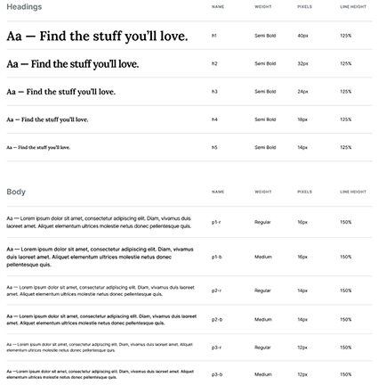
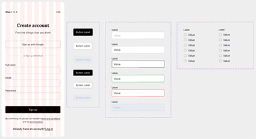
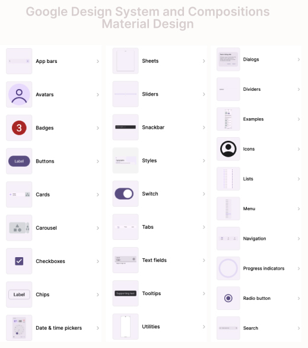

## Visual Design & Design Systems

<details>
  <summary>Spacing and Grids</summary>
  
- Grids: Always start with the basics. In this case, base units. The base units are going to define what every other unit is based off of. They make the whole design easier to scale and handoff. The base unit that is the most recommended is 8px because most screen sizes are divisible by 8 and its divisible itself. All other UI elements should be in increments of the base unit.

Grids are made up of **3 elements: columns, gutters, and margins**. Columns are the vertical sections that go from left to right. Typically a **12 column grid** is used, because it can be divided in so many ways it makes it more versatile. Keep in mind, most desktops today are extremely wide. Use max-width to contain your grid so users don't have to turn left to right to view all of your content. Gutters are the white space between the columns. Margins are the outside edges of the columns that separate the grid from the edge of the screen. The gutter and margin size are going to be a multiple of the base unit.

- Layouts: Using multiple types of grids together can help balance and visually enhance your design, but once you get your grids on a page, there are still more choices to make. The responsive part of the grid comes with choosing between fixed, fluid, and adaptive grids. Fixed layouts will stay the same no matter what the screen size. Fluid layouts will stretch and shrink with your content. Adaptive layouts will change to use different grids depending on the screen size it is at. By using breakpoints, you are able to change the design of the page for different screen sizes.

There are far too many screen sizes out there now to worry about specific breakpoint numbers. Using just small (600px), medium (768px), large (1024px), and extra-large (1280px) sizes will be a good starting off point to get an idea of what the layouts should be.

 
</details>

<details>
  <summary>Typography/Fonts</summary>
Typographic design is a highly specialized area of graphic design focusing on the creation and design of letterforms, typefaces, and type treatments . Some type designers own digital type foundries, which are firms that design, license, publish, and dispense fonts. Other typographers specialize in handmade type and typefaces. Lettering is the drawing of letterforms by hand (as opposed to type generated on a computer). Typographic design includes custom and proprietary font design for digital type foundries, hand lettering,handmade type, and custom typography.

By taking a **base font size of 16px**, you can multiply it by the **golden ratio of 1.618** and get multiples of the size for headings. 
You end up with **10px or 0.618em, 16px or 1em, 26px or 1.6118em, 42px or 2.618em, and 68px or 4.236em**. These fonts follow the golden ratio curve and are eye-catching.

### Color: Before choosing colors, ask yourself what message does the brand want to communicate or what problem is it trying to solve. Colors can really influence the personality of the brand.

Another thing to look at is who the target users are. Knowing the demographic of the users and if there are cultural influences can really help in choosing the right colors. Think about what the colors mean to you as well. The psychology of color is a powerful tool that shapes how we perceive the world.

Colors should be able to be scaled or added to, by having a mini monochromatic palette within each color. You can add depth to your blacks and greys by adding in hints of the brand colors. Sometimes black comes off as too harsh if left untouched.

The most important thing when choosing **colors is to test for accessibility**. Make sure there is enough contrast between backgrounds and foregrounds to ensure it is readable for everyone. 

 
</details>

<details>
  <summary>Imagery and Iconography</summary>
Images, Icons, Illustration, Graphic interpretation, Collage, Photomontage, Mixed media, Motion graphics and Diagram

 
</details>

<details>
  <summary>Forms and UI Elements</summary>
  
- **Forms**: Forms are a collection of input fields that allow users to submit data to a server or process within an application. They are commonly used for tasks such as signing up, logging in, filling out contact information, or submitting feedback. A form typically includes:
    - Text Fields: For entering text input.
    - Checkboxes: For selecting multiple options.
    - Radio Buttons: For selecting one option from a set.
    - Dropdowns: For selecting an option from a list.
    - Buttons: For submitting or resetting the form.
     - Labels: Text that describes the purpose of each input field.
    - Error Messages: To indicate if there are issues with the input (e.g., required fields left empty).
- **UI Elements**: UI Elements are the building blocks of a user interface. They are the components that users interact with on a screen. These elements can be simple or complex and include:
    - Buttons: Interactive elements that trigger actions (e.g., "Submit", "Cancel").
    - Text Fields: Areas where users can input text.
    - Icons: Visual symbols representing actions, objects, or ideas.
    - Sliders: UI components that allow users to select a value from a range.
    - Progress Bars: Visual indicators showing the progression of a process.
    - Tabs: Navigational elements that switch between different views or sections.
    - Modals: Pop-up dialogs that require user interaction before returning to the main content.
    - Tooltips: Small informational pop-ups that appear when hovering over an element.

     
</details>

<details>
  <summary>Accessibility</summary>

  Accessible design enables users with diverse abilities to navigate, understand, and enjoy a UI. As designers, the products that we create should be usable by everyone. If just one person can't use your design, then you have failed them in a sense. This is the process of accessibility, making things accessible to all people.

  - [Accessibility - Material Design](https://m3.material.io/foundations/designing/overview)
  - [WCAG Standard](https://www.w3.org/WAI/standards-guidelines/wcag/)

   > "Accessibility is not a checklist. It should be ingrained in the way we design." - Daniel Schifano

   Assistive technologies
    - Screen readers: A program that reads the content of a web page created for visually impaired users.
    - Braille terminals: A keyboard created for the blind or visually impaired users to navigate a computer and the internet.
    - Screen magnifier: Enlarges a portion of the screen that the user hovers over.
    - Alternate Input Devices & Software: These include voice and push buttons that control the actions on the computer.


</details>

<details>
  <summary>Design Patterns</summary>

  A design pattern is a general solution that can be repeated to commonly occurring problems. The first step is to analyse the problem and then to find ways to eliminate or help resolve any pain points. Look for usability issues with real data from testing and feedback.

  Next, look at how other brands and products have solved this problem. Having multiple examples of how a solution is implemented can give you more insight if this is something that will work for your product.

  Finally, choose the one solution that will work best for your product. This is why lots of designs look the same across varying sites, because these patterns become the standard proven to help users. You don't always need to create innovative ways of doing things, but always seeing the same thing can get boring too. It's a delicate balance of good design with good user experience. 
  
  Design patterns can be put into six categories:
  - Data & input: Products that give feedback and response to data they receive, like a drag and drop UI.
  - Content structure: The structure of the content on a page that streamlines the flow and helps improve the accessibility of the product.
  - Navigation: Ensure the ease of navigation through the product. This includes sidebars, hamburger menus, and navigation bars.
  - Incentivization: Provides the user with positive feedback to get them to keep using your product.
  - Hierarchy: Gives a flow to the product to visually establish important or primary elements.
  - Social Media: Encourages users to share the product with members of their social networks.

  Our minds are wired to always look for patterns in the things we do repeatedly. We are looking for efficiency and easier access to things constantly. Using these standards creates less cognitive strain (brain power) to use a product.
</details>

<details>
  <summary>Visual design</summary>

  Web composition refers to how visual elements are arranged on a web page to create clarity, hierarchy, usability, and aesthetic balance. A strong composition helps users navigate content and engage intuitively with the site.

### Core Principles of Web Composition

**1. Grid System**
- Creates consistent alignment and spacing
- Helps maintain rhythm and structure
- Common systems: 12-column grid, baseline grid

**2. Visual Hierarchy**
- Guides the viewer’s eye from most to least important
- Uses size, color, spacing, and contrast
- Example: Headline > Subheading > Body text > Footer

**3. Whitespace (Negative Space)**
- Gives elements room to breathe
- Enhances clarity and elegance
- Prevents clutter and overload

**4. Balance and Symmetry**
- Symmetrical: Stable, formal, safe (e.g., portfolios)
- Asymmetrical: Dynamic, engaging, modern (e.g., creative studios)

**5. Focal Point**
- Clear visual entry point (e.g., hero image, call to action)
- Often larger or more colorful than surroundings

**6. Consistency**
- Typography, colors, and UI elements repeat consistently
- Supports brand identity and user recognition

### Recommended Visuals for Web Composition
Visual types to use for teaching and layout reference:
- Wireframe layout examples (mobile vs desktop)
- Grid overlays on existing websites
- Visual hierarchy diagrams
- Before/after layout improvements

### ✅ Summary
> “Good composition is invisible. It guides, balances, and brings clarity without calling attention to itself.”

A well-composed web page invites users in, helps them understand what to do, and reflects the brand’s tone — all without visual chaos.

 
</details>

<details>
  <summary>Design Systems</summary>

  - [Google - Material Design](https://m3.material.io/)

  A design system is a single place where all the elements needed to design a product live. It creates a single source of truth for each individual element of the design where anyone on a team can easily see and use it. A common methodology for design systems is atomic design. It is based on the book of the same name by Brad Frost and breaks a design system up into atoms, molecules, organisms, templates, and pages that work together to create an entire system for a product. Each piece builds on the piece before it and adds more to the design. In the Complete Web & Mobile Designer course, Daniel uses a similar methodology based on a foundation, components, and then recipes to build out an entire product.

  - The foundation has colors, typography, icons, and other individual items that may be used in the product.
  - Components are where elements from the foundation are put together to make reusable items such as buttons, inputs, and cards.
  - The recipes section is where all the components come together to make even bigger groupings of what will make up sections of an app or a page.
  - The biggest thing to remember is that design systems are ever evolving.

  Material Design is a design system built and supported by Google designers and developers. Material.io ies in-depth UX guidance and UI component implementations for Android, Flutter, and the Web.The latest version, Material 3, enables personal, adaptive, and expressive experiences – from dynamic color and enhanced accessibility, to foundations for large screen layouts and design tokens.nclud

   

   <details>
  <summary>How to Use Material Design – A Practical Guide</summary>

  ## Design Phase

### (1) Plan the Layout
- Use a **12-column grid system** to create responsive layouts.
- Example: Visual alignment of content to grid for consistency.
- Ensure key content appears in visual hotspots (e.g., screen center).

### Why Material Design Components Are Responsive

#### 📐 Responsive Grid
- Uses a **12-column layout system**.
- Components adjust sizes dynamically based on screen width.
- Use `flexbox` or `CSS Grid` for fluid responsiveness:
```css
.container {
  display: grid;
  grid-template-columns: repeat(auto-fit, minmax(200px, 1fr));
}
```
✅ Components auto-wrap and scale with screen width.

#### 📏 Breakpoints (Media Queries)
Material Design includes predefined breakpoints: XS, SM, MD, LG, XL.
```css
@media (max-width: 600px) {
  .button { font-size: 12px; padding: 8px; }
}
@media (min-width: 600px) {
  .button { font-size: 14px; padding: 10px; }
}
@media (min-width: 1024px) {
  .button { font-size: 16px; padding: 12px; }
}
```
✅ Buttons and cards adjust size based on screen.

#### 🔄 Adaptive Component Sizing
- **Buttons**: Compact on mobile, more padding on desktop.
- **Dialogs**: Fullscreen on mobile, modal on larger screens.
- **App Bar**: Hamburger menu on small screens, full menu on larger ones.

#### 🖼️ Adaptive Layouts (Density Scaling)
Material components auto-scale based on screen size.
```js
import { createTheme } from '@mui/material/styles';

const theme = createTheme({
  components: {
    MuiButton: {
      styleOverrides: {
        root: {
          '@media (max-width:600px)': { padding: '8px' },
          '@media (min-width:1024px)': { padding: '12px' }
        }
      }
    }
  }
});
```
✅ With **Material UI (MUI)**, components adapt automatically.

#### Motion Responsiveness
- Animations (e.g., ripple, elevation) adapt to device type.
- **Touch devices** → larger ripple effects.
- **Desktop** → more precise hover/click feedback.

---

### (2) Use Component Libraries
- Use built-in Material Design components: buttons, cards, toolbars, navigation bars.
- Ensure each component's purpose and design match user expectations.

### (3) Color System
- Select primary and secondary colors based on the Material palette.
- Use **Material Theme Builder** for consistent color schemes.

### (4) Animation and Microinteractions
- Design transitions: page change, button press, etc.
- Keep animations natural and short to avoid waiting.

### (5) Typography
- Use Material Design’s typographic hierarchy (headings, body, captions).
- Prefer **Google Fonts** for clean integration.

---

## Development Phase

### (1) Choose the Right Framework
- **Web:** Use **Material-UI (React)** for fast UI development.
- **Mobile:** Use **Flutter**, which natively integrates Material components.

### (2) Implement Responsive Layout
- Use **CSS Flexbox or Grid** to build adaptable layouts.
- MUI includes a responsive grid system out of the box.

### (3) Add Motion and Animation
- Use built-in animation systems (e.g., Flutter's AnimationController).
- On the web, use **GSAP** or **Framer Motion** for interactions.

### (4) Focus on Performance
- Optimize animations to prevent heavy DOM updates.
- Use lazy-loading for images, assets, and components.

---

## Testing & Iteration

### (1) User Testing
- Invite real users to test usability.
- Improve interface based on feedback.

### (2) Accessibility Checks
- Use Google **Lighthouse** to test accessibility (contrast, font sizes, etc.).

### (3) Responsive Testing
- Test your app/website on various devices and browsers.

---

## 💡 Suggested Project Ideas

### ✅ Task Manager App
- Card-based layout with animated task add/complete transitions.

### ✅ Online Learning Platform
- Use Material components for course lists, progress, and reviews.

### ✅ Meditation App
- Use gradient backgrounds, floating buttons, and calm navigation.

### ✅ Tech Dashboard
- Combine cards and charts to display real-time data.

---

### Final Thoughts
- The key to Material Design: balance **usability** with **personality**.
- Use official resources and components to speed up production.
- Customize color, typography, and interactions based on project needs.
</details>
</details>


