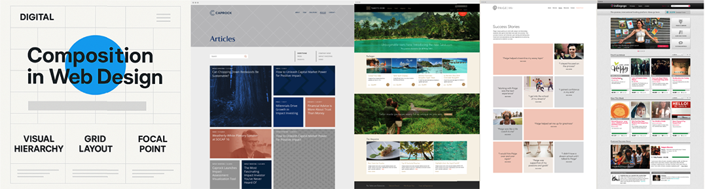

## Visual Design & Design Systems

  
Spacing and Grids

  
- Grids: Always start with the basics. In this case, base units. The base units are going to define what every other unit is based off of. They make the whole design easier to scale and handoff. The base unit that is the most recommended is 8px because most screen sizes are divisible by 8 and its divisible itself. All other UI elements should be in increments of the base unit.

Grids are made up of **3 elements: columns, gutters, and margins**. Columns are the vertical sections that go from left to right. Typically a **12 column grid** is used, because it can be divided in so many ways it makes it more versatile. Keep in mind, most desktops today are extremely wide. Use max-width to contain your grid so users don't have to turn left to right to view all of your content. Gutters are the white space between the columns. Margins are the outside edges of the columns that separate the grid from the edge of the screen. The gutter and margin size are going to be a multiple of the base unit.

- Layouts: Using multiple types of grids together can help balance and visually enhance your design, but once you get your grids on a page, there are still more choices to make. The responsive part of the grid comes with choosing between fixed, fluid, and adaptive grids. Fixed layouts will stay the same no matter what the screen size. Fluid layouts will stretch and shrink with your content. Adaptive layouts will change to use different grids depending on the screen size it is at. By using breakpoints, you are able to change the design of the page for different screen sizes.

There are far too many screen sizes out there now to worry about specific breakpoint numbers. Using just small (600px), medium (768px), large (1024px), and extra-large (1280px) sizes will be a good starting off point to get an idea of what the layouts should be.

  
Typography/Fonts

Typographic design is a highly specialized area of graphic design focusing on the creation and design of letterforms, typefaces, and type treatments . Some type designers own digital type foundries, which are firms that design, license, publish, and dispense fonts. Other typographers specialize in handmade type and typefaces. Lettering is the drawing of letterforms by hand (as opposed to type generated on a computer). Typographic design includes custom and proprietary font design for digital type foundries, hand lettering,handmade type, and custom typography.

By taking a **base font size of 16px**, you can multiply it by the **golden ratio of 1.618** and get multiples of the size for headings. 
You end up with **10px or 0.618em, 16px or 1em, 26px or 1.6118em, 42px or 2.618em, and 68px or 4.236em**. These fonts follow the golden ratio curve and are eye-catching.

### Color: Before choosing colors, ask yourself what message does the brand want to communicate or what problem is it trying to solve. Colors can really influence the personality of the brand.

Another thing to look at is who the target users are. Knowing the demographic of the users and if there are cultural influences can really help in choosing the right colors. Think about what the colors mean to you as well. The psychology of color is a powerful tool that shapes how we perceive the world.

Colors should be able to be scaled or added to, by having a mini monochromatic palette within each color. You can add depth to your blacks and greys by adding in hints of the brand colors. Sometimes black comes off as too harsh if left untouched.

The most important thing when choosing **colors is to test for accessibility**. Make sure there is enough contrast between backgrounds and foregrounds to ensure it is readable for everyone. 

  
Imagery and Iconography

Images,Icons, and Illustration

  
Forms and UI Elements

  
- **Forms**: Forms are a collection of input fields that allow users to submit data to a server or process within an application. They are commonly used for tasks such as signing up, logging in, filling out contact information, or submitting feedback. A form typically includes:
    - Text Fields: For entering text input.
    - Checkboxes: For selecting multiple options.
    - Radio Buttons: For selecting one option from a set.
    - Dropdowns: For selecting an option from a list.
    - Buttons: For submitting or resetting the form.
     - Labels: Text that describes the purpose of each input field.
    - Error Messages: To indicate if there are issues with the input (e.g., required fields left empty).
- **UI Elements**: UI Elements are the building blocks of a user interface. They are the components that users interact with on a screen. These elements can be simple or complex and include:
    - Buttons: Interactive elements that trigger actions (e.g., "Submit", "Cancel").
    - Text Fields: Areas where users can input text.
    - Icons: Visual symbols representing actions, objects, or ideas.
    - Sliders: UI components that allow users to select a value from a range.
    - Progress Bars: Visual indicators showing the progression of a process.
    - Tabs: Navigational elements that switch between different views or sections.
    - Modals: Pop-up dialogs that require user interaction before returning to the main content.
    - Tooltips: Small informational pop-ups that appear when hovering over an element.

  
Accessibility

  Accessible design enables users with diverse abilities to navigate, understand, and enjoy a UI. As designers, the products that we create should be usable by everyone. If just one person can't use your design, then you have failed them in a sense. This is the process of accessibility, making things accessible to all people.

  - [Accessibility - Material Design](https://m3.material.io/foundations/designing/overview)
  - [WCAG Standard](https://www.w3.org/WAI/standards-guidelines/wcag/)

   > "Accessibility is not a checklist. It should be ingrained in the way we design." - Daniel Schifano

   Assistive technologies
    - Screen readers: A program that reads the content of a web page created for visually impaired users.
    - Braille terminals: A keyboard created for the blind or visually impaired users to navigate a computer and the internet.
    - Screen magnifier: Enlarges a portion of the screen that the user hovers over.
    - Alternate Input Devices & Software: These include voice and push buttons that control the actions on the computer.

  
Visual design

  Web composition refers to how visual elements are arranged on a web page to create clarity, hierarchy, usability, and aesthetic balance. A strong composition helps users navigate content and engage intuitively with the site.

### Core Principles of Web Composition

**1. Grid System**
- Creates consistent alignment and spacing
- Helps maintain rhythm and structure
- Common systems: 12-column grid, baseline grid

**2. Visual Hierarchy**
- Guides the viewer’s eye from most to least important
- Uses size, color, spacing, and contrast
- Example: Headline > Subheading > Body text > Footer

**3. Whitespace (Negative Space)**
- Gives elements room to breathe
- Enhances clarity and elegance
- Prevents clutter and overload

**4. Balance and Symmetry**
- Symmetrical: Stable, formal, safe (e.g., portfolios)
- Asymmetrical: Dynamic, engaging, modern (e.g., creative studios)

**5. Focal Point**
- Clear visual entry point (e.g., hero image, call to action)
- Often larger or more colorful than surroundings

**6. Consistency**
- Typography, colors, and UI elements repeat consistently
- Supports brand identity and user recognition

### Recommended Visuals for Web Composition
Visual types to use for teaching and layout reference:
- Wireframe layout examples (mobile vs desktop)
- Grid overlays on existing websites
- Visual hierarchy diagrams
- Before/after layout improvements

### ✅ Summary
> “Good composition is invisible. It guides, balances, and brings clarity without calling attention to itself.”

A well-composed web page invites users in, helps them understand what to do, and reflects the brand’s tone — all without visual chaos.

 

  
Design Systems

  A design system is a single place where all the elements needed to design a product live. It creates a single source of truth for each individual element of the design where anyone on a team can easily see and use it. A common methodology for design systems is atomic design. It is based on the book of the same name by Brad Frost and breaks a design system up into atoms, molecules, organisms, templates, and pages that work together to create an entire system for a product. Each piece builds on the piece before it and adds more to the design. In the Complete Web & Mobile Designer course, Daniel uses a similar methodology based on a foundation, components, and then recipes to build out an entire product.
  - The foundation has colors, typography, icons, and other individual items that may be used in the product.
  - Components are where elements from the foundation are put together to make reusable items such as buttons, inputs, and cards.
  - The recipes section is where all the components come together to make even bigger groupings of what will make up sections of an app or a page.
  - The biggest thing to remember is that design systems are ever evolving.

  - [Google - Material Design](https://m3.material.io/)

  Material Design is a design system built and supported by Google designers and developers. Material.io ies in-depth UX guidance and UI component implementations for Android, Flutter, and the Web.The latest version, Material 3, enables personal, adaptive, and expressive experiences – from dynamic color and enhanced accessibility, to foundations for large screen layouts and design tokens.nclud

